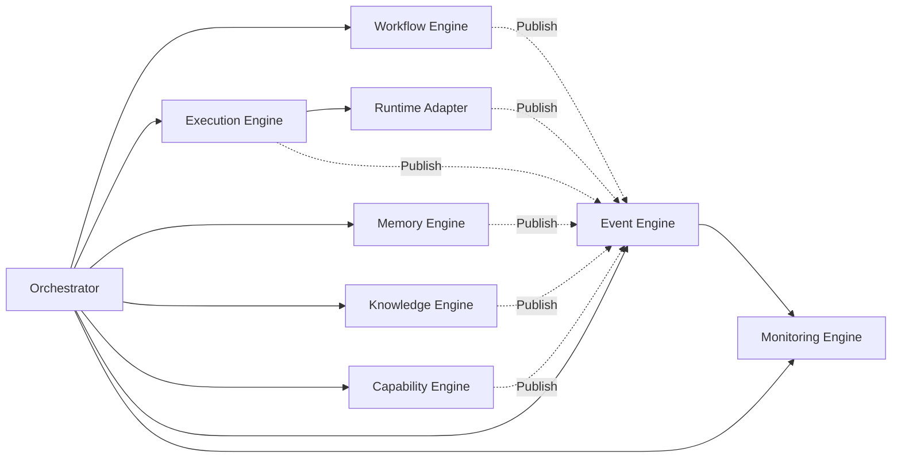
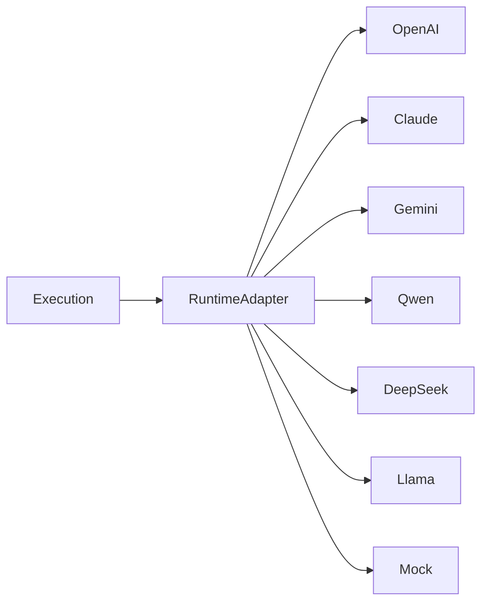
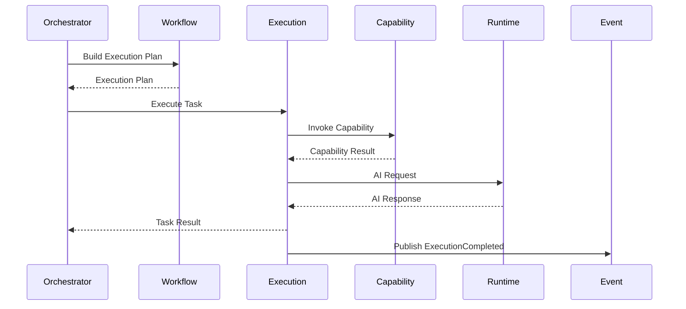

# MMOS v1.0 — Engine Overview

Version: 1.0

Status: REFERENCE

---

# 1. Purpose

Dokumen ini menjelaskan arsitektur internal seluruh Engine pada MMOS.

Engine merupakan komponen yang menjalankan seluruh pekerjaan sistem.
Setiap Engine memiliki tanggung jawab yang jelas (Single Responsibility)
dan tidak saling bergantung secara langsung.

Seluruh koordinasi dilakukan oleh Orchestrator.

Dokumen ini merupakan visualisasi dari:

- MAS-300 Engine Architecture
- MAS-400 Orchestrator
- MAS-500 Memory & Knowledge
- MAS-700 AI Runtime

Dokumen ini tidak menambahkan spesifikasi baru.

---

# 2. Engine Architecture Overview



---

# 3. Engine Philosophy

MMOS menggunakan prinsip:

> **Engine Does the Work**

Artinya:

- seluruh pekerjaan dilakukan Engine
- Orchestrator hanya mengatur urutan
- Engine saling independen
- Engine dapat berkembang tanpa memengaruhi Engine lain

Dengan pendekatan ini:

- coupling rendah
- skalabilitas tinggi
- mudah diuji
- mudah diganti implementasinya

---

# 4. Engine Dependency

Dependency resmi antar Engine adalah sebagai berikut.

```text
                  Orchestrator
                        │
        ┌───────────────┼───────────────┐
        │               │               │
 Workflow Engine   Execution Engine   Memory Engine
        │               │
        │               ▼
        │         Runtime Adapter
        │
        ▼
 Capability Engine

Knowledge Engine

Event Engine

Monitoring Engine
```

Aturan utama:

- Engine tidak boleh mengendalikan Engine lain.
- Engine tidak boleh mengetahui implementasi internal Engine lain.
- Interaksi dilakukan melalui kontrak resmi atau Event.

---

# 5. Workflow Engine

## Purpose

Workflow Engine bertanggung jawab mengelola seluruh lifecycle Workflow.

Workflow Engine mengetahui:

- struktur workflow
- dependency antar task
- branching
- looping
- retry policy
- compensation

Workflow Engine **tidak mengeksekusi task**.

---

## Responsibilities

- Workflow Validation
- Workflow Scheduling
- Dependency Resolution
- Conditional Branching
- Loop Execution
- Retry Strategy
- Parallel Planning
- Workflow State Management

---

## Input

- Workflow Object
- Execution Context

---

## Output

- Execution Plan
- Next Task
- Workflow State

---

# 6. Execution Engine

Execution Engine merupakan pusat eksekusi.

Engine ini menjalankan task sesuai Execution Plan.

Execution Engine bertanggung jawab terhadap:

- task lifecycle
- concurrency
- timeout
- cancellation
- retry
- checkpoint
- recovery

Execution Engine tidak mengetahui vendor AI.

---

## Responsibilities

- Task Scheduling
- Task Dispatch
- Task Execution
- Retry
- Timeout
- Parallel Execution
- Context Injection

---

## Input

- Execution Plan
- Task Definition

---

## Output

- Task Result
- Execution Result
- Execution Event

---

# 7. Memory Engine

Memory Engine mengelola seluruh memory sistem.

Jenis memory:

- Session Memory
- Working Memory
- Long-Term Memory

Memory Engine tidak mengetahui workflow.

---

## Responsibilities

- Read Memory
- Write Memory
- Delete Memory
- Update Memory
- Memory Indexing
- Memory Versioning

---

## Storage

Memory Engine dapat menggunakan:

- Redis
- PostgreSQL
- MongoDB
- Vector Database

Implementasi bersifat bebas.

---

# 8. Knowledge Engine

Knowledge Engine mengelola seluruh pengetahuan.

Knowledge berbeda dengan Memory.

Knowledge bersifat:

- reusable
- searchable
- indexed

---

## Responsibilities

- Document Indexing
- Embedding
- Semantic Search
- Chunk Retrieval
- Ranking
- Knowledge Cache

---

## Supported Sources

- PDF
- DOCX
- Markdown
- Database
- Website
- API

---

# 9. Capability Engine

Capability Engine menyediakan akses ke dunia luar.

Capability merupakan abstraksi terhadap layanan eksternal.

Contoh Capability:

- HTTP
- Database
- Email
- Calendar
- Queue
- Storage
- Filesystem
- Search
- OCR

Execution Engine memanggil Capability Engine tanpa mengetahui implementasi capability tersebut.

---

## Responsibilities

- Capability Discovery
- Capability Validation
- Capability Invocation
- Authentication
- Authorization
- Error Mapping

---

# 10. Event Engine

Event Engine mengelola komunikasi asynchronous.

Semua Engine dapat menerbitkan Event.

Event Engine bertanggung jawab terhadap:

- publish
- subscribe
- routing
- filtering
- replay
- dead-letter

---

## Event Sources

- Workflow Engine
- Execution Engine
- Memory Engine
- Knowledge Engine
- Capability Engine
- Runtime Adapter

---

## Event Consumers

- Monitoring
- Audit
- Notification
- Analytics
- External Integration

---

# 11. Monitoring Engine

Monitoring Engine bersifat pasif.

Monitoring tidak boleh mengubah perilaku sistem.

Monitoring hanya melakukan observasi.

---

## Responsibilities

- Metrics
- Logging
- Distributed Tracing
- Audit Trail
- Health Check
- Performance Statistics

---

## Output

Monitoring dapat mengirim data ke:

- Prometheus
- Grafana
- OpenTelemetry
- Jaeger
- Elastic
- Cloud Monitoring

---

# 12. Runtime Adapter

Runtime Adapter bukan Engine.

Runtime Adapter merupakan lapisan abstraksi yang menghubungkan MMOS dengan model AI.

Diagram:



Runtime Adapter bertanggung jawab:

- Request Mapping
- Response Mapping
- Token Normalization
- Streaming Translation
- Error Translation
- Provider Selection

---

# 13. Engine Communication



---

# 14. Engine Lifecycle

Seluruh Engine mengikuti lifecycle yang sama.

```text
Created

↓

Initialized

↓

Ready

↓

Running

↓

Idle

↓

Stopping

↓

Stopped

↓

Restarting (optional)
```

Engine wajib mampu berpindah state secara aman.

---

# 15. Isolation Rules

Engine harus memenuhi aturan berikut.

## Independent

Setiap Engine dapat dikembangkan sendiri.

---

## Replaceable

Implementasi Engine dapat diganti tanpa mengubah kontrak.

---

## Stateless (Preferred)

Engine sebaiknya stateless.

State permanen disimpan pada Storage.

---

## Observable

Seluruh aktivitas menghasilkan Event dan Metrics.

---

## Recoverable

Engine harus dapat dipulihkan setelah kegagalan.

---

## Scalable

Engine dapat dijalankan:

- Single Instance
- Multi Instance
- Cluster

tanpa perubahan kontrak.

---

# 16. Design Principles

Engine mengikuti prinsip resmi MMOS.

- Engine Does the Work
- Single Responsibility
- Loose Coupling
- Event Driven
- Contract First
- Stateless by Default
- Replaceable Implementation
- Platform Independent
- Runtime Independent

---

# 17. Reference Documents

Dokumen ini diturunkan dari:

- MAS-300 Engine Architecture
- MAS-400 Orchestrator
- MAS-500 Memory & Knowledge
- MAS-700 AI Runtime
- IMS-400 Execution Specification
- IMS-500 Memory Specification
- IMS-600 Capability Specification
- IMS-700 Runtime Specification
- IMS-800 Event Specification

---

# END