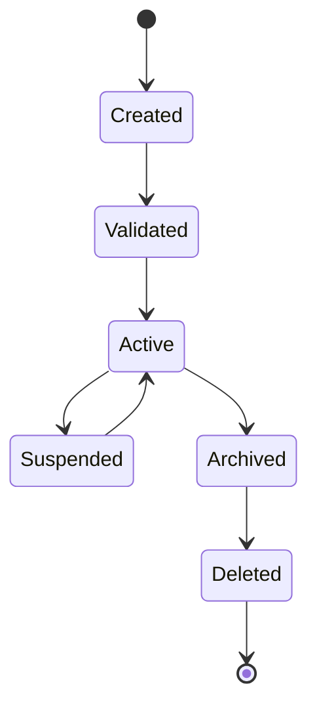
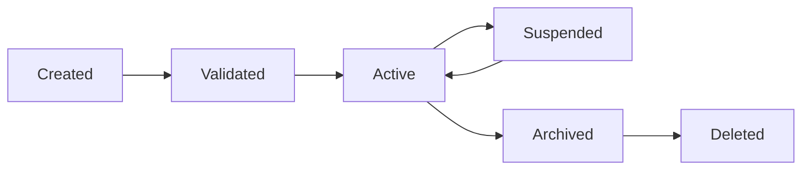
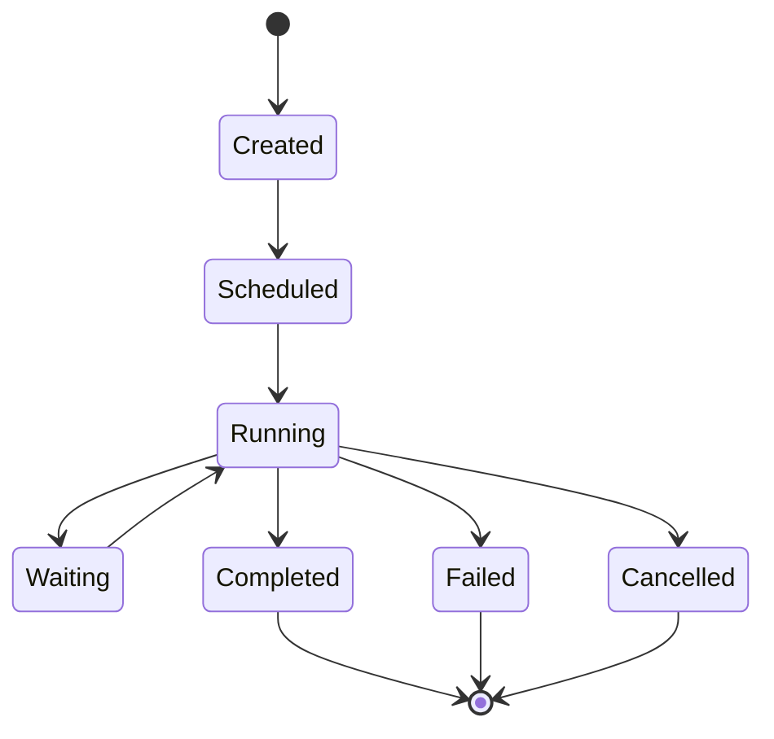

# MMOS v1.0 — Object Lifecycle

Version: 1.0

Status: REFERENCE

---

# 1. Purpose

Dokumen ini mendefinisikan lifecycle resmi seluruh Object dalam MMOS.

Setiap Object di MMOS memiliki lifecycle yang konsisten sehingga seluruh
Engine dapat mengelola Object menggunakan mekanisme yang sama.

Dokumen ini merupakan referensi implementasi dan tidak menambahkan
spesifikasi baru di luar MAS maupun IMS.

Lifecycle ini berlaku untuk seluruh Object yang diturunkan dari Base Object.

---

# 2. Lifecycle Philosophy

Seluruh Object mengikuti prinsip:

> Every Object Has a Lifecycle

Artinya:

- setiap Object memiliki state
- state hanya berubah melalui transition resmi
- setiap perubahan menghasilkan Event
- setiap perubahan dapat diaudit
- setiap perubahan memiliki timestamp

Lifecycle bersifat deterministic.

---

# 3. Generic Lifecycle

Seluruh Object minimal memiliki lifecycle berikut.



Lifecycle di atas menjadi pola dasar seluruh Object.

---

# 4. Object States

| State | Description |
|--------|-------------|
| Created | Object baru dibuat |
| Validated | Object telah lolos validasi kontrak |
| Active | Object aktif digunakan |
| Suspended | Object dinonaktifkan sementara |
| Archived | Object tidak lagi aktif namun masih disimpan |
| Deleted | Object dihapus secara logis atau permanen |

---

# 5. State Definitions

## Created

Object telah dibuat.

Karakteristik:

- memiliki ID
- memiliki Metadata
- belum digunakan
- belum tervalidasi

Event:

- ObjectCreated

---

## Validated

Object telah melewati validasi.

Validasi meliputi:

- Schema
- Required Field
- Version
- Reference
- Constraint

Object belum tentu digunakan.

Event:

- ObjectValidated

---

## Active

Object siap digunakan oleh sistem.

Pada state ini Object dapat:

- dibaca
- diperbarui
- direferensikan
- digunakan Engine

Event:

- ObjectActivated

---

## Suspended

Object dinonaktifkan sementara.

Contoh:

- Agent dinonaktifkan
- Capability dimatikan
- Workflow dibekukan

Object tetap tersedia tetapi tidak digunakan.

Event:

- ObjectSuspended

---

## Archived

Object dipindahkan ke arsip.

Object:

- tidak dapat digunakan
- tetap dapat diaudit
- tetap memiliki histori

Event:

- ObjectArchived

---

## Deleted

Object telah dihapus.

Implementasi dapat berupa:

- soft delete
- hard delete

Event:

- ObjectDeleted

---

# 6. Lifecycle Transition



Transition lain dianggap tidak valid kecuali didefinisikan secara khusus.

---

# 7. Transition Rules

| From | To | Allowed |
|------|----|----------|
| Created | Validated | Yes |
| Created | Active | No |
| Validated | Active | Yes |
| Active | Suspended | Yes |
| Suspended | Active | Yes |
| Active | Archived | Yes |
| Archived | Deleted | Yes |
| Deleted | Active | No |

---

# 8. Lifecycle Events

Setiap perubahan state menghasilkan Event.

| Transition | Event |
|------------|-------|
| Create | ObjectCreated |
| Validate | ObjectValidated |
| Activate | ObjectActivated |
| Suspend | ObjectSuspended |
| Resume | ObjectResumed |
| Archive | ObjectArchived |
| Delete | ObjectDeleted |

Event dipublikasikan ke Event Engine.

---

# 9. Ownership During Lifecycle

Owner Object tidak berubah selama lifecycle.

Contoh:

```text
Workspace
    │
    └── Agent
            │
            └── Workflow
                    │
                    └── Task
```

Perubahan state tidak mengubah ownership.

---

# 10. Versioning

Lifecycle berbeda dengan Version.

Contoh:

```text
Workflow v1

↓

Validated

↓

Active

↓

Archived
```

Kemudian:

```text
Workflow v2

↓

Created

↓

Validated

↓

Active
```

Versi baru memiliki lifecycle sendiri.

---

# 11. Identity

Identity Object bersifat immutable.

Yang tidak boleh berubah:

- Object ID
- Object Type
- Created Time
- Owner

Yang dapat berubah:

- Metadata
- Configuration
- Description
- Status

---

# 12. Audit Trail

Setiap transition wajib dicatat.

Minimal informasi:

- Timestamp
- Previous State
- New State
- Actor
- Reason
- Correlation ID

Audit tidak boleh dihapus.

---

# 13. Lifecycle per Object

## Workspace

```text
Created

↓

Validated

↓

Active

↓

Archived
```

Workspace umumnya tidak menggunakan Suspended.

---

## Agent

```text
Created

↓

Validated

↓

Active

↓

Suspended

↓

Active

↓

Archived
```

---

## Workflow

```text
Created

↓

Validated

↓

Active

↓

Suspended

↓

Archived
```

---

## Task

Task mengikuti Workflow.

Task tidak memiliki lifecycle independen saat runtime.

---

## Execution

Execution memiliki lifecycle khusus.



Execution tidak menggunakan Archived.

---

## Runtime

Runtime bersifat ephemeral.

```text
Created

↓

Initialized

↓

Executing

↓

Streaming

↓

Completed

↓

Disposed
```

Runtime hidup mengikuti Execution.

---

## Memory

```text
Created

↓

Validated

↓

Active

↓

Archived
```

Memory umumnya tidak menggunakan Suspended.

---

## Knowledge

```text
Created

↓

Indexed

↓

Available

↓

Archived
```

Knowledge memiliki lifecycle khusus karena melalui proses indexing.

---

## Capability

```text
Created

↓

Validated

↓

Available

↓

Disabled

↓

Available

↓

Archived
```

Capability dapat dinonaktifkan tanpa dihapus.

---

## Event

Event bersifat immutable.

```text
Created

↓

Published

↓

Consumed

↓

Archived
```

Event tidak pernah diubah.

---

## Artifact

```text
Created

↓

Available

↓

Archived

↓

Deleted
```

Artifact dapat digunakan kembali sebelum diarsipkan.

---

# 14. Parent-Child Lifecycle

Lifecycle child bergantung pada parent.

```text
Workspace
    │
Agent
    │
Workflow
    │
Task
```

Jika Workspace dihapus, seluruh child mengikuti kebijakan lifecycle yang ditentukan sistem.

---

# 15. Cascade Rules

Contoh:

```
Archive Workspace

↓

Archive Agent

↓

Archive Workflow

↓

Archive Task
```

Cascade dapat bersifat:

- Automatic
- Manual
- Configurable

---

# 16. State Validation

Engine wajib memvalidasi state sebelum menggunakan Object.

Contoh:

- Active → boleh digunakan
- Suspended → ditolak
- Archived → read-only
- Deleted → tidak ditemukan

---

# 17. Lifecycle Responsibility

| Object | Responsible Engine |
|----------|-------------------|
| Workspace | Orchestrator |
| Agent | Orchestrator |
| Workflow | Workflow Engine |
| Task | Workflow Engine |
| Execution | Execution Engine |
| Runtime | Runtime Adapter |
| Memory | Memory Engine |
| Knowledge | Knowledge Engine |
| Capability | Capability Engine |
| Event | Event Engine |
| Artifact | Execution Engine |

---

# 18. Design Principles

Lifecycle mengikuti prinsip:

- Explicit State
- Deterministic Transition
- Immutable Identity
- Version Independent
- Event Driven
- Auditable
- Observable
- Recoverable

---

# 19. Reference Documents

Dokumen ini diturunkan dari:

- object-model.md
- object-catalog.md
- event-catalog.md
- engine-interaction.md
- MAS-300 Engine Architecture
- MAS-500 Memory & Knowledge
- MAS-700 AI Runtime
- IMS-100 hingga IMS-800

---

# END