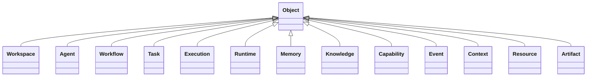
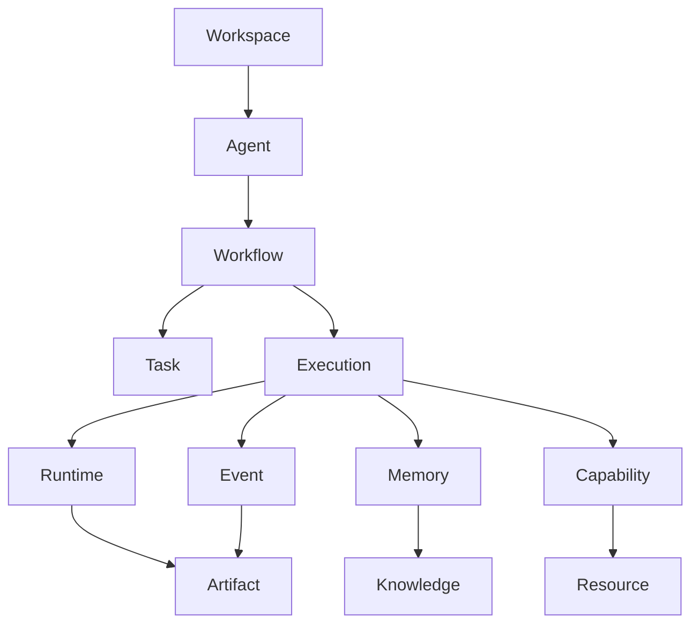
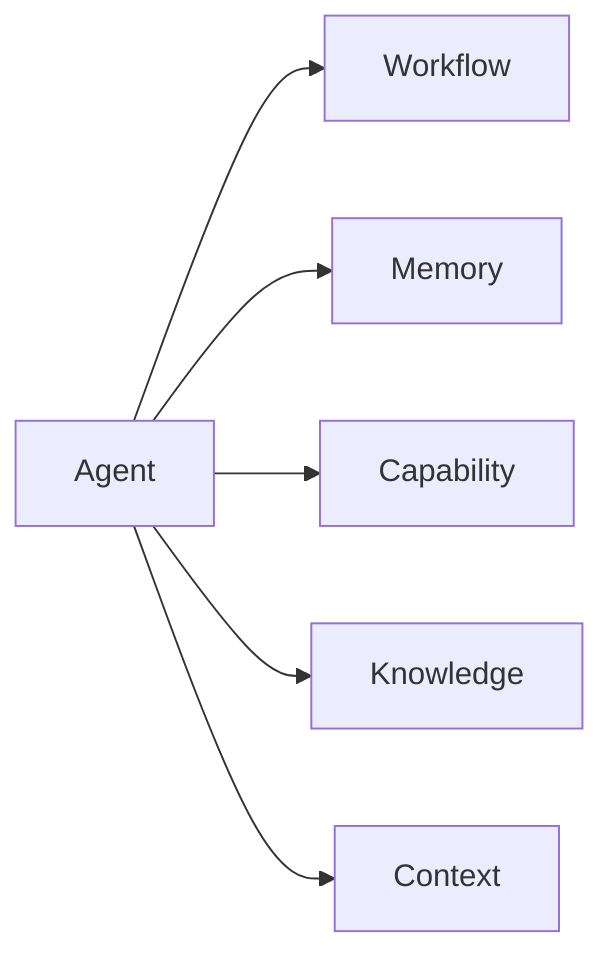
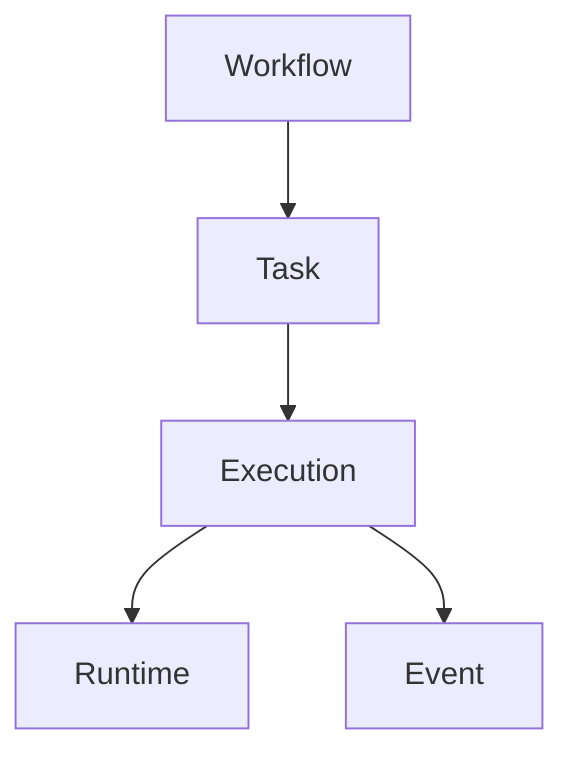
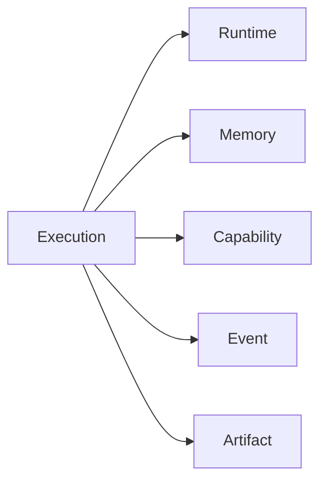
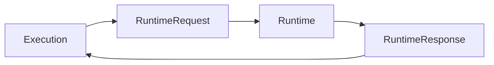
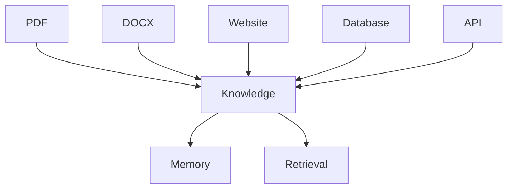
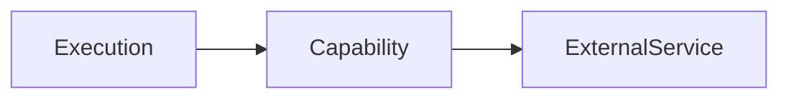
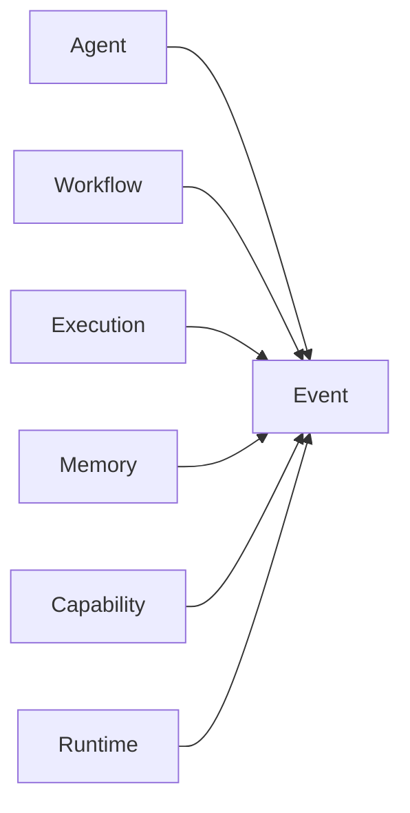
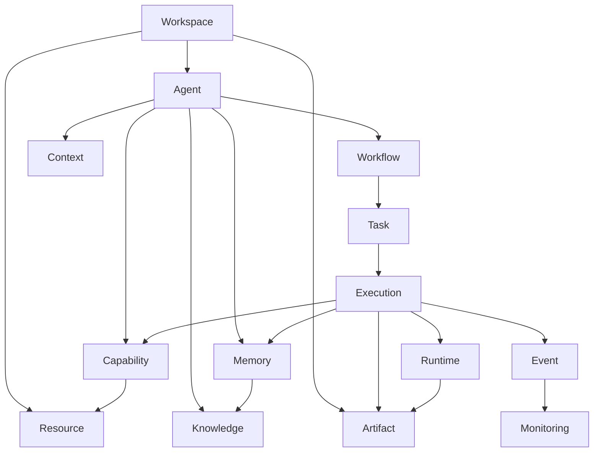

# MMOS v1.0 — Object Relationship

Version: 1.0

Status: REFERENCE

---

# 1. Purpose

Dokumen ini menjelaskan hubungan (relationship) antar seluruh Object resmi
dalam MMOS.

Dokumen ini merupakan visualisasi dari:

- object-model.md
- object-catalog.md
- capability-catalog.md
- event-catalog.md
- IMS-100 Object Specification
- IMS-200 Agent Specification
- IMS-300 Workflow Specification
- IMS-400 Execution Specification
- IMS-500 Memory Specification
- IMS-600 Capability Specification
- IMS-700 Runtime Specification
- IMS-800 Event Specification

Dokumen ini tidak mendefinisikan Object baru.

Seluruh relationship pada dokumen ini merupakan referensi implementasi.

---

# 2. Object Philosophy

MMOS dibangun berdasarkan prinsip:

> **Everything is Object**

Seluruh informasi di dalam sistem direpresentasikan sebagai Object yang
memiliki:

- Identity
- Metadata
- Lifecycle
- Relationship
- Version
- Event

Dengan pendekatan ini seluruh Engine dapat bekerja menggunakan kontrak yang
seragam.

---

# 3. Object Hierarchy



Seluruh Object MMOS diturunkan dari Base Object.

---

# 4. Core Object Graph



Diagram ini menunjukkan hubungan utama antar Object pada saat runtime.

---

# 5. Workspace Relationship

Workspace merupakan container logis tertinggi.

```text
Workspace
│
├── Agent
├── Workflow
├── Memory
├── Capability
├── Resource
└── Artifact
```

Workspace mengelompokkan seluruh Object ke dalam satu domain kerja.

---

# 6. Agent Relationship

Agent merupakan pusat perilaku (behavior).



Agent:

- memiliki Workflow
- menggunakan Memory
- menggunakan Capability
- memiliki Context
- menghasilkan Event

Agent tidak memiliki Runtime.

Runtime hanya digunakan ketika Workflow dieksekusi.

---

# 7. Workflow Relationship

Workflow mendefinisikan proses bisnis.



Workflow bersifat deklaratif.

Workflow tidak menjalankan Task.

---

# 8. Task Relationship

Task merupakan unit kerja terkecil.

Task dapat berupa:

- Prompt
- Capability Call
- Decision
- Condition
- Parallel
- Loop
- Sub Workflow

Task menghasilkan satu atau lebih Execution.

---

# 9. Execution Relationship

Execution merupakan representasi proses yang sedang berjalan.



Execution menjadi pusat hubungan antar Engine.

---

# 10. Runtime Relationship

Runtime digunakan oleh Execution.



Runtime tidak mengetahui Agent maupun Workflow.

Runtime hanya menerima RuntimeRequest.

---

# 11. Memory Relationship

Memory terhubung dengan:

```text
Agent

↓

Memory

↓

Knowledge

↓

Storage
```

Memory dapat digunakan oleh:

- Workflow
- Task
- Execution

Memory tidak bergantung pada Runtime.

---

# 12. Knowledge Relationship

Knowledge berasal dari berbagai sumber.



Knowledge bersifat reusable.

---

# 13. Capability Relationship

Capability merupakan abstraksi layanan eksternal.



Capability tidak mengetahui Workflow.

Capability hanya menerima Request Object.

---

# 14. Event Relationship

Setiap Object dapat menghasilkan Event.



Event menjadi media komunikasi antar Engine.

---

# 15. Context Relationship

Context menyimpan informasi sementara.

```text
Workspace

↓

Agent

↓

Context

↓

Execution
```

Context tidak disimpan sebagai Knowledge permanen.

---

# 16. Resource Relationship

Resource merepresentasikan aset eksternal.

Contoh:

- File
- Database
- Queue
- API
- Bucket
- Secret

Relationship:

```text
Capability

↓

Resource
```

Resource tidak dipanggil langsung oleh Workflow.

---

# 17. Artifact Relationship

Artifact merupakan hasil dari proses.

Contoh:

- Generated Text
- Image
- Audio
- Video
- JSON
- Report
- Document

Relationship:

```text
Execution

↓

Artifact
```

Artifact dapat digunakan kembali oleh Workflow berikutnya.

---

# 18. Complete Object Relationship



Diagram ini merupakan hubungan utama seluruh Object MMOS.

---

# 19. Cardinality

| Parent | Child | Cardinality |
|---------|--------|-------------|
| Workspace | Agent | 1..N |
| Workspace | Resource | 1..N |
| Workspace | Artifact | 0..N |
| Agent | Workflow | 1..N |
| Agent | Memory | 1 |
| Agent | Capability | 0..N |
| Agent | Context | 1 |
| Workflow | Task | 1..N |
| Task | Execution | 0..N |
| Execution | Runtime | 1 |
| Execution | Event | 0..N |
| Execution | Artifact | 0..N |
| Execution | Capability | 0..N |
| Execution | Memory | 0..N |
| Capability | Resource | 1 |
| Memory | Knowledge | 0..N |

---

# 20. Lifecycle Dependency

```text
Workspace
    │
    ▼
Agent
    │
    ▼
Workflow
    │
    ▼
Task
    │
    ▼
Execution
    │
    ├────────► Runtime
    │
    ├────────► Memory
    │
    ├────────► Capability
    │
    └────────► Event

Execution
    │
    ▼
Artifact
```

Object di bawah hanya dapat hidup jika parent lifecycle masih valid.

---

# 21. Ownership Rules

| Object | Owner |
|---------|-------|
| Agent | Workspace |
| Workflow | Agent |
| Task | Workflow |
| Execution | Workflow |
| Memory | Agent |
| Knowledge | Workspace |
| Capability | Workspace |
| Context | Agent |
| Runtime | Execution |
| Event | Execution |
| Artifact | Execution |
| Resource | Workspace |

Ownership menentukan:

- akses
- lifecycle
- security
- versioning
- audit

---

# 22. Dependency Rules

Object hanya boleh bergantung pada level di atasnya.

```text
Workspace
    │
Agent
    │
Workflow
    │
Task
    │
Execution
```

Aturan penting:

- Workflow tidak boleh mengetahui Runtime Provider.
- Runtime tidak boleh mengetahui Agent.
- Capability tidak boleh mengetahui Workflow.
- Memory tidak boleh bergantung pada Runtime.
- Event tidak boleh mengubah Object sumber.

---

# 23. Design Principles

Relationship Object mengikuti prinsip resmi MMOS:

- Everything is Object
- Composition over Inheritance
- Contract First
- Immutable Identity
- Versioned Objects
- Event Driven
- Loose Coupling
- Explicit Ownership
- Clear Lifecycle
- Platform Independent

---

# 24. Reference Documents

Dokumen ini diturunkan dari:

- object-model.md
- object-catalog.md
- capability-catalog.md
- event-catalog.md
- MAS-100 Workspace
- MAS-300 Engine Architecture
- MAS-600 Agent Architecture
- IMS-100 hingga IMS-800

---

# END