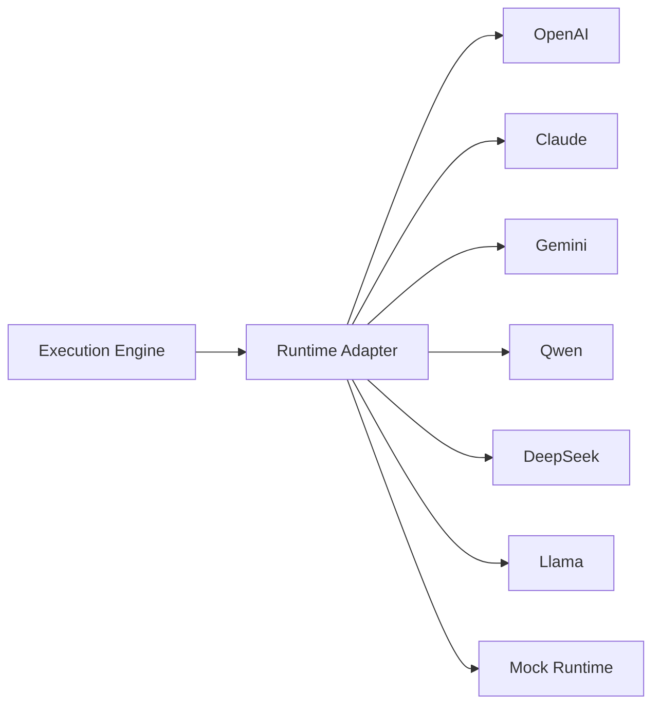
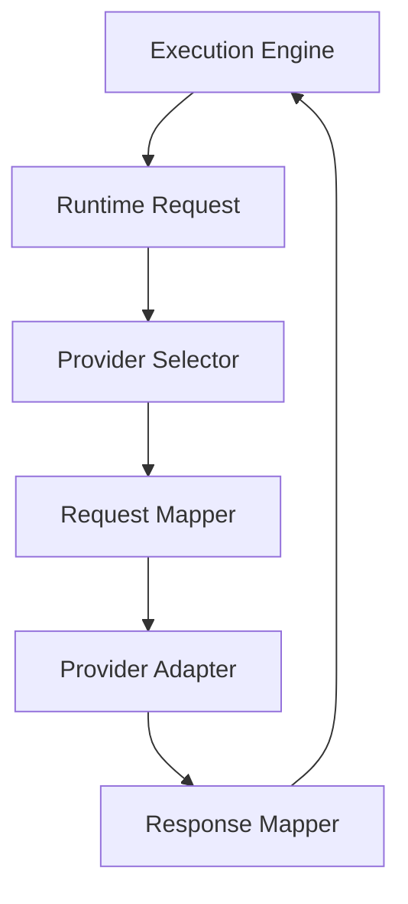
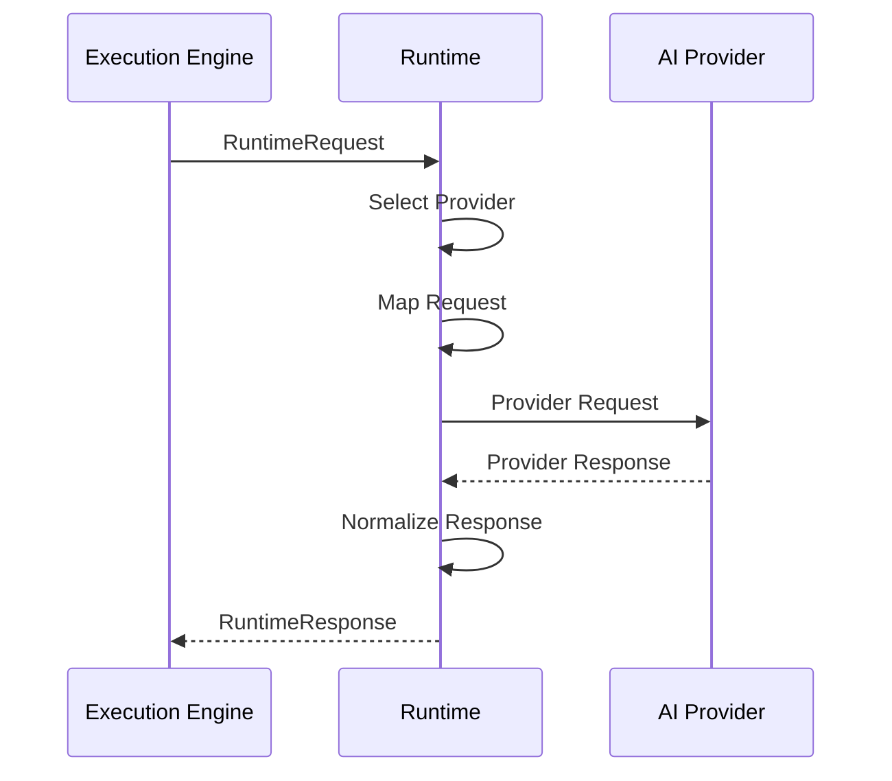

# MMOS v1.0 — Runtime Overview

Version: 1.0

Status: REFERENCE

---

# 1. Purpose

Dokumen ini menjelaskan arsitektur Runtime MMOS.

Runtime merupakan lapisan abstraksi yang memungkinkan MMOS menggunakan
berbagai AI Provider tanpa mengubah Workflow, Engine, maupun Object.

Runtime bukan bagian dari Business Logic.

Runtime merupakan implementation adapter antara kontrak MMOS dan layanan AI.

Dokumen ini diturunkan dari:

- MAS-700 AI Runtime
- MAS-300 Engine Architecture
- IMS-700 Runtime Specification

Dokumen ini tidak menambahkan spesifikasi baru.

---

# 2. Runtime Position

Runtime berada di antara Execution Engine dan AI Provider.



Execution Engine hanya mengenal Runtime Adapter.

Execution Engine tidak mengetahui provider yang digunakan.

---

# 3. Runtime Philosophy

Runtime mengikuti prinsip:

> Runtime Independent

Artinya:

- Workflow tidak mengenal vendor.
- Agent tidak mengenal vendor.
- Capability tidak mengenal vendor.
- Engine tidak mengenal vendor.

Seluruh detail vendor diisolasi pada Runtime Adapter.

---

# 4. Runtime Architecture



Runtime menerima Runtime Request.

Runtime mengubah request menjadi format provider.

Provider mengembalikan response.

Runtime mengubah response menjadi Runtime Response.

---

# 5. Runtime Components

Runtime terdiri dari beberapa komponen utama.

```text
Runtime
│
├── Provider Selector
├── Request Mapper
├── Response Mapper
├── Streaming Adapter
├── Tool Adapter
├── Token Manager
├── Error Translator
├── Metrics Collector
├── Retry Handler
└── Provider Adapter
```

Setiap komponen memiliki tanggung jawab yang terpisah.

---

# 6. Provider Adapter

Setiap provider memiliki adapter sendiri.

```text
runtime/

├── openai/
├── claude/
├── gemini/
├── qwen/
├── deepseek/
├── llama/
└── mock/
```

Setiap adapter menerjemahkan kontrak MMOS menjadi kontrak provider.

---

# 7. Runtime Request Flow



---

# 8. Runtime Request

Runtime menerima Object:

```text
RuntimeRequest
```

Runtime Request minimal berisi:

- Model
- Messages
- Parameters
- Tools
- Context
- Metadata

Runtime tidak mengetahui Agent maupun Workflow.

---

# 9. Runtime Response

Runtime menghasilkan:

```text
RuntimeResponse
```

Berisi:

- Content
- Tool Calls
- Usage
- Finish Reason
- Metadata

Seluruh provider harus menghasilkan format yang sama.

---

# 10. Provider Selection

Provider dapat dipilih berdasarkan:

- konfigurasi Agent
- Workspace Policy
- Execution Policy
- Availability
- Cost
- Latency
- Capability
- Failover Rule

Diagram:

```mermaid
flowchart LR

RuntimeRequest

↓

Provider Selector

↓

Provider Adapter

↓

Provider
```

---

# 11. Request Mapping

Provider memiliki format request yang berbeda.

Runtime bertanggung jawab mengubah:

```text
MMOS Runtime Request

↓

Provider Request
```

Contoh:

MMOS

↓

OpenAI Chat Completion

atau

↓

Claude Messages API

atau

↓

Gemini GenerateContent

---

# 12. Response Mapping

Response provider juga berbeda.

Runtime mengubah:

```text
Provider Response

↓

Runtime Response
```

Sehingga Execution Engine selalu menerima format yang identik.

---

# 13. Streaming Support

Runtime mendukung Streaming.

```mermaid
flowchart LR

Execution

↓

Runtime

↓

Provider

↓

Streaming Response

↓

Runtime

↓

Execution
```

Runtime menyatukan format streaming dari seluruh provider.

---

# 14. Tool Calling

Runtime juga mengelola Tool Calling.

```mermaid
flowchart LR

Execution

↓

Runtime

↓

Provider

↓

Tool Call

↓

Execution

↓

Capability Engine
```

Runtime tidak menjalankan Tool.

Runtime hanya meneruskan Tool Call.

---

# 15. Structured Output

Runtime mendukung:

- JSON Mode
- Structured Output
- Function Calling
- Tool Calling

Jika provider tidak mendukung fitur tertentu,
Runtime dapat melakukan normalisasi sesuai kontrak MMOS.

---

# 16. Token Management

Runtime bertanggung jawab terhadap:

- token counting
- token usage
- token limit
- context window
- truncation

Execution Engine tidak perlu mengetahui implementasi token provider.

---

# 17. Retry Strategy

Retry dilakukan oleh Runtime jika kegagalan berasal dari provider.

Contoh:

- timeout
- rate limit
- transient network error

Retry tidak dilakukan untuk:

- invalid request
- authentication error
- contract violation

---

# 18. Error Translation

Runtime menerjemahkan error provider menjadi Runtime Error resmi.

```text
OpenAI Error

↓

RuntimeError

Claude Error

↓

RuntimeError

Gemini Error

↓

RuntimeError
```

Execution Engine tidak mengetahui format error vendor.

---

# 19. Metrics Collection

Runtime menghasilkan metrics seperti:

- Request Count
- Success Rate
- Error Rate
- Average Latency
- Token Usage
- Cost Estimation
- Streaming Duration

Seluruh metrics dikirim ke Monitoring Engine.

---

# 20. Runtime Events

Runtime menghasilkan Event.

Contoh:

- RuntimeStarted
- RuntimeCompleted
- RuntimeFailed
- StreamingStarted
- StreamingCompleted
- ToolCallRequested

Event dikirim ke Event Engine.

---

# 21. Failover

Runtime dapat melakukan failover.

Contoh:

```text
OpenAI

↓

Timeout

↓

Claude

↓

Timeout

↓

Gemini
```

Failover mengikuti Runtime Policy.

Workflow tidak mengetahui proses ini.

---

# 22. Mock Runtime

MMOS menyediakan Mock Runtime.

Tujuan:

- Unit Test
- Integration Test
- SDK Test
- CI/CD
- Offline Development

Mock Runtime mengikuti kontrak Runtime resmi.

---

# 23. Runtime Isolation Rules

Runtime wajib memenuhi aturan berikut.

- Tidak mengetahui Workflow.
- Tidak mengetahui Agent.
- Tidak mengetahui Memory.
- Tidak mengetahui Capability.
- Tidak menyimpan Business State.
- Tidak mengubah Workflow.
- Tidak mengubah Execution Plan.

Runtime hanya menerjemahkan komunikasi.

---

# 24. Runtime Lifecycle

```text
Created

↓

Initialized

↓

Ready

↓

Executing

↓

Streaming

↓

Completed

↓

Disposed
```

Lifecycle Runtime bersifat sementara (ephemeral) dan mengikuti Execution.

---

# 25. Runtime Dependency

Dependency Runtime adalah:

```text
Execution Engine

↓

Runtime Adapter

↓

Provider Adapter

↓

AI Provider
```

Tidak boleh ada dependency terbalik.

---

# 26. Runtime Design Principles

Runtime mengikuti prinsip resmi MMOS.

- Runtime Independent
- Contract First
- Adapter Pattern
- Stateless
- Replaceable
- Observable
- Provider Agnostic
- Fail Safe
- Extensible by Design

---

# 27. Future Provider Support

Runtime dirancang agar provider baru dapat ditambahkan tanpa mengubah Engine.

Contoh provider masa depan:

- Azure OpenAI
- AWS Bedrock
- Google Vertex AI
- Mistral
- Cohere
- Grok
- Local Model (Ollama, vLLM, LM Studio)
- Custom Enterprise Runtime

Penambahan provider hanya membutuhkan implementasi Provider Adapter.

---

# 28. Reference Documents

Dokumen ini diturunkan dari:

- MAS-700 AI Runtime
- MAS-300 Engine Architecture
- IMS-700 Runtime Specification
- IMS-400 Execution Specification
- object-model.md
- object-relationship.md

---

# END