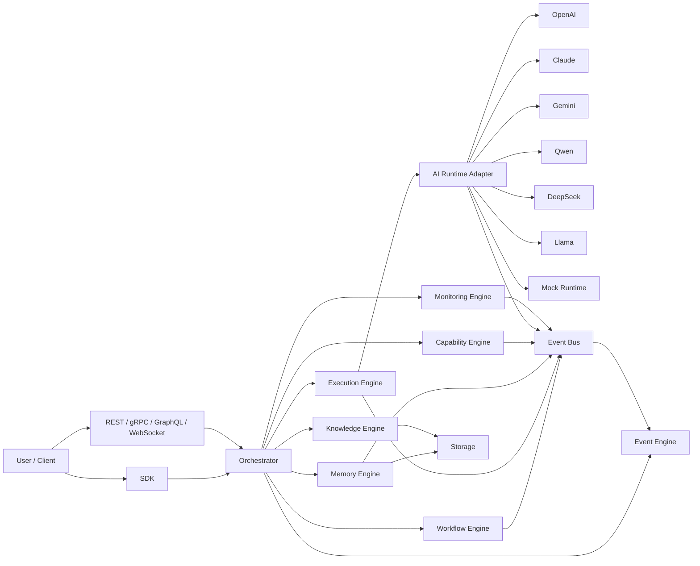

# MMOS v1.0 — System Overview

Version: 1.0

Status: REFERENCE

---

# 1. Purpose

Dokumen ini memberikan gambaran arsitektur tingkat tinggi (High-Level Architecture)
MMOS v1.0.

Diagram pada dokumen ini merupakan referensi implementasi resmi yang
diturunkan langsung dari seluruh dokumen MAS dan IMS.

Dokumen ini **tidak mendefinisikan spesifikasi baru**, melainkan
memvisualisasikan hubungan antar komponen utama.

---

# 2. High Level Architecture



---

# 3. Architecture Layers

MMOS dibagi menjadi beberapa lapisan utama.

```
+----------------------------------------------------+
| Client Layer                                       |
| SDK / REST / gRPC / GraphQL / WebSocket            |
+----------------------------------------------------+

                ↓

+----------------------------------------------------+
| Coordination Layer                                 |
| Orchestrator                                       |
+----------------------------------------------------+

                ↓

+----------------------------------------------------+
| Engine Layer                                       |
| Workflow                                           |
| Execution                                          |
| Memory                                             |
| Knowledge                                          |
| Capability                                         |
| Event                                              |
| Monitoring                                         |
+----------------------------------------------------+

                ↓

+----------------------------------------------------+
| Runtime Layer                                      |
| OpenAI                                             |
| Claude                                             |
| Gemini                                             |
| Qwen                                               |
| DeepSeek                                           |
| Llama                                              |
| Mock                                               |
+----------------------------------------------------+

                ↓

+----------------------------------------------------+
| Infrastructure Layer                               |
| Database                                           |
| Vector DB                                          |
| Object Store                                       |
| Event Bus                                          |
| Cache                                               |
+----------------------------------------------------+
```

---

# 4. Component Responsibilities

## User / Client

Merupakan konsumen sistem MMOS.

Client dapat berupa:

- Web Application
- Desktop Application
- Mobile Application
- CLI
- Backend Service

Client tidak pernah berinteraksi langsung dengan Engine.

---

## SDK

SDK menyediakan API yang konsisten untuk seluruh bahasa pemrograman.

Contoh:

- Java
- Go
- Rust
- Python
- JavaScript
- TypeScript
- Kotlin

SDK menerjemahkan request menjadi kontrak MMOS.

---

## API Layer

Menyediakan endpoint resmi.

Transport yang didukung:

- REST
- gRPC
- GraphQL
- WebSocket

Semua transport memiliki kontrak yang identik.

---

## Orchestrator

Orchestrator merupakan pusat koordinasi sistem.

Tanggung jawab:

- menerima request
- membuat execution context
- memilih workflow
- memanggil engine
- menggabungkan hasil
- mengembalikan response

Orchestrator **tidak menjalankan logika bisnis**.

---

## Workflow Engine

Bertanggung jawab terhadap:

- workflow definition
- workflow execution
- workflow scheduling
- branching
- looping
- retry

---

## Execution Engine

Menjalankan setiap task.

Execution Engine bertanggung jawab terhadap:

- lifecycle execution
- concurrency
- timeout
- cancellation
- retry
- dependency

---

## Memory Engine

Mengelola seluruh memory.

Meliputi:

- session memory
- working memory
- long-term memory

---

## Knowledge Engine

Mengelola knowledge.

Meliputi:

- retrieval
- indexing
- embedding
- semantic search

---

## Capability Engine

Menjalankan seluruh capability.

Contoh:

- HTTP
- Database
- Filesystem
- Email
- Calendar
- External API

---

## Event Engine

Mengelola seluruh event.

Meliputi:

- publish
- subscribe
- routing
- filtering
- replay

---

## Monitoring Engine

Mengumpulkan:

- metrics
- tracing
- logs
- audit

---

## Runtime Adapter

Menyediakan abstraksi terhadap seluruh model AI.

Runtime Adapter menerjemahkan kontrak MMOS ke API vendor.

---

## AI Providers

Provider bersifat interchangeable.

Contoh:

- OpenAI
- Claude
- Gemini
- Qwen
- DeepSeek
- Llama
- Mock Runtime

Engine tidak mengetahui vendor yang digunakan.

---

## Storage

Storage menyimpan seluruh data sistem.

Contoh:

- relational database
- vector database
- blob storage
- cache

---

## Event Bus

Media komunikasi asynchronous antar engine.

Seluruh engine dapat:

- publish event
- subscribe event

Engine tidak saling memanggil secara langsung.

---

# 5. Design Principles

Diagram ini mengikuti prinsip resmi MMOS.

- Contract First
- Everything is Object
- Engine Does the Work
- Orchestrator Coordinates
- Loose Coupling
- Event Driven
- Platform Independent
- Runtime Independent
- Extensible by Design

---

# 6. Communication Rules

1. Client hanya berkomunikasi dengan SDK atau API.

2. SDK tidak pernah memanggil Engine secara langsung.

3. Seluruh request masuk melalui Orchestrator.

4. Engine saling berkomunikasi menggunakan kontrak resmi.

5. Event dikirim melalui Event Bus.

6. Runtime hanya diakses melalui Runtime Adapter.

7. Provider AI tidak boleh diakses langsung oleh Engine.

8. Storage diakses melalui Engine yang berwenang.

---

# 7. Typical Request Flow

```
Client

↓

SDK

↓

Orchestrator

↓

Workflow Engine

↓

Execution Engine

↓

Capability Engine

↓

Runtime Adapter

↓

AI Provider

↓

Runtime Adapter

↓

Execution Engine

↓

Workflow Engine

↓

Orchestrator

↓

Client
```

---

# 8. Dependency Rules

Dependency resmi adalah:

Client

↓

SDK

↓

API

↓

Orchestrator

↓

Engine

↓

Runtime

↓

Provider

Engine tidak boleh bergantung pada Provider.

Workflow tidak boleh bergantung pada Runtime.

Capability tidak boleh bergantung pada Memory.

Monitoring hanya melakukan observasi.

---

# 9. Reference Documents

Architecture ini diturunkan dari:

- MAS-100 Workspace
- MAS-200 Execution Model
- MAS-300 Engine Architecture
- MAS-400 Orchestrator
- MAS-500 Memory & Knowledge
- MAS-600 Agent Architecture
- MAS-700 AI Runtime
- MAS-800 Platform
- MAS-900 Developer Platform

Serta seluruh Implementation Specification (IMS-100 hingga IMS-900).

---

# END