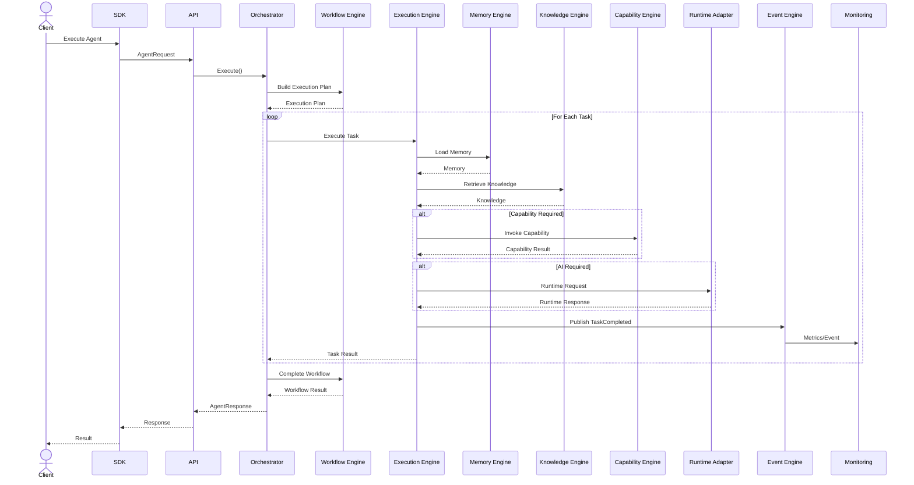

# MMOS v1.0 — Agent Execution Sequence

Version: 1.0

Status: REFERENCE

---

# 1. Purpose

Dokumen ini menjelaskan urutan eksekusi (execution sequence) ketika sebuah
Agent dijalankan di dalam MMOS.

Dokumen ini merupakan referensi implementasi yang diturunkan dari:

- MAS-200 Execution Model
- MAS-300 Engine Architecture
- MAS-400 Orchestrator
- MAS-600 Agent Architecture
- MAS-700 AI Runtime
- IMS-200 Agent Specification
- IMS-300 Workflow Specification
- IMS-400 Execution Specification

Dokumen ini tidak mendefinisikan perilaku baru.

---

# 2. Overview

Agent Execution merupakan alur utama MMOS.

Secara umum urutannya adalah:

```
Client

↓

Orchestrator

↓

Workflow Engine

↓

Execution Engine

↓

Memory / Capability / Runtime

↓

Execution Result

↓

Workflow Completion

↓

Client Response
```

---

# 3. High-Level Sequence



---

# 4. Participants

| Component | Responsibility |
|------------|----------------|
| Client | Mengirim permintaan |
| SDK | SDK resmi MMOS |
| API | Transport Layer |
| Orchestrator | Mengoordinasikan seluruh proses |
| Workflow Engine | Menyusun Execution Plan |
| Execution Engine | Menjalankan Task |
| Memory Engine | Mengelola Memory |
| Knowledge Engine | Mengambil Knowledge |
| Capability Engine | Menjalankan Capability |
| Runtime Adapter | Menghubungkan AI Provider |
| Event Engine | Mengelola Event |
| Monitoring | Observability |

---

# 5. Step-by-Step Execution

## Step 1 — Client Request

Client mengirim:

```
AgentRequest
```

Berisi:

- Agent ID
- Input
- Context
- Metadata

---

## Step 2 — API Validation

API melakukan:

- Authentication
- Authorization
- Contract Validation

Jika valid, request diteruskan ke Orchestrator.

---

## Step 3 — Create Execution Context

Orchestrator membuat:

```
ExecutionContext
```

Meliputi:

- Correlation ID
- Execution ID
- Workspace
- Agent
- Variables
- Policies

Execution Context digunakan oleh seluruh Engine.

---

## Step 4 — Build Execution Plan

Workflow Engine:

- membaca Workflow
- memvalidasi Workflow
- mengevaluasi dependency
- menentukan urutan Task

Output:

```
ExecutionPlan
```

---

## Step 5 — Execute Task

Untuk setiap Task:

Execution Engine:

- membuat Task Execution
- mengubah status menjadi Running
- mempersiapkan Runtime Context

---

## Step 6 — Load Memory

Jika diperlukan:

Execution Engine meminta:

```
Memory Engine
```

untuk mengambil:

- Session Memory
- Working Memory
- Long-Term Memory

---

## Step 7 — Retrieve Knowledge

Jika Task menggunakan Knowledge:

Execution Engine meminta:

```
Knowledge Engine
```

melakukan:

- Semantic Search
- Ranking
- Retrieval

---

## Step 8 — Invoke Capability

Jika Task membutuhkan layanan eksternal.

Execution Engine memanggil:

```
Capability Engine
```

Capability dapat berupa:

- HTTP
- Database
- File
- Email
- Queue

---

## Step 9 — Runtime Execution

Jika Task membutuhkan AI.

Execution Engine membuat:

```
RuntimeRequest
```

Runtime Adapter:

- memilih provider
- memetakan request
- memanggil provider
- memetakan response

---

## Step 10 — Produce Task Result

Execution Engine menghasilkan:

```
TaskResult
```

Berisi:

- Output
- Status
- Metrics
- Metadata

---

## Step 11 — Publish Event

Execution Engine menerbitkan:

- TaskStarted
- TaskCompleted
- TaskFailed

Event dikirim ke Event Engine.

---

## Step 12 — Monitoring

Monitoring menerima:

- Metrics
- Trace
- Audit
- Logs

Monitoring tidak memengaruhi eksekusi.

---

## Step 13 — Continue Workflow

Workflow Engine menentukan:

- Task berikutnya
- Branch berikutnya
- Loop berikutnya

Jika Workflow selesai:

```
WorkflowCompleted
```

---

## Step 14 — Agent Response

Orchestrator menyusun:

```
AgentResponse
```

Lalu mengirim kembali ke Client.

---

# 6. Execution Loop

Diagram berikut menggambarkan iterasi setiap Task.

```mermaid
flowchart TD

Start

↓

GetNextTask

↓

ExecuteTask

↓

TaskCompleted

↓

Decision{More Tasks?}

Decision -->|Yes| GetNextTask

Decision -->|No| WorkflowCompleted
```

---

# 7. Parallel Execution

Jika Workflow memiliki Parallel Task.

```mermaid
flowchart LR

TaskA

TaskB

TaskC

↓

Execution Engine

↓

Join

↓

Next Task
```

Execution Engine bertanggung jawab melakukan sinkronisasi.

---

# 8. Error Handling

Jika terjadi kegagalan.

```mermaid
flowchart TD

Task

↓

Error

↓

Retry?

Retry? -->|Yes| Retry

Retry --> Task

Retry? -->|No| Failed
```

Retry mengikuti Workflow Policy.

---

# 9. Cancellation

Execution dapat dibatalkan.

Sumber pembatalan:

- User
- Timeout
- Policy
- System Failure

Execution Engine:

- menghentikan Task
- membatalkan Runtime
- menerbitkan Event

---

# 10. Timeout

Timeout dapat diterapkan pada:

- Workflow
- Task
- Capability
- Runtime

Timeout menghasilkan:

```
ExecutionTimeout
```

---

# 11. Event Timeline

```
AgentStarted

↓

WorkflowStarted

↓

TaskStarted

↓

MemoryLoaded

↓

KnowledgeRetrieved

↓

CapabilityInvoked

↓

RuntimeCompleted

↓

TaskCompleted

↓

WorkflowCompleted

↓

AgentCompleted
```

---

# 12. Object Evolution

Selama Agent berjalan:

```
Agent

↓

Workflow

↓

Execution

↓

Task

↓

Runtime

↓

TaskResult

↓

WorkflowResult

↓

AgentResponse
```

---

# 13. Engine Interaction Matrix

| Engine | Read | Write |
|----------|------|-------|
| Workflow | Workflow | Execution Plan |
| Execution | Execution | Task Result |
| Memory | Memory | Memory |
| Knowledge | Knowledge | — |
| Capability | Resource | External Resource |
| Runtime | Runtime Request | Runtime Response |
| Event | Event | Event |
| Monitoring | Metrics | Metrics Store |

---

# 14. State Transition

Execution mengikuti state berikut.

```text
Created

↓

Scheduled

↓

Running

↓

Waiting (optional)

↓

Completed
```

Jika gagal:

```
Running

↓

Failed

↓

Retry

↓

Running
```

---

# 15. Performance Considerations

Execution Engine sebaiknya mendukung:

- Parallel Execution
- Streaming Response
- Lazy Memory Loading
- Capability Pooling
- Runtime Connection Reuse

Seluruh optimisasi tidak boleh mengubah kontrak MMOS.

---

# 16. Design Principles

Sequence ini mengikuti prinsip:

- Orchestrator Coordinates
- Engine Does the Work
- Event Driven
- Runtime Independent
- Loose Coupling
- Contract First
- Stateless Execution
- Observable System

---

# 17. Reference Documents

Dokumen ini diturunkan dari:

- MAS-200 Execution Model
- MAS-300 Engine Architecture
- MAS-400 Orchestrator
- MAS-600 Agent Architecture
- MAS-700 AI Runtime
- IMS-200 Agent Specification
- IMS-300 Workflow Specification
- IMS-400 Execution Specification
- object-relationship.md
- runtime-overview.md

---

# END