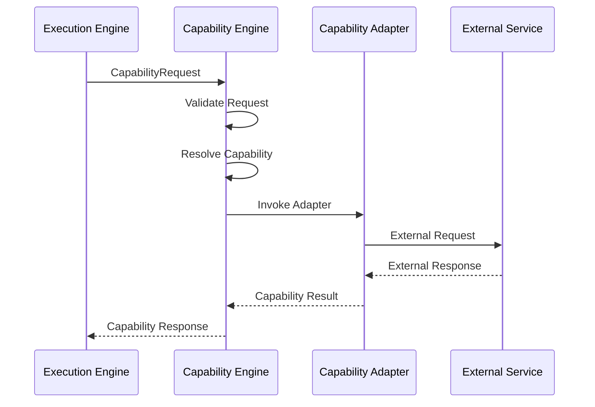
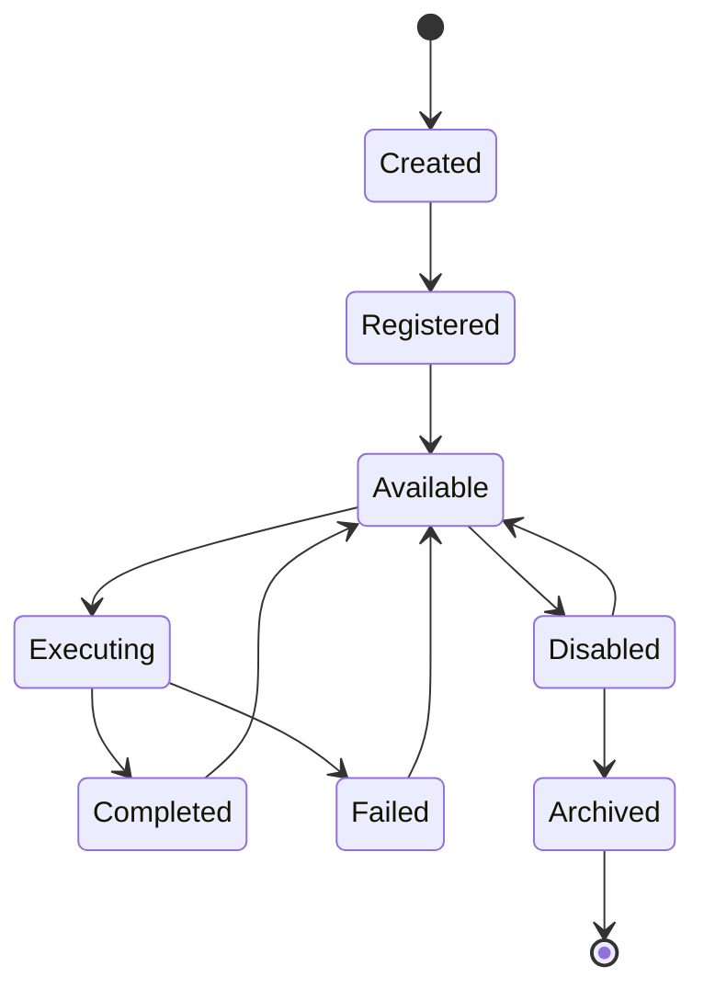
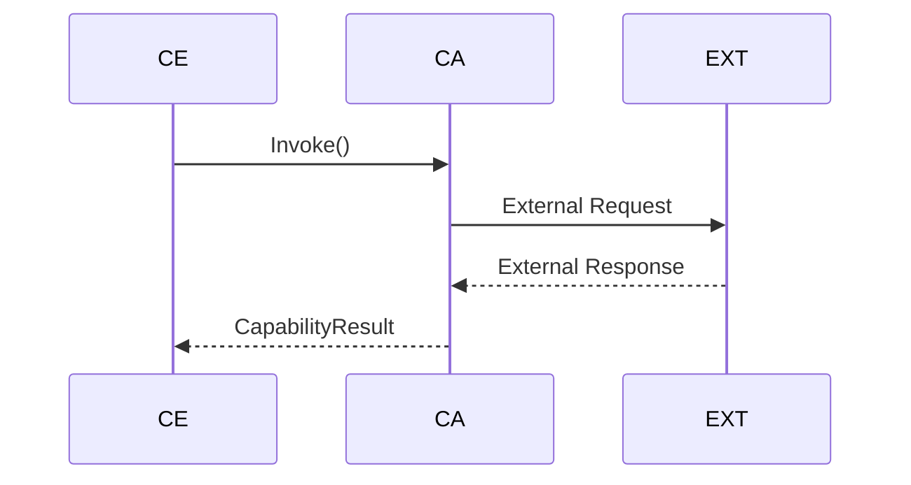
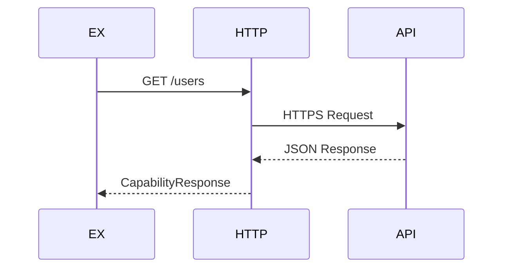
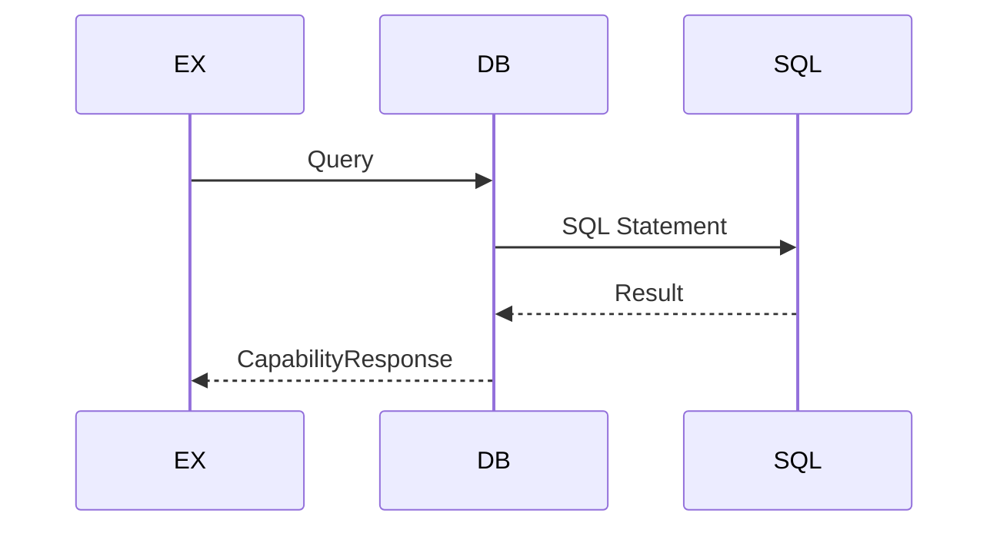
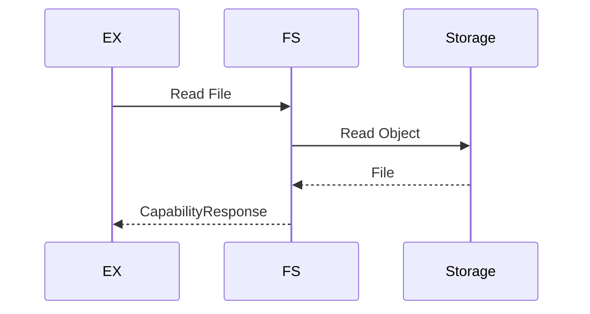
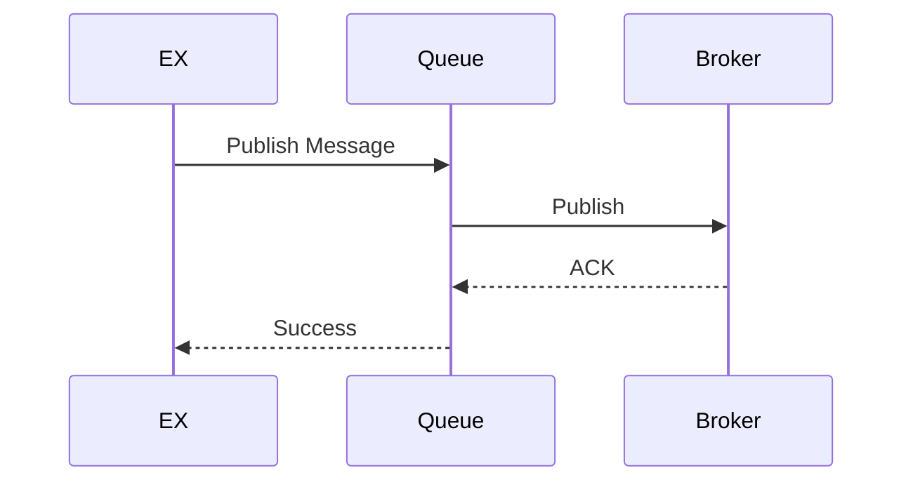
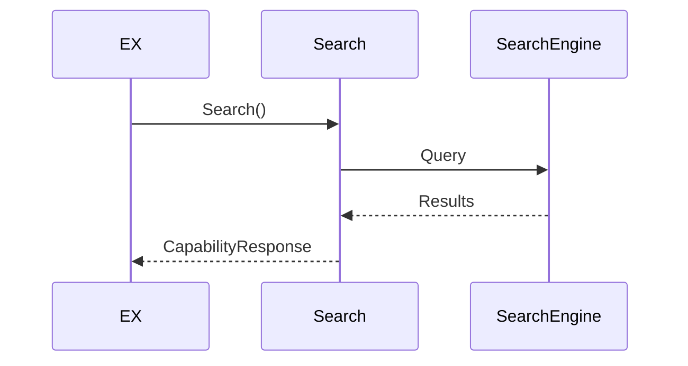
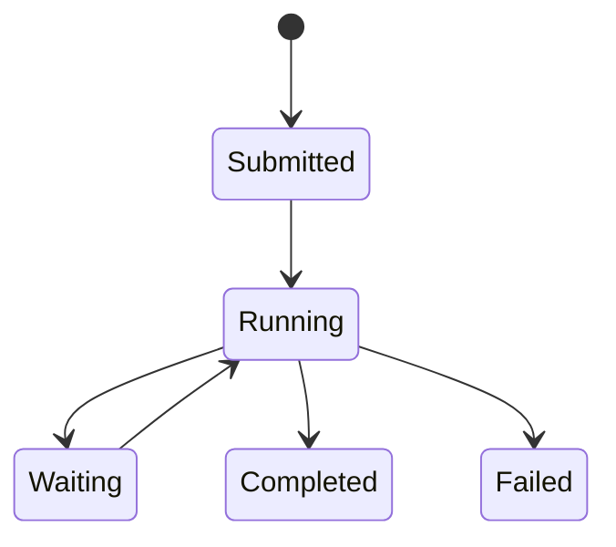
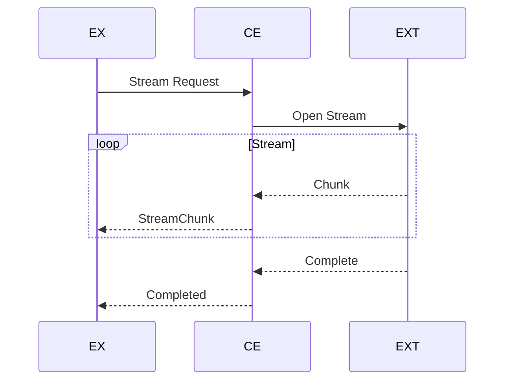

# MMOS v1.0 — Capability Call Sequence

Version: 1.0

Status: REFERENCE

---

# 1. Purpose

Dokumen ini menjelaskan urutan komunikasi antara Execution Engine,
Capability Engine, dan layanan eksternal (External Services).

Capability Engine merupakan abstraksi resmi MMOS terhadap seluruh layanan
di luar platform, sehingga Workflow maupun Execution tidak pernah
bergantung pada implementasi teknologi tertentu.

Dokumen ini diturunkan dari:

- MAS-300 Engine Architecture
- MAS-600 Agent Architecture
- IMS-400 Execution Specification
- IMS-600 Capability Specification

Dokumen ini tidak mendefinisikan spesifikasi baru.

---

# 2. Capability Position

Capability berada di antara Execution Engine dan External Resource.

```
Execution Engine

↓

Capability Engine

↓

Capability Adapter

↓

External Service
```

Execution Engine tidak pernah mengakses resource secara langsung.

---

# 3. High-Level Sequence



---

# 4. Capability Lifecycle



Capability merupakan komponen reusable.

---

# 5. Capability Request

Execution Engine mengirim:

```
CapabilityRequest
```

Minimal berisi:

- Capability ID
- Capability Type
- Execution ID
- Input
- Context
- Metadata
- Policy

Capability Request bersifat implementation-independent.

---

# 6. Capability Validation

Capability Engine memvalidasi:

- Capability tersedia
- Input Schema
- Authorization
- Permission
- Resource Binding
- Execution Policy

Jika gagal:

```
CapabilityValidationError
```

---

# 7. Capability Resolution

Capability Engine menentukan adapter yang akan digunakan.

Contoh:

```
HTTP Capability

↓

HTTP Adapter
```

atau

```
Database Capability

↓

SQL Adapter
```

atau

```
Email Capability

↓

SMTP Adapter
```

---

# 8. Capability Adapter

Setiap Capability memiliki adapter tersendiri.

```
capability/

├── http/
├── database/
├── filesystem/
├── email/
├── queue/
├── storage/
├── search/
├── ocr/
└── custom/
```

Adapter bertugas menerjemahkan kontrak MMOS ke implementasi teknis.

---

# 9. External Invocation



Capability Adapter hanya mengetahui satu jenis layanan.

---

# 10. Capability Response

Capability Engine menghasilkan:

```
CapabilityResponse
```

Berisi:

- Status
- Output
- Metadata
- Metrics
- Resource Information

Execution Engine selalu menerima format yang seragam.

---

# 11. HTTP Capability

Contoh alur HTTP.



Workflow tidak mengetahui bahwa komunikasi dilakukan melalui HTTP.

---

# 12. Database Capability



Database Engine tidak terekspos ke Workflow.

---

# 13. File Capability



---

# 14. Queue Capability



---

# 15. Search Capability



---

# 16. Long Running Capability

Capability dapat berjalan lama.



Execution Engine dapat melanjutkan monitoring berdasarkan Capability ID.

---

# 17. Retry Strategy

Retry dilakukan sesuai Capability Policy.

```mermaid
flowchart TD

Invoke

↓

Failed

↓

Retry?

Retry? -->|Yes| Retry

Retry --> Invoke

Retry? -->|No| Failed
```

Retry hanya dilakukan pada error yang dapat dipulihkan.

---

# 18. Timeout Handling

Timeout dapat diterapkan pada:

- HTTP Request
- Database Query
- File Access
- Queue Publish
- Search Request

Timeout menghasilkan:

```
CapabilityTimeout
```

---

# 19. Error Translation

Capability Adapter menerjemahkan error eksternal.

```
Database Error

↓

CapabilityError

HTTP Error

↓

CapabilityError

SMTP Error

↓

CapabilityError
```

Execution Engine tidak mengetahui error asli provider.

---

# 20. Streaming Capability

Capability dapat mengirim data secara streaming.



---

# 21. Capability Events

Capability menghasilkan Event.

```
CapabilityInvoked

↓

CapabilityExecuting

↓

CapabilityCompleted
```

Jika gagal:

```
CapabilityFailed
```

Seluruh Event dikirim ke Event Engine.

---

# 22. Metrics Collection

Capability menghasilkan Metrics.

Contoh:

- Request Count
- Success Count
- Failure Count
- Average Latency
- Timeout Count
- Retry Count
- Resource Usage

Monitoring Engine mengumpulkan seluruh Metrics.

---

# 23. Capability Isolation

Capability tidak mengetahui:

- Workflow
- Agent
- Runtime
- AI Provider

Capability hanya mengenal:

- CapabilityRequest
- CapabilityResponse
- Resource

---

# 24. Security Layer

Capability Engine bertanggung jawab terhadap:

- Authentication
- Authorization
- Secret Resolution
- Credential Injection
- Access Policy
- Audit Logging

Credential tidak pernah diteruskan ke Workflow.

---

# 25. Resource Binding

Capability dapat diikat ke Resource tertentu.

Contoh:

```
Capability

↓

Database Resource

↓

Production PostgreSQL
```

atau

```
Capability

↓

Storage Resource

↓

S3 Bucket
```

Binding dilakukan saat konfigurasi, bukan saat Workflow berjalan.

---

# 26. Parallel Capability Execution

Execution Engine dapat menjalankan beberapa Capability secara paralel.

```mermaid
flowchart TD

Task

↓

Capability A

Capability B

Capability C

↓

Join

↓

Task Completed
```

Sinkronisasi dilakukan oleh Execution Engine.

---

# 27. Design Principles

Capability Call mengikuti prinsip:

- Capability Abstraction
- Adapter Pattern
- Contract First
- Loose Coupling
- Resource Isolation
- Replaceable Implementation
- Observable Execution
- Stateless Invocation

---

# 28. Reference Documents

Dokumen ini diturunkan dari:

- MAS-300 Engine Architecture
- IMS-400 Execution Specification
- IMS-600 Capability Specification
- capability-catalog.md
- runtime-overview.md
- runtime-call.md
- workflow-execution.md

---

# END