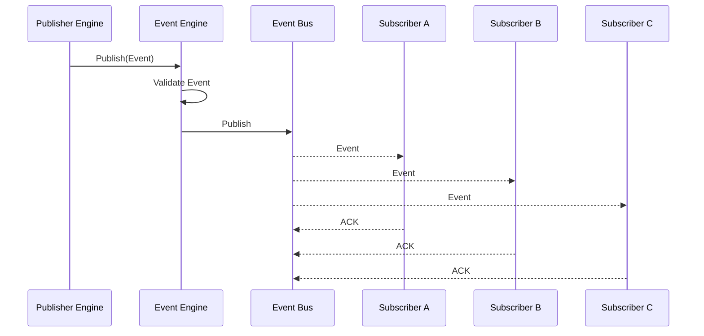
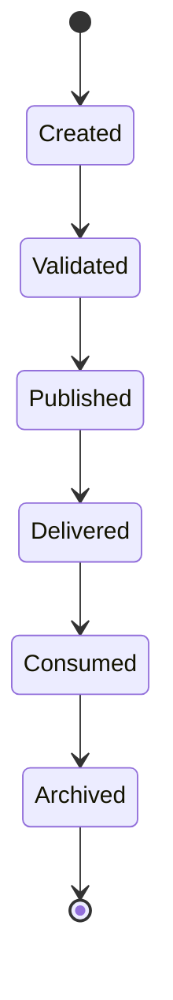
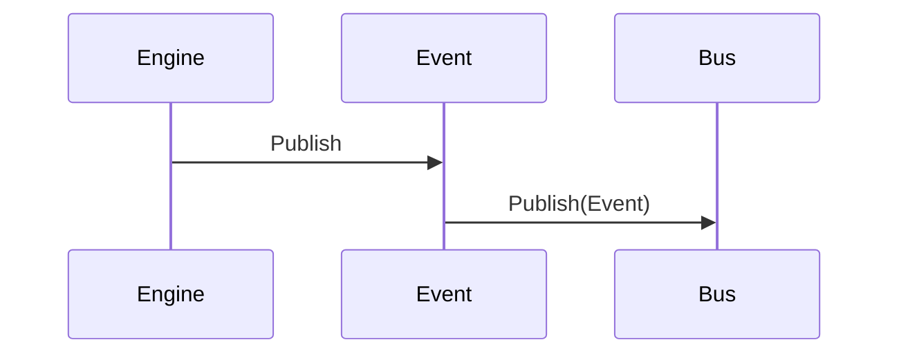
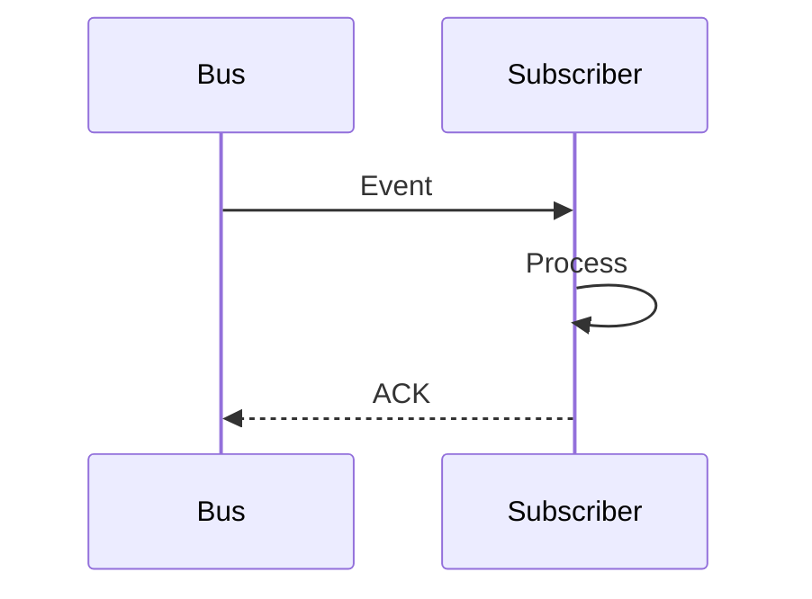

# MMOS v1.0 — Event Flow Sequence

Version: 1.0

Status: REFERENCE

---

# 1. Purpose

Dokumen ini menjelaskan bagaimana Event mengalir di dalam MMOS.

Event merupakan mekanisme komunikasi asynchronous antar Engine
sehingga setiap Engine tetap independen (loosely coupled).

Dokumen ini diturunkan dari:

- MAS-300 Engine Architecture
- MAS-400 Orchestrator
- MAS-800 Platform
- IMS-800 Event Specification

Dokumen ini tidak mendefinisikan perilaku baru.

---

# 2. Event Philosophy

MMOS menggunakan arsitektur Event-Driven.

Prinsip utama:

- Engine tidak saling bergantung secara langsung
- Event bersifat immutable
- Event dapat memiliki banyak subscriber
- Publisher tidak mengetahui subscriber
- Subscriber tidak mengetahui publisher

---

# 3. Event Position

```
Workflow Engine

Execution Engine

Memory Engine

Capability Engine

Runtime Adapter

Monitoring

↓

Event Engine

↓

Event Bus

↓

Subscribers
```

Semua Event melewati Event Engine.

---

# 4. High-Level Sequence



---

# 5. Event Lifecycle



Event bersifat immutable.

---

# 6. Event Structure

Setiap Event minimal memiliki:

```
Event ID

Event Type

Timestamp

Source

Correlation ID

Execution ID

Workspace ID

Payload

Metadata
```

Seluruh Event mengikuti kontrak resmi MMOS.

---

# 7. Event Creation

Engine membuat Event.

Contoh:

```
TaskCompleted
```

atau

```
RuntimeStarted
```

atau

```
MemoryWriteCompleted
```

Engine hanya membuat Event.

Engine tidak mengirim langsung ke subscriber.

---

# 8. Event Validation

Event Engine melakukan validasi.

Meliputi:

- Schema
- Version
- Required Field
- Event Type
- Metadata

Jika gagal:

```
InvalidEvent
```

---

# 9. Publish Event

Jika valid.



Publisher selesai setelah Event diterima Event Engine.

---

# 10. Event Bus

Event Bus bertanggung jawab terhadap:

- Routing
- Fan-out
- Delivery
- Retry
- Ordering (jika diperlukan)

Implementasi dapat berupa:

- Kafka
- RabbitMQ
- NATS
- Pulsar
- Redis Streams
- Cloud Event Bus

Implementasi tidak memengaruhi kontrak MMOS.

---

# 11. Event Subscription

Subscriber mendaftarkan Event yang diminati.

Contoh:

```
Monitoring

↓

TaskCompleted

↓

MemoryUpdated

↓

RuntimeCompleted
```

Publisher tidak mengetahui Subscription.

---

# 12. Fan-Out

Satu Event dapat dikirim ke banyak Subscriber.

```mermaid
flowchart TD

Event

↓

Bus

↓

Subscriber A

Subscriber B

Subscriber C

Subscriber D
```

---

# 13. Event Ordering

MMOS tidak menjamin Global Ordering.

Ordering hanya berlaku jika:

- Workspace sama
- Execution sama
- Partition sama

Ordering di luar itu bergantung implementasi Event Bus.

---

# 14. Event Delivery

Delivery dapat berupa:

- At Most Once
- At Least Once
- Exactly Once (jika didukung)

Policy ditentukan Platform.

---

# 15. Retry Strategy

Jika Subscriber gagal.

```mermaid
flowchart TD

Event

↓

Delivery Failed

↓

Retry

↓

Subscriber

↓

Success
```

Retry mengikuti Event Policy.

---

# 16. Dead Letter Queue

Jika Retry gagal.

```
Event

↓

Retry

↓

Dead Letter Queue
```

DLQ memungkinkan investigasi tanpa kehilangan Event.

---

# 17. Event Consumption

Subscriber menerima Event.



Subscriber tidak boleh mengubah Event.

---

# 18. Event Categories

MMOS memiliki beberapa kategori Event.

### Workflow Event

- WorkflowStarted
- WorkflowCompleted
- WorkflowFailed

---

### Task Event

- TaskStarted
- TaskCompleted
- TaskFailed

---

### Runtime Event

- RuntimeStarted
- RuntimeCompleted
- RuntimeFailed

---

### Capability Event

- CapabilityInvoked
- CapabilityCompleted
- CapabilityFailed

---

### Memory Event

- MemoryReadCompleted
- MemoryWriteCompleted
- MemoryUpdated

---

### System Event

- WorkspaceCreated
- AgentRegistered
- PolicyUpdated

---

# 19. Correlation

Seluruh Event membawa:

```
Correlation ID
```

Contoh:

```
WorkflowStarted

↓

TaskStarted

↓

RuntimeStarted

↓

RuntimeCompleted

↓

TaskCompleted

↓

WorkflowCompleted
```

Seluruh Event memiliki Correlation ID yang sama.

---

# 20. Event Trace

Trace dibangun dari Event.

```
Execution

↓

Task

↓

Runtime

↓

Capability

↓

Memory

↓

Workflow
```

Monitoring dapat membangun Timeline lengkap.

---

# 21. Event Persistence

Platform dapat menyimpan Event.

Tujuan:

- Audit
- Replay
- Analytics
- Debugging

Retention mengikuti Platform Policy.

---

# 22. Event Replay

Jika diperlukan.

```
Archived Event

↓

Replay

↓

Subscriber
```

Replay tidak mengubah Event asli.

---

# 23. Event Security

Event Engine bertanggung jawab terhadap:

- Authentication
- Authorization
- Encryption
- Workspace Isolation
- Event Validation

Subscriber hanya menerima Event yang diizinkan.

---

# 24. Event Metrics

Event Engine menghasilkan Metrics.

Contoh:

- Published Events
- Delivered Events
- Failed Deliveries
- Retry Count
- DLQ Count
- Average Delivery Time
- Subscriber Count

Monitoring mengumpulkan seluruh Metrics.

---

# 25. Event Isolation

Event Engine tidak mengetahui:

- Workflow Logic
- Runtime Logic
- Memory Implementation
- Capability Implementation

Event Engine hanya mengenal:

- Event
- Subscriber
- Publisher
- Event Bus

---

# 26. Event Design Principles

Event Flow mengikuti prinsip:

- Event Driven
- Immutable Event
- Loose Coupling
- Publisher Independent
- Subscriber Independent
- Observable Platform
- Replayable
- Auditable

---

# 27. Relationship with Other Engines

| Engine | Publish | Subscribe |
|----------|---------|-----------|
| Orchestrator | ✓ | ✓ |
| Workflow Engine | ✓ | ✓ |
| Execution Engine | ✓ | ✓ |
| Runtime Adapter | ✓ | ✓ |
| Capability Engine | ✓ | ✓ |
| Memory Engine | ✓ | ✓ |
| Monitoring Engine | — | ✓ |
| Audit Engine | — | ✓ |

Event Engine menjadi pusat komunikasi asynchronous seluruh platform.

---

# 28. Complete Event Timeline

```text
AgentStarted

↓

WorkflowStarted

↓

TaskScheduled

↓

TaskStarted

↓

MemoryReadCompleted

↓

CapabilityInvoked

↓

CapabilityCompleted

↓

RuntimeStarted

↓

RuntimeCompleted

↓

MemoryWriteCompleted

↓

TaskCompleted

↓

WorkflowCompleted

↓

AgentCompleted
```

Timeline ini dapat direkonstruksi menggunakan Correlation ID.

---

# 29. Reference Documents

Dokumen ini diturunkan dari:

- MAS-300 Engine Architecture
- MAS-400 Orchestrator
- MAS-800 Platform
- IMS-800 Event Specification
- event-catalog.md
- engine-interaction.md
- agent-execution.md
- workflow-execution.md
- runtime-call.md
- capability-call.md
- memory-read.md
- memory-write.md

---

# END