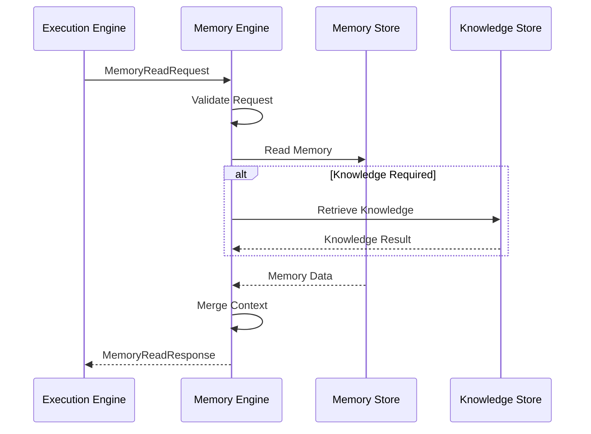
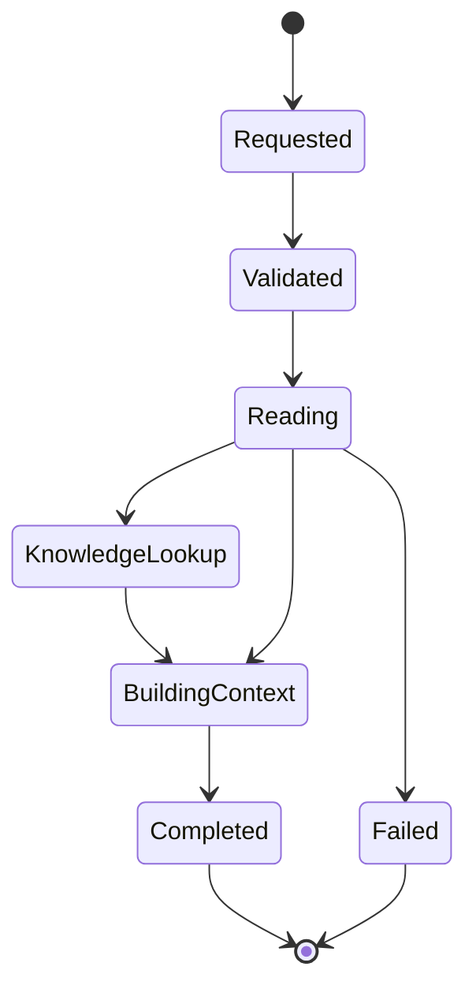
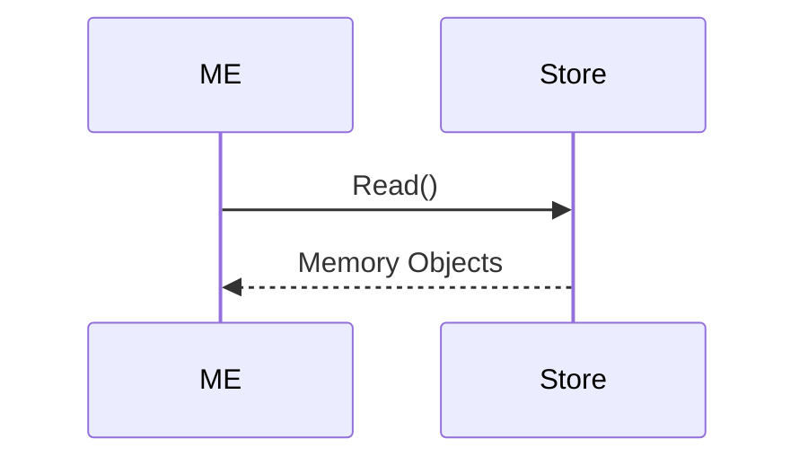
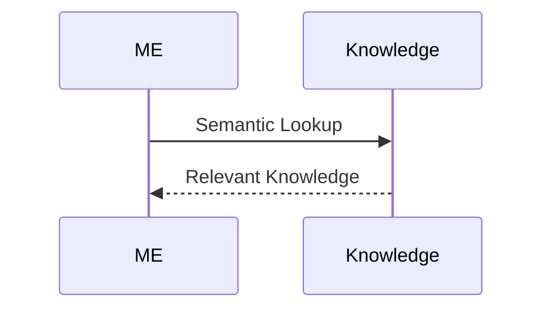

# MMOS v1.0 — Memory Read Sequence

Version: 1.0

Status: REFERENCE

---

# 1. Purpose

Dokumen ini menjelaskan proses pembacaan (read operation) Memory pada MMOS.

Memory Read merupakan mekanisme resmi bagi Execution Engine untuk memperoleh
informasi yang diperlukan selama proses eksekusi tanpa mengetahui bagaimana
Memory disimpan maupun diimplementasikan.

Dokumen ini diturunkan dari:

- MAS-300 Engine Architecture
- MAS-500 Memory & Knowledge
- IMS-400 Execution Specification
- IMS-500 Memory Specification

Dokumen ini tidak mendefinisikan spesifikasi baru.

---

# 2. Memory Read Position

```
Execution Engine

↓

Memory Engine

↓

Memory Store

↓

Knowledge Store (optional)

↓

Memory Result
```

Execution Engine tidak pernah membaca database secara langsung.

---

# 3. High-Level Sequence



---

# 4. Read Lifecycle



---

# 5. Memory Read Request

Execution Engine mengirim:

```
MemoryReadRequest
```

Minimal berisi:

- Execution ID
- Workspace ID
- Agent ID
- Memory Scope
- Query
- Context
- Metadata

---

# 6. Request Validation

Memory Engine memvalidasi:

- Workspace
- Agent
- Memory Scope
- Permission
- Version
- Schema

Jika gagal:

```
MemoryValidationError
```

---

# 7. Memory Scope Resolution

Memory Engine menentukan ruang lingkup Memory.

Scope yang didukung:

```
Session Memory

Working Memory

Long-Term Memory

Shared Memory
```

Satu Request dapat mengakses lebih dari satu Scope.

---

# 8. Session Memory

Session Memory digunakan untuk informasi selama satu sesi.

Contoh:

- Conversation History
- Runtime Variables
- Temporary State

Lifecycle pendek.

---

# 9. Working Memory

Working Memory menyimpan data selama Workflow berjalan.

Contoh:

- Intermediate Result
- Temporary Object
- Loop Variable
- Branch State

Lifecycle mengikuti Workflow.

---

# 10. Long-Term Memory

Long-Term Memory menyimpan informasi permanen.

Contoh:

- User Preference
- Learned Fact
- Historical Data
- Persistent Configuration

Lifecycle independen terhadap Workflow.

---

# 11. Shared Memory

Shared Memory dapat digunakan oleh beberapa Agent.

Contoh:

```
Workspace

↓

Shared Memory

↓

Agent A

Agent B

Agent C
```

Hak akses ditentukan oleh Workspace Policy.

---

# 12. Memory Store Access

Memory Engine membaca dari Memory Store.



Implementasi dapat berupa:

- PostgreSQL
- Redis
- MongoDB
- DynamoDB
- In-Memory Cache

---

# 13. Knowledge Enrichment

Jika diperlukan, Memory Engine melakukan enrichment.



Knowledge bukan bagian dari Memory tetapi dapat digunakan untuk melengkapi Context.

---

# 14. Context Building

Memory Engine membangun Context.

Input:

- Session Memory
- Working Memory
- Long-Term Memory
- Knowledge

Output:

```
Execution Context
```

Execution Context bersifat sementara.

---

# 15. Memory Read Response

Memory Engine menghasilkan:

```
MemoryReadResponse
```

Berisi:

- Context
- Memory Objects
- Metadata
- Version
- Metrics

---

# 16. Cache Strategy

Memory Engine dapat menggunakan Cache.

```mermaid
flowchart LR

Request

↓

Cache

Cache -->|Hit| Response

Cache -->|Miss| Memory Store

Memory Store --> Cache

Cache --> Response
```

Cache merupakan optimisasi implementasi.

---

# 17. Read Consistency

Memory Engine menjamin:

- Object Identity
- Version Consistency
- Snapshot Consistency
- Read Isolation

Implementasi penyimpanan dapat berbeda tetapi kontrak tetap sama.

---

# 18. Parallel Read

Memory Engine dapat membaca beberapa Memory secara paralel.

```mermaid
flowchart TD

Read Request

↓

Session

Working

Long-Term

↓

Merge

↓

Response
```

---

# 19. Read Failure

Jika pembacaan gagal.

```mermaid
flowchart TD

Read

↓

Error

↓

Retry?

Retry --> Read

Retry --> Failed
```

Retry mengikuti Memory Policy.

---

# 20. Memory Events

Memory Engine menghasilkan Event.

```
MemoryReadStarted

↓

MemoryReadCompleted
```

Jika gagal:

```
MemoryReadFailed
```

Event dikirim ke Event Engine.

---

# 21. Metrics Collection

Memory Read menghasilkan Metrics.

Contoh:

- Read Count
- Cache Hit
- Cache Miss
- Read Latency
- Memory Size
- Retrieved Objects

Monitoring Engine mengumpulkan seluruh Metrics.

---

# 22. Security

Memory Engine melakukan:

- Authorization
- Scope Validation
- Workspace Isolation
- Object Permission

Execution Engine tidak menangani keamanan Memory.

---

# 23. Isolation Rules

Memory Engine tidak mengetahui:

- Workflow Logic
- Runtime Provider
- Capability Implementation

Memory Engine hanya mengenal:

- Memory Request
- Memory Object
- Memory Store
- Knowledge Engine

---

# 24. Design Principles

Memory Read mengikuti prinsip:

- Contract First
- Memory Abstraction
- Context Composition
- Read Consistency
- Workspace Isolation
- Stateless Engine
- Observable Operation
- Implementation Independent

---

# 25. Reference Documents

Dokumen ini diturunkan dari:

- MAS-500 Memory & Knowledge
- IMS-500 Memory Specification
- memory-overview (MAS)
- object-relationship.md
- object-lifecycle.md
- workflow-execution.md

---

# END