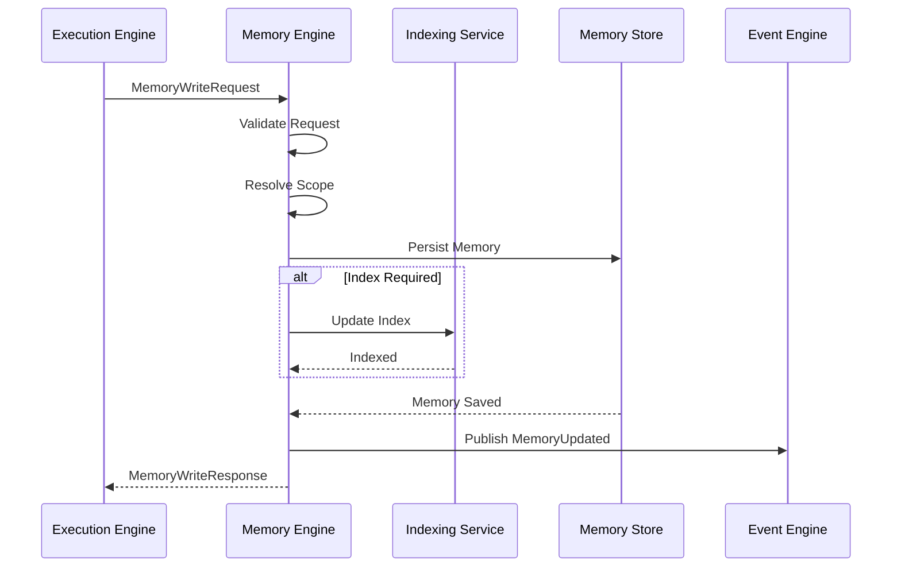
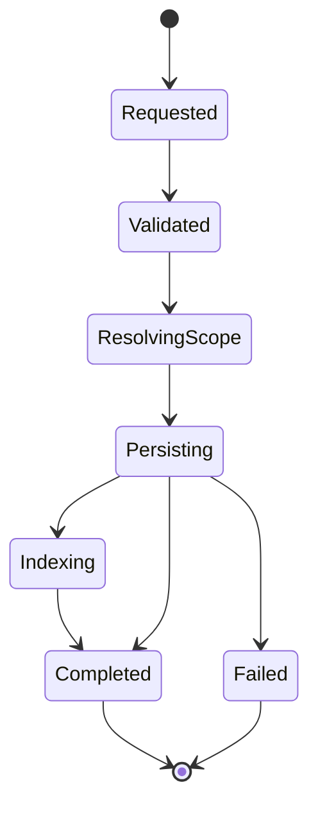
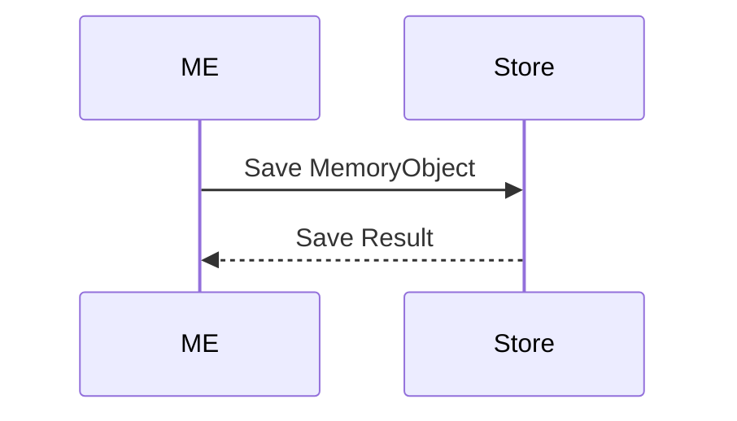

# MMOS v1.0 — Memory Write Sequence

Version: 1.0

Status: REFERENCE

---

# 1. Purpose

Dokumen ini menjelaskan proses penulisan (write operation) Memory pada MMOS.

Memory Write merupakan mekanisme resmi untuk menyimpan hasil Execution,
mengubah Context, memperbarui Memory, serta membangun Long-Term Knowledge
tanpa membuat Execution Engine bergantung pada implementasi Storage.

Dokumen ini diturunkan dari:

- MAS-300 Engine Architecture
- MAS-500 Memory & Knowledge
- IMS-400 Execution Specification
- IMS-500 Memory Specification

Dokumen ini tidak mendefinisikan spesifikasi baru.

---

# 2. Memory Write Position

```
Execution Engine

↓

Memory Engine

↓

Memory Store

↓

Indexing (optional)

↓

Memory Updated
```

Execution Engine tidak pernah menulis langsung ke Storage.

---

# 3. High-Level Sequence



---

# 4. Write Lifecycle



---

# 5. Memory Write Request

Execution Engine mengirim:

```
MemoryWriteRequest
```

Minimal berisi:

- Execution ID
- Workspace ID
- Agent ID
- Memory Scope
- Memory Object
- Metadata
- Write Policy

---

# 6. Request Validation

Memory Engine melakukan validasi:

- Workspace
- Ownership
- Permission
- Object Schema
- Object Version
- Write Policy

Jika gagal:

```
MemoryWriteRejected
```

---

# 7. Scope Resolution

Memory Engine menentukan tujuan penyimpanan.

Scope yang didukung:

- Session Memory
- Working Memory
- Long-Term Memory
- Shared Memory

Scope ditentukan oleh Workflow Policy maupun Agent Policy.

---

# 8. Session Memory Write

Session Memory digunakan untuk informasi sementara.

Contoh:

- Conversation History
- Temporary Variables
- Runtime State

Lifecycle mengikuti Session.

---

# 9. Working Memory Write

Working Memory menyimpan hasil selama Workflow berlangsung.

Contoh:

- Intermediate Result
- Tool Output
- Runtime Variable
- Branch State
- Loop State

Lifecycle mengikuti Workflow.

---

# 10. Long-Term Memory Write

Long-Term Memory digunakan untuk informasi permanen.

Contoh:

- User Preference
- Learned Fact
- Business Data
- Persistent Context

Penulisan mengikuti Memory Policy.

---

# 11. Shared Memory Write

Shared Memory digunakan bersama beberapa Agent.

```
Workspace

↓

Shared Memory

↓

Agent A

Agent B

Agent C
```

Penulisan harus memenuhi Workspace Permission.

---

# 12. Persist Memory

Memory Engine menyimpan Object.



Implementasi dapat berupa:

- PostgreSQL
- Redis
- MongoDB
- Cassandra
- DynamoDB

Kontrak MMOS tetap sama.

---

# 13. Update Existing Memory

Jika Object sudah ada.

```
Read Current Version

↓

Validate Version

↓

Merge

↓

Save New Version
```

Update harus mengikuti Version Policy.

---

# 14. Versioning

Memory bersifat versioned.

```
Memory v1

↓

Memory v2

↓

Memory v3
```

Versi sebelumnya tetap dapat diaudit.

---

# 15. Merge Strategy

Memory Engine dapat melakukan:

- Replace
- Merge
- Append
- Patch

Strategi ditentukan oleh Write Policy.

---

# 16. Index Update

Jika Memory dapat dicari.

Memory Engine memperbarui Index.

```mermaid
flowchart LR

Memory Saved

↓

Index Update

↓

Search Index
```

Indexing bersifat asynchronous apabila diizinkan oleh Policy.

---

# 17. Consistency

Memory Engine menjamin:

- Atomic Write
- Version Consistency
- Ownership Integrity
- Metadata Integrity

---

# 18. Concurrent Write

Jika dua Execution menulis Memory yang sama.

```
Execution A

↓

Version Check

↓

Conflict?

↓

Merge / Reject
```

Strategi ditentukan oleh Conflict Resolution Policy.

---

# 19. Failure Handling

```mermaid
flowchart TD

Write

↓

Failed

↓

Retry?

Retry --> Write

Retry --> Failed
```

Retry hanya dilakukan untuk kesalahan yang dapat dipulihkan.

---

# 20. Transaction Boundary

Satu Memory Write dianggap berhasil apabila:

- Object berhasil disimpan
- Metadata berhasil diperbarui
- Version berhasil dibuat

Index Update dapat dilakukan setelah transaksi selesai apabila menggunakan asynchronous indexing.

---

# 21. Memory Events

Memory Engine menghasilkan Event.

```
MemoryWriteStarted

↓

MemoryPersisted

↓

MemoryIndexed

↓

MemoryWriteCompleted
```

Jika gagal:

```
MemoryWriteFailed
```

Seluruh Event dipublikasikan ke Event Engine.

---

# 22. Metrics Collection

Memory Write menghasilkan Metrics.

Contoh:

- Write Count
- Write Latency
- Updated Objects
- New Objects
- Version Count
- Conflict Count
- Retry Count

Monitoring Engine mengumpulkan seluruh Metrics.

---

# 23. Security

Memory Engine bertanggung jawab terhadap:

- Authorization
- Workspace Isolation
- Ownership Validation
- Write Permission
- Audit Logging

Credential Storage bukan tanggung jawab Execution Engine.

---

# 24. Isolation Rules

Memory Engine tidak mengetahui:

- Workflow Logic
- Runtime Provider
- Capability Implementation

Memory Engine hanya mengenal:

- Memory Object
- Storage
- Version
- Policy

---

# 25. Design Principles

Memory Write mengikuti prinsip:

- Contract First
- Versioned Objects
- Atomic Write
- Conflict Aware
- Workspace Isolation
- Observable Operation
- Stateless Engine
- Implementation Independent

---

# 26. Relationship with Other Components

| Component | Interaction |
|-----------|-------------|
| Execution Engine | Mengirim MemoryWriteRequest |
| Event Engine | Menerima Event |
| Monitoring Engine | Menerima Metrics |
| Storage | Menyimpan Memory |
| Knowledge Engine | Tidak dipanggil langsung saat Write normal |

Knowledge Engine hanya digunakan apabila Memory Policy mengharuskan pembentukan Knowledge baru.

---

# 27. Reference Documents

Dokumen ini diturunkan dari:

- MAS-500 Memory & Knowledge
- IMS-500 Memory Specification
- object-lifecycle.md
- object-relationship.md
- memory-read.md
- workflow-execution.md

---

# END