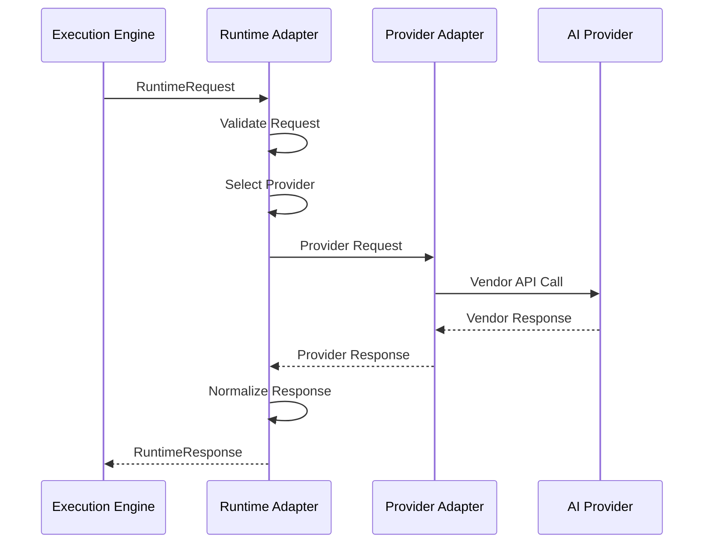
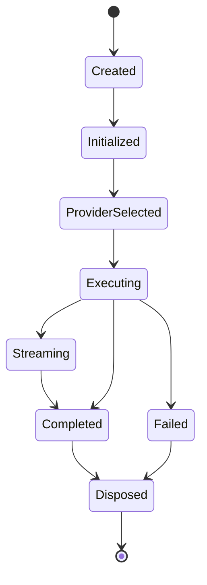
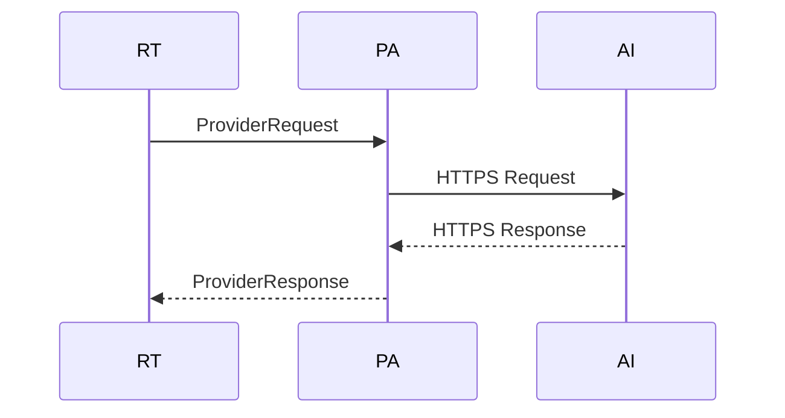
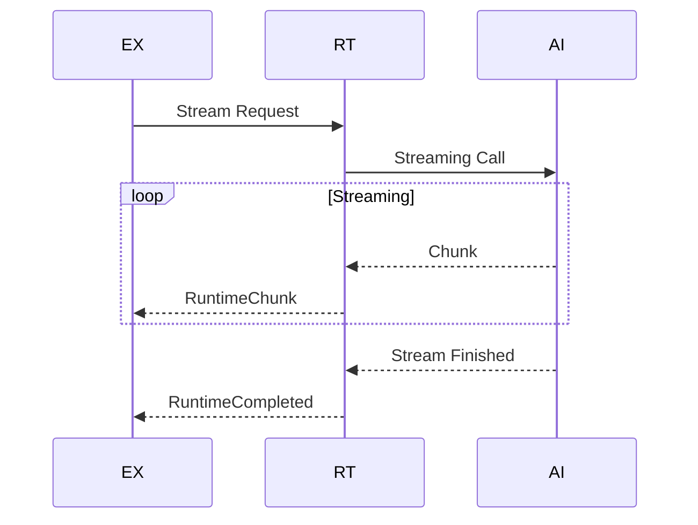
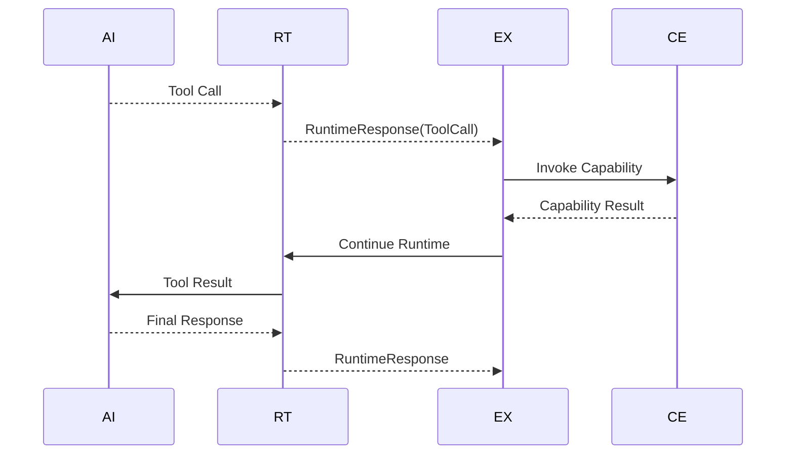
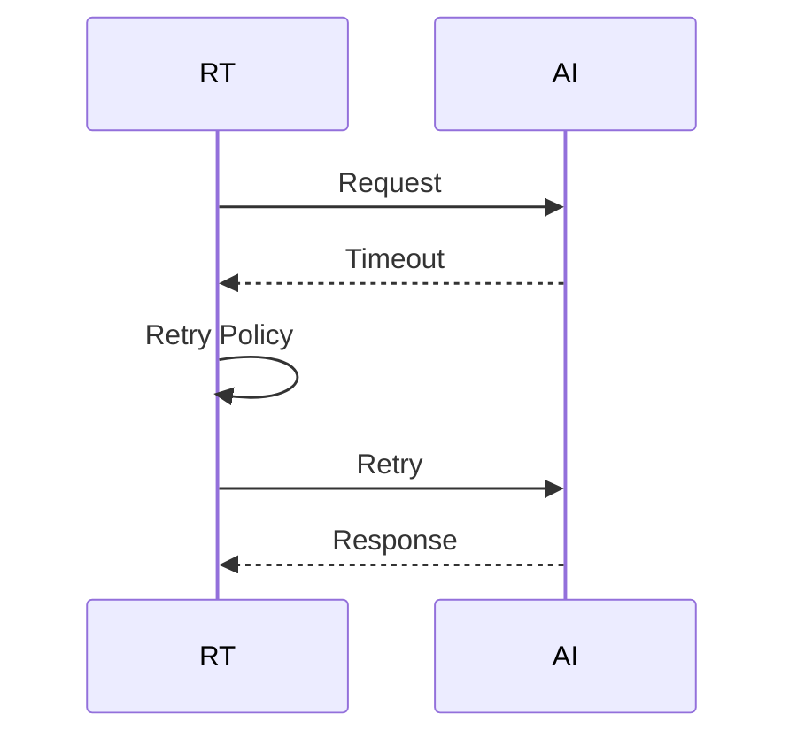
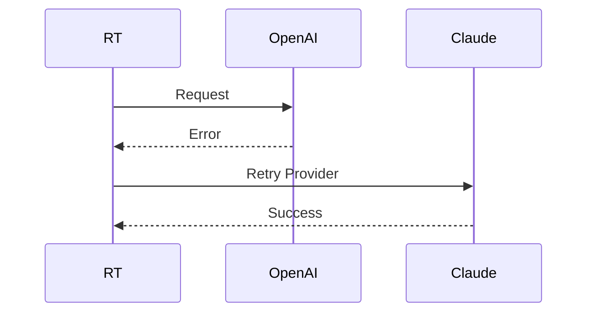
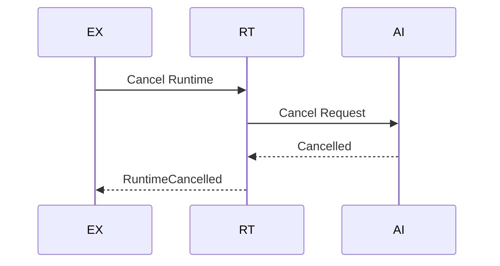

# MMOS v1.0 — Runtime Call Sequence

Version: 1.0

Status: REFERENCE

---

# 1. Purpose

Dokumen ini menjelaskan urutan komunikasi antara Execution Engine,
Runtime Adapter, dan AI Provider.

Dokumen ini menjadi referensi implementasi seluruh Runtime Adapter
MMOS.

Runtime merupakan lapisan abstraksi yang memastikan seluruh Engine
tetap independen terhadap vendor AI.

Dokumen ini diturunkan dari:

- MAS-300 Engine Architecture
- MAS-700 AI Runtime
- IMS-400 Execution Specification
- IMS-700 Runtime Specification

Dokumen ini tidak mendefinisikan perilaku baru.

---

# 2. Runtime Position

```
Execution Engine

↓

Runtime Adapter

↓

Provider Adapter

↓

AI Provider
```

Execution Engine tidak pernah memanggil AI Provider secara langsung.

---

# 3. High-Level Sequence



---

# 4. Runtime Lifecycle



Runtime bersifat ephemeral.

Satu Runtime Instance mengikuti satu Execution.

---

# 5. Runtime Request

Execution Engine mengirim:

```
RuntimeRequest
```

Berisi:

- Runtime ID
- Execution ID
- Workspace ID
- Model
- Messages
- Parameters
- Tools
- Metadata
- Policy

RuntimeRequest bersifat vendor-independent.

---

# 6. Request Validation

Runtime melakukan validasi:

- Required Field
- Message Format
- Parameter Range
- Tool Definition
- Runtime Policy
- Provider Availability

Jika gagal:

```
RuntimeValidationError
```

dikembalikan ke Execution Engine.

---

# 7. Provider Selection

Runtime memilih Provider.

Input yang digunakan:

- Workspace Policy
- Agent Policy
- Runtime Policy
- Preferred Model
- Availability
- Cost
- Latency
- Capability

Diagram:

```mermaid
flowchart LR

RuntimeRequest

↓

Provider Selector

↓

Provider Adapter
```

Output:

```
Selected Provider
```

---

# 8. Request Mapping

Runtime mengubah kontrak MMOS menjadi kontrak provider.

```
RuntimeRequest

↓

ProviderRequest
```

Contoh:

MMOS

↓

OpenAI Chat Completion

atau

↓

Claude Messages

atau

↓

Gemini GenerateContent

atau

↓

DeepSeek Chat

---

# 9. Provider Invocation

Provider Adapter mengirim request.



Provider Adapter hanya mengetahui satu provider.

---

# 10. Response Mapping

Provider Response diterjemahkan menjadi:

```
RuntimeResponse
```

Runtime memastikan seluruh provider menghasilkan format yang sama.

---

# 11. Runtime Response

Minimal berisi:

- Response ID
- Content
- Tool Calls
- Usage
- Finish Reason
- Metadata
- Raw Provider Metadata

Execution Engine tidak perlu memahami format vendor.

---

# 12. Streaming Sequence



Runtime bertanggung jawab melakukan normalisasi seluruh Streaming Chunk.

---

# 13. Tool Calling

Jika Provider menghasilkan Tool Call.



Runtime tidak pernah menjalankan Tool.

---

# 14. Multi-Turn Conversation

Runtime mendukung percakapan multi-turn.

```
Execution

↓

Runtime

↓

Conversation History

↓

Provider

↓

RuntimeResponse
```

History dikirim sebagai bagian RuntimeRequest.

Runtime tidak menyimpan Conversation State permanen.

---

# 15. Structured Output

Runtime dapat meminta:

- JSON Mode
- Schema Validation
- Structured Response

Jika provider tidak mendukung fitur tersebut,
Runtime dapat melakukan normalisasi setelah menerima response.

---

# 16. Retry Sequence

Jika provider gagal.



Retry hanya dilakukan sesuai Runtime Policy.

---

# 17. Failover Sequence

Jika provider gagal total.



Execution Engine tidak mengetahui proses failover.

---

# 18. Error Translation

Provider memiliki format Error berbeda.

Runtime menerjemahkan:

```
Provider Error

↓

Runtime Error
```

Kategori:

- Validation Error
- Authentication Error
- Authorization Error
- Timeout
- Rate Limit
- Service Unavailable
- Internal Error

---

# 19. Metrics Collection

Runtime menghasilkan Metrics.

Contoh:

- Request Count
- Completion Count
- Error Count
- Streaming Count
- Token Usage
- Latency
- Retry Count
- Failover Count

Seluruh Metrics dikirim ke Monitoring Engine.

---

# 20. Runtime Events

Runtime menghasilkan Event berikut.

```
RuntimeStarted

↓

ProviderSelected

↓

ProviderInvoked

↓

StreamingStarted

↓

ToolCallRequested

↓

ProviderCompleted

↓

RuntimeCompleted
```

Jika gagal:

```
RuntimeFailed
```

---

# 21. Timeout Handling

Timeout dapat terjadi pada:

- Connection
- Request
- Streaming
- Provider Response

Timeout menghasilkan:

```
RuntimeTimeout
```

---

# 22. Cancellation

Execution Engine dapat membatalkan Runtime.



---

# 23. Concurrency

Runtime harus mendukung banyak Execution.

```
Execution A

↓

Runtime A

↓

Provider

--------------------

Execution B

↓

Runtime B

↓

Provider
```

Runtime Instance tidak boleh berbagi state.

---

# 24. Runtime Isolation

Runtime tidak mengetahui:

- Agent
- Workflow
- Memory
- Capability
- Event

Runtime hanya mengenal:

- RuntimeRequest
- RuntimeResponse
- Provider Adapter

---

# 25. Provider Adapter Responsibility

Setiap Provider Adapter bertanggung jawab terhadap:

- Authentication
- HTTP Request
- Response Parsing
- Streaming
- Error Mapping
- Token Usage
- Provider Metadata

Tidak ada logika Workflow di dalam Provider Adapter.

---

# 26. Design Principles

Runtime Call mengikuti prinsip:

- Runtime Independent
- Adapter Pattern
- Stateless
- Provider Agnostic
- Contract First
- Replaceable Provider
- Observable Runtime
- Fail Safe

---

# 27. Reference Documents

Dokumen ini diturunkan dari:

- MAS-700 AI Runtime
- IMS-700 Runtime Specification
- runtime-overview.md
- workflow-execution.md
- agent-execution.md

---

# END