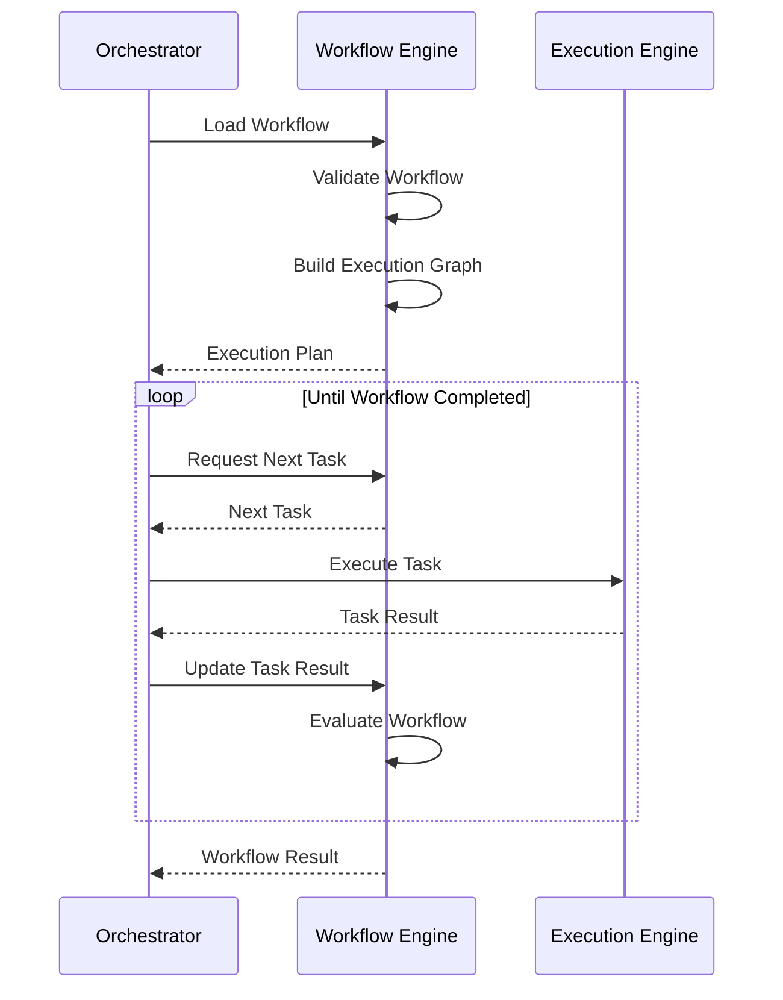
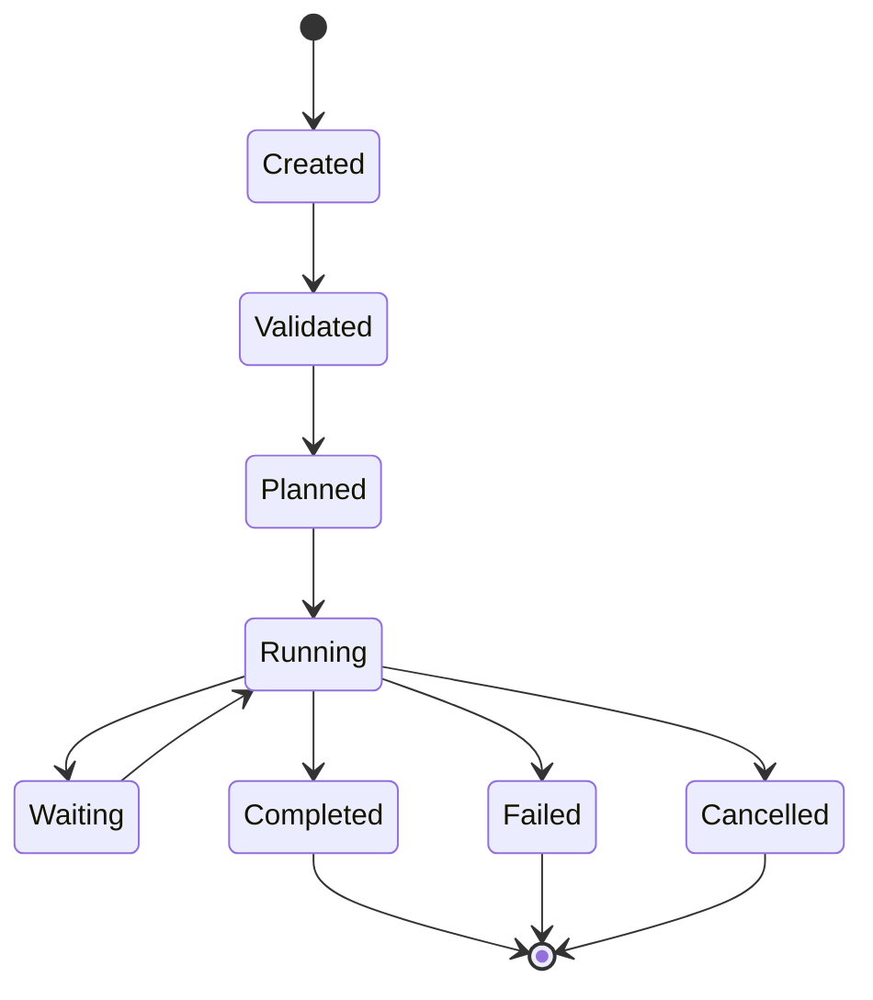
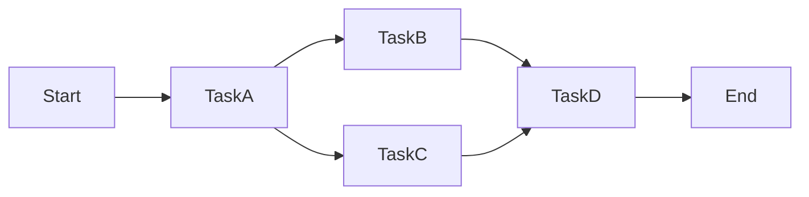
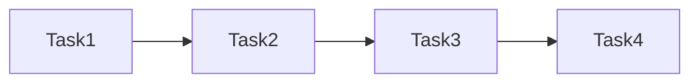
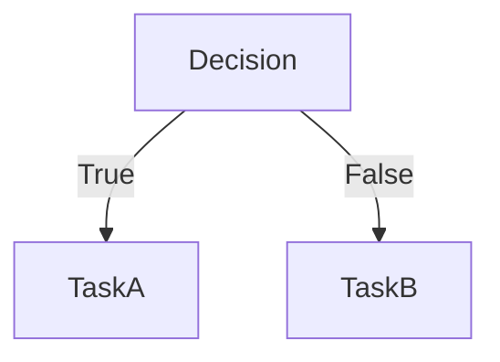
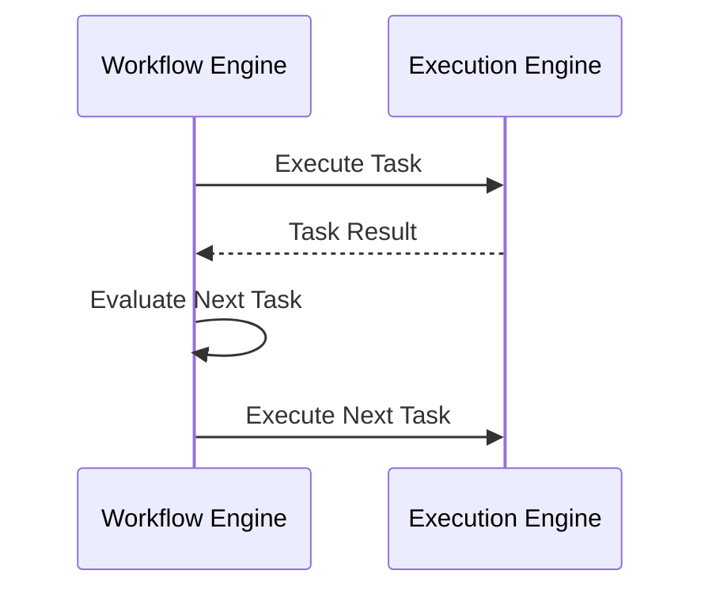

# MMOS v1.0 — Workflow Execution Sequence

Version: 1.0

Status: REFERENCE

---

# 1. Purpose

Dokumen ini menjelaskan bagaimana Workflow Engine menjalankan sebuah
Workflow dari awal hingga selesai.

Dokumen ini merupakan penjabaran lebih rinci dari Agent Execution Sequence
dan berfokus pada aktivitas internal Workflow Engine.

Dokumen ini diturunkan dari:

- MAS-200 Execution Model
- MAS-300 Engine Architecture
- MAS-400 Orchestrator
- IMS-300 Workflow Specification
- IMS-400 Execution Specification

Dokumen ini tidak mendefinisikan perilaku baru.

---

# 2. Workflow Execution Overview

Workflow Engine bertanggung jawab untuk:

- memuat Workflow
- memvalidasi Workflow
- membangun Execution Plan
- menentukan Task berikutnya
- mengevaluasi kondisi
- mengatur paralelisme
- mengelola loop
- menentukan akhir Workflow

Workflow Engine **tidak mengeksekusi Task**.

Task selalu dijalankan oleh Execution Engine.

---

# 3. High-Level Sequence



---

# 4. Workflow Lifecycle

Workflow mengikuti lifecycle berikut.



---

# 5. Workflow Initialization

Workflow Engine menerima:

```
WorkflowRequest
```

Langkah pertama:

- membaca Workflow Definition
- memuat Metadata
- memuat Version
- memuat Policy
- memuat Dependency

Output:

```
WorkflowInstance
```

---

# 6. Workflow Validation

Workflow harus divalidasi sebelum dijalankan.

Validasi meliputi:

- Schema Validation
- Version Validation
- Reference Validation
- Task Validation
- Dependency Validation
- Cycle Detection

Jika validasi gagal:

```
WorkflowRejected
```

---

# 7. Build Execution Graph

Workflow diubah menjadi Directed Acyclic Graph (DAG).



Execution Graph menjadi dasar seluruh penjadwalan Task.

---

# 8. Create Execution Plan

Workflow Engine menghasilkan:

```
ExecutionPlan
```

Execution Plan berisi:

- Task Order
- Dependency
- Retry Policy
- Timeout Policy
- Parallel Group
- Condition
- Compensation Rule

Execution Plan bersifat immutable selama eksekusi berlangsung.

---

# 9. Determine Next Task

Workflow Engine menentukan Task berikutnya berdasarkan:

- dependency selesai
- kondisi terpenuhi
- loop selesai
- branch aktif

Output:

```
NextTask
```

---

# 10. Sequential Execution

Workflow sederhana dijalankan secara berurutan.



Task berikutnya hanya dapat dijalankan jika Task sebelumnya selesai.

---

# 11. Parallel Execution

Workflow dapat memiliki Task paralel.

```mermaid
flowchart TD

TaskA

TaskB

TaskC

↓

Join

↓

TaskD
```

Workflow Engine hanya menentukan paralelisme.

Execution Engine yang menjalankan paralelisme tersebut.

---

# 12. Conditional Branch

Workflow mendukung percabangan.



Workflow Engine mengevaluasi Condition.

---

# 13. Loop Execution

Workflow mendukung Loop.

```mermaid
flowchart TD

Task

↓

Condition

Condition -->|Repeat| Task

Condition -->|Done| NextTask
```

Loop dikontrol sepenuhnya oleh Workflow Engine.

---

# 14. Sub Workflow

Workflow dapat memanggil Workflow lain.

```mermaid
flowchart LR

WorkflowA

↓

SubWorkflow

↓

WorkflowB
```

Sub Workflow menghasilkan Workflow Result tersendiri.

---

# 15. Waiting State

Workflow dapat menunggu:

- Human Approval
- External Event
- Timer
- Schedule
- Callback

```mermaid
flowchart LR

Running

↓

Waiting

↓

Resume

↓

Running
```

---

# 16. Retry Strategy

Retry dilakukan sesuai Workflow Policy.

```mermaid
flowchart TD

Task Failed

↓

Retry?

Retry? -->|Yes| Retry

Retry --> Execute Again

Retry? -->|No| Workflow Failed
```

---

# 17. Compensation

Jika Workflow gagal setelah beberapa Task berhasil dijalankan.

Workflow dapat melakukan:

```
Compensation Workflow
```

Contoh:

```
Reserve Stock

↓

Charge Payment

↓

Failure

↓

Refund

↓

Release Stock
```

---

# 18. Workflow Completion

Workflow dianggap selesai jika:

- seluruh Task selesai
- seluruh Branch selesai
- seluruh Loop selesai
- seluruh Join selesai

Output:

```
WorkflowResult
```

---

# 19. Workflow Failure

Workflow gagal jika:

- Task gagal tanpa Retry
- Condition Error
- Invalid Workflow
- Timeout
- Manual Cancellation

Output:

```
WorkflowFailed
```

---

# 20. Workflow Cancellation

Workflow dapat dihentikan oleh:

- User
- Policy
- Timeout
- System Failure

Workflow Engine akan:

- menghentikan penjadwalan Task
- membatalkan Task yang belum berjalan
- menerbitkan Event

---

# 21. Workflow Events

Workflow menghasilkan Event berikut.

```
WorkflowCreated

↓

WorkflowValidated

↓

WorkflowStarted

↓

TaskScheduled

↓

TaskCompleted

↓

BranchSelected

↓

LoopRepeated

↓

WorkflowCompleted
```

Jika gagal:

```
WorkflowFailed
```

---

# 22. Interaction with Execution Engine



Workflow Engine tidak pernah menjalankan Task secara langsung.

---

# 23. State Transition Rules

| Current State | Next State |
|---------------|------------|
| Created | Validated |
| Validated | Planned |
| Planned | Running |
| Running | Waiting |
| Waiting | Running |
| Running | Completed |
| Running | Failed |
| Running | Cancelled |

---

# 24. Design Principles

Workflow Execution mengikuti prinsip:

- Declarative Workflow
- Deterministic Planning
- Execution Separation
- Immutable Execution Plan
- Event Driven
- Retry by Policy
- Explicit Dependency
- Observable Workflow

---

# 25. Relationship with Other Components

| Component | Interaction |
|-----------|-------------|
| Orchestrator | Memulai dan mengendalikan Workflow |
| Execution Engine | Menjalankan Task |
| Event Engine | Menerima Event Workflow |
| Monitoring Engine | Mengumpulkan Metrics |
| Memory Engine | Tidak diakses langsung |
| Runtime Adapter | Tidak diakses langsung |

Workflow Engine hanya berinteraksi langsung dengan Orchestrator dan Execution Engine.

---

# 26. Reference Documents

Dokumen ini diturunkan dari:

- MAS-200 Execution Model
- MAS-300 Engine Architecture
- MAS-400 Orchestrator
- IMS-300 Workflow Specification
- IMS-400 Execution Specification
- agent-execution.md
- object-lifecycle.md

---

# END