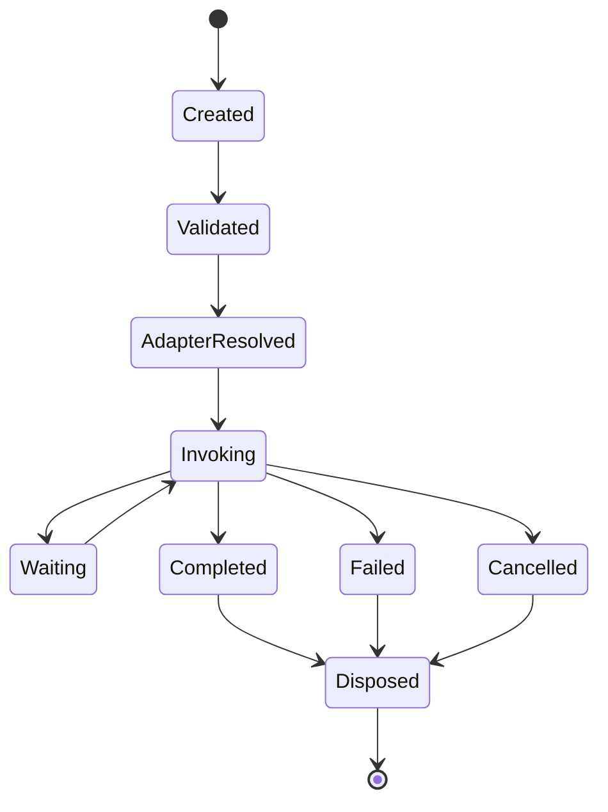
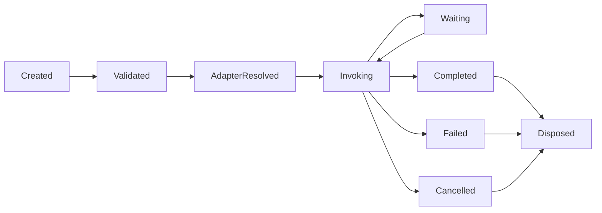

# MMOS v1.0 — Capability State Machine

Version: 1.0

Status: REFERENCE

---

# 1. Purpose

Dokumen ini mendefinisikan State Machine resmi untuk Object **Capability**
di dalam MMOS.

Capability merepresentasikan abstraksi terhadap layanan eksternal
(External Service) yang digunakan oleh Workflow melalui Execution Engine.

State Machine ini memastikan seluruh implementasi Capability Engine
memiliki perilaku yang konsisten, dapat diganti implementasinya, dan
tidak bergantung pada teknologi tertentu.

Dokumen ini diturunkan dari:

- MAS-300 Engine Architecture
- IMS-600 Capability Specification
- capability-catalog.md

Dokumen ini tidak mendefinisikan perilaku baru.

---

# 2. Capability Philosophy

Capability mengikuti prinsip:

- Service Abstraction
- Adapter Pattern
- Stateless Invocation
- Explicit State
- Observable
- Recoverable
- Provider Independent

Capability tidak menyimpan Business State.

Setiap Invocation bersifat independen.

---

# 3. Capability State Machine



---

# 4. Capability States

| State | Description |
|---------|-------------|
| Created | Request dibuat |
| Validated | Request tervalidasi |
| AdapterResolved | Adapter telah dipilih |
| Invoking | Memanggil layanan eksternal |
| Waiting | Menunggu respons |
| Completed | Berhasil |
| Failed | Gagal |
| Cancelled | Dibatalkan |
| Disposed | Resource dibersihkan |

---

# 5. Created

Capability Request dibuat oleh Execution Engine.

Informasi yang tersedia:

- Capability ID
- Execution ID
- Task ID
- Request Metadata

Event

```
CapabilityCreated
```

---

# 6. Validated

Capability Engine memvalidasi Request.

Validasi meliputi:

- Capability tersedia
- Permission
- Policy
- Input Schema
- Workspace Access

Event

```
CapabilityValidated
```

---

# 7. AdapterResolved

Capability Engine memilih Adapter.

Contoh:

```
HTTP Adapter

Database Adapter

Filesystem Adapter

Email Adapter

Queue Adapter

Storage Adapter
```

Pemilihan dilakukan melalui Capability Registry.

Event

```
CapabilityAdapterResolved
```

---

# 8. Invoking

Capability mulai memanggil layanan eksternal.

Aktivitas:

- Build Request
- Resolve Credential
- Inject Metadata
- Invoke Adapter

Event

```
CapabilityInvoking
```

---

# 9. Waiting

Capability sedang menunggu respons.

Contoh:

- HTTP Request
- Database Query
- Queue ACK
- File Download
- Long Running Service

Setelah respons diterima Capability kembali ke:

```
Invoking
```

Event

```
CapabilityWaiting
```

---

# 10. Completed

Capability berhasil.

Menghasilkan:

```
CapabilityResponse
```

Event

```
CapabilityCompleted
```

Terminal State.

---

# 11. Failed

Capability gagal.

Contoh:

- Network Error
- Authentication Error
- Timeout
- Adapter Error
- External Service Error

Event

```
CapabilityFailed
```

Terminal State.

---

# 12. Cancelled

Capability dihentikan.

Penyebab:

- Execution Cancelled
- Workflow Cancelled
- User Request
- System Shutdown

Event

```
CapabilityCancelled
```

Terminal State.

---

# 13. Disposed

Capability membersihkan Resource.

Aktivitas:

- Close Connection
- Release Resource
- Clear Temporary Object

Event

```
CapabilityDisposed
```

---

# 14. Transition Rules

| From | To | Allowed |
|------|----|----------|
| Created | Validated | ✓ |
| Validated | AdapterResolved | ✓ |
| AdapterResolved | Invoking | ✓ |
| Invoking | Waiting | ✓ |
| Waiting | Invoking | ✓ |
| Invoking | Completed | ✓ |
| Invoking | Failed | ✓ |
| Invoking | Cancelled | ✓ |
| Completed | Disposed | ✓ |
| Failed | Disposed | ✓ |
| Cancelled | Disposed | ✓ |

Transition lain dianggap tidak valid.

---

# 15. Transition Diagram



---

# 16. Trigger Matrix

| Trigger | Result |
|----------|--------|
| Validation Success | Validated |
| Adapter Selected | AdapterResolved |
| Request Sent | Invoking |
| Waiting Response | Waiting |
| Response Received | Invoking |
| Invocation Success | Completed |
| Invocation Failed | Failed |
| User Cancel | Cancelled |
| Cleanup Finished | Disposed |

---

# 17. Retry Behaviour

Retry tidak membuat Capability baru.

```text
Invoking

↓

Failed

↓

Retry

↓

Invoking
```

Retry mengikuti Retry Policy.

Retry Count dicatat sebagai Metadata.

---

# 18. Timeout Behaviour

Jika Timeout terjadi.

```text
Invoking

↓

Timeout

↓

Failed
```

atau

```text
Invoking

↓

Timeout

↓

Cancelled
```

Ditentukan oleh Capability Policy.

---

# 19. Adapter Failover

Capability dapat berpindah Adapter apabila Policy mengizinkan.

```text
HTTP Adapter A

↓

Failed

↓

HTTP Adapter B

↓

Success
```

Execution tidak mengetahui perubahan Adapter.

---

# 20. Long Running Capability

Capability dapat berjalan lama.

```text
Invoking

↓

Waiting

↓

Invoking

↓

Waiting

↓

Completed
```

Contoh:

- OCR
- Video Rendering
- Batch Processing
- AI Training

---

# 21. Streaming Behaviour

Capability dapat menerima Streaming Response.

```text
Invoking

↓

Streaming Response

↓

Invoking

↓

Completed
```

Streaming merupakan variasi dari state **Waiting**.

---

# 22. Event Mapping

| State | Event |
|---------|-------|
| Created | CapabilityCreated |
| Validated | CapabilityValidated |
| AdapterResolved | CapabilityAdapterResolved |
| Invoking | CapabilityInvoking |
| Waiting | CapabilityWaiting |
| Completed | CapabilityCompleted |
| Failed | CapabilityFailed |
| Cancelled | CapabilityCancelled |
| Disposed | CapabilityDisposed |

---

# 23. Metrics

Capability menghasilkan Metrics.

Contoh:

- Invocation Count
- Success Count
- Failure Count
- Retry Count
- Timeout Count
- Average Latency
- Data Size
- Adapter Usage

---

# 24. State Validation

Capability Engine wajib memvalidasi State.

Contoh:

```text
Completed

↓

Invoke Again

↓

Rejected
```

Capability Invocation yang telah selesai tidak boleh digunakan kembali.

---

# 25. Recovery

Capability dapat dipulihkan apabila berada pada:

- Validated
- AdapterResolved
- Invoking
- Waiting

Recovery dilakukan melalui:

- Retry
- Adapter Failover

Capability yang telah:

- Completed
- Failed
- Cancelled
- Disposed

tidak dapat di-resume.

---

# 26. State Ownership

State Capability hanya boleh diubah oleh:

```
Capability Engine
```

Execution Engine hanya mengirim CapabilityRequest dan menerima CapabilityResponse.

---

# 27. Relationship with Other State Machines

Capability berhubungan dengan:

```text
Task State

↓

Execution State

↓

Runtime State

↓

Memory State

↓

Event State
```

Capability dapat dipanggil oleh Runtime (Tool Calling) maupun langsung oleh Task, tetapi lifecycle Capability tetap dikelola oleh Capability Engine.

---

# 28. Design Principles

Capability State Machine mengikuti prinsip:

- Service Abstraction
- Adapter Pattern
- Stateless Invocation
- Provider Independent
- Explicit State
- Recoverable
- Observable
- Contract First

---

# 29. Reference Documents

Dokumen ini diturunkan dari:

- MAS-300 Engine Architecture
- IMS-600 Capability Specification
- capability-call.md
- capability-catalog.md
- runtime-call.md
- runtime-state.md
- task-state.md
- execution-state.md

---

# END