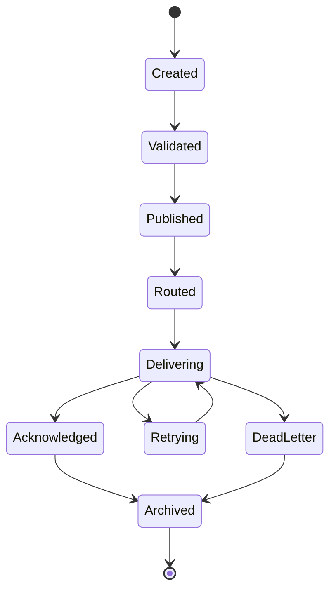
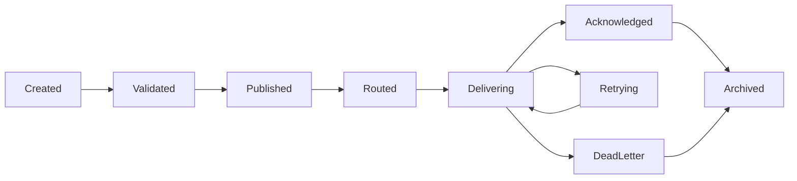

# MMOS v1.0 — Event State Machine

Version: 1.0

Status: REFERENCE

---

# 1. Purpose

Dokumen ini mendefinisikan State Machine resmi untuk Object **Event**
di dalam MMOS.

Event merupakan representasi perubahan keadaan (state change) atau fakta
yang terjadi di dalam platform. Event menjadi media komunikasi asynchronous
antar Engine melalui Event Engine.

State Machine ini memastikan seluruh implementasi Event Engine memiliki
perilaku yang konsisten, dapat diaudit, dapat di-replay, dan tidak
bergantung pada implementasi Event Bus.

Dokumen ini diturunkan dari:

- MAS-300 Engine Architecture
- MAS-400 Orchestrator
- MAS-800 Platform
- IMS-800 Event Specification

Dokumen ini tidak mendefinisikan perilaku baru.

---

# 2. Event Philosophy

Event mengikuti prinsip:

- Immutable
- Event Driven
- Explicit State
- Observable
- Replayable
- Auditable
- Bus Independent

Setelah Event dibuat, Payload tidak boleh berubah.

---

# 3. Event State Machine



---

# 4. Event States

| State | Description |
|---------|-------------|
| Created | Event dibuat |
| Validated | Event tervalidasi |
| Published | Event dipublikasikan |
| Routed | Event telah dirutekan |
| Delivering | Event sedang dikirim |
| Retrying | Sedang dilakukan retry |
| Acknowledged | Seluruh Subscriber selesai |
| DeadLetter | Event gagal diproses |
| Archived | Event menjadi histori |

---

# 5. Created

Publisher membuat Event.

Karakteristik:

- Event ID tersedia
- Timestamp tersedia
- Payload tersedia
- Metadata tersedia

Event

```
EventCreated
```

---

# 6. Validated

Event Engine memvalidasi:

- Schema
- Version
- Event Type
- Required Field
- Metadata

Event

```
EventValidated
```

---

# 7. Published

Event diterima Event Engine.

Aktivitas:

- Assign Sequence
- Assign Correlation
- Store Metadata

Event mulai tersedia untuk Routing.

Event

```
EventPublished
```

---

# 8. Routed

Event Engine menentukan Subscriber.

Contoh:

```
Workflow Engine

Execution Engine

Memory Engine

Monitoring Engine

Audit Engine
```

Routing dilakukan berdasarkan Subscription.

Event

```
EventRouted
```

---

# 9. Delivering

Event sedang dikirim.

Aktivitas:

- Push Event
- Wait ACK
- Monitor Timeout

Satu Event dapat dikirim ke banyak Subscriber.

Event

```
EventDelivering
```

---

# 10. Retrying

Pengiriman gagal.

Event Engine melakukan Retry.

Retry mengikuti Event Policy.

Event

```
EventRetrying
```

---

# 11. Acknowledged

Seluruh Subscriber yang diwajibkan telah mengirim ACK.

Delivery dianggap selesai.

Event

```
EventAcknowledged
```

---

# 12. DeadLetter

Retry telah melebihi batas.

Event dipindahkan ke:

```
Dead Letter Queue
```

Event

```
EventDeadLetter
```

---

# 13. Archived

Event menjadi histori.

Digunakan untuk:

- Replay
- Audit
- Analytics
- Monitoring

Event

```
EventArchived
```

Terminal State.

---

# 14. Transition Rules

| From | To | Allowed |
|------|----|----------|
| Created | Validated | ✓ |
| Validated | Published | ✓ |
| Published | Routed | ✓ |
| Routed | Delivering | ✓ |
| Delivering | Acknowledged | ✓ |
| Delivering | Retrying | ✓ |
| Retrying | Delivering | ✓ |
| Delivering | DeadLetter | ✓ |
| Acknowledged | Archived | ✓ |
| DeadLetter | Archived | ✓ |

Transition lain dianggap tidak valid.

---

# 15. Transition Diagram



---

# 16. Trigger Matrix

| Trigger | Result |
|----------|--------|
| Validation Success | Validated |
| Publish Accepted | Published |
| Subscriber Resolved | Routed |
| Delivery Started | Delivering |
| ACK Received | Acknowledged |
| Delivery Failed | Retrying |
| Retry Limit Reached | DeadLetter |
| Retention Policy | Archived |

---

# 17. Fan-Out Behaviour

Satu Event dapat memiliki banyak Subscriber.

```text
Event

├── Subscriber A
├── Subscriber B
├── Subscriber C
└── Subscriber D
```

State Event tetap:

```
Delivering
```

hingga seluruh Subscriber selesai.

---

# 18. Retry Behaviour

Retry dilakukan tanpa membuat Event baru.

```text
Delivering

↓

Retrying

↓

Delivering
```

Retry Count dicatat sebagai Metadata.

---

# 19. Delivery Behaviour

Delivery dapat berupa:

- At Most Once
- At Least Once
- Exactly Once (jika didukung)

Strategi ditentukan oleh Platform Policy.

---

# 20. Replay Behaviour

Event yang telah diarsipkan dapat diputar ulang.

```text
Archived

↓

Replay Request

↓

Published

↓

Routed

↓

Delivering
```

Replay tidak mengubah Event asli.

Replay menghasilkan Delivery baru, bukan Event baru.

---

# 21. Dead Letter Behaviour

Jika seluruh Retry gagal.

```text
Delivering

↓

Retrying

↓

Retrying

↓

DeadLetter
```

Dead Letter Queue digunakan untuk investigasi.

---

# 22. Event Ordering

Ordering hanya dijamin pada:

- Correlation ID yang sama
- Execution yang sama
- Partition yang sama

Global Ordering bukan bagian dari kontrak MMOS.

---

# 23. Correlation Behaviour

Setiap Event membawa:

- Correlation ID
- Execution ID
- Workflow ID
- Task ID (opsional)

Contoh:

```text
WorkflowStarted

↓

TaskStarted

↓

RuntimeStarted

↓

RuntimeCompleted

↓

TaskCompleted
```

Seluruh Event dapat ditelusuri menggunakan Correlation ID.

---

# 24. Event Mapping

| State | Internal Event |
|---------|----------------|
| Created | EventCreated |
| Validated | EventValidated |
| Published | EventPublished |
| Routed | EventRouted |
| Delivering | EventDelivering |
| Retrying | EventRetrying |
| Acknowledged | EventAcknowledged |
| DeadLetter | EventDeadLetter |
| Archived | EventArchived |

---

# 25. Metrics

Event menghasilkan Metrics.

Contoh:

- Published Events
- Delivered Events
- Failed Deliveries
- Retry Count
- DLQ Count
- Average Delivery Time
- Subscriber Count
- Replay Count

---

# 26. State Validation

Event Engine wajib memvalidasi state.

Contoh:

```text
Archived

↓

Modify Payload

↓

Rejected
```

Event bersifat immutable.

---

# 27. Recovery

Event dapat dipulihkan apabila berada pada:

- Delivering
- Retrying

Recovery dilakukan melalui:

- Retry
- Replay

Event yang telah berada di Dead Letter dapat diproses ulang melalui kebijakan operasional Platform.

---

# 28. State Ownership

State Event hanya boleh diubah oleh:

```
Event Engine
```

Publisher maupun Subscriber tidak boleh mengubah State Event secara langsung.

---

# 29. Relationship with Other State Machines

Event berhubungan dengan seluruh Object MMOS.

```text
Workflow

↓

Execution

↓

Task

↓

Runtime

↓

Capability

↓

Memory

↓

Event Engine
```

Semua perubahan State pada Object lain menghasilkan Event, tetapi Event tidak mengubah State Object secara langsung.

---

# 30. Design Principles

Event State Machine mengikuti prinsip:

- Immutable Event
- Event Driven
- Loose Coupling
- Bus Independent
- Replayable
- Auditable
- Observable
- Contract First

---

# 31. Reference Documents

Dokumen ini diturunkan dari:

- MAS-300 Engine Architecture
- MAS-400 Orchestrator
- MAS-800 Platform
- IMS-800 Event Specification
- event-flow.md
- execution-state.md
- workflow-state.md
- task-state.md
- runtime-state.md
- capability-state.md
- memory-state.md

---

# END