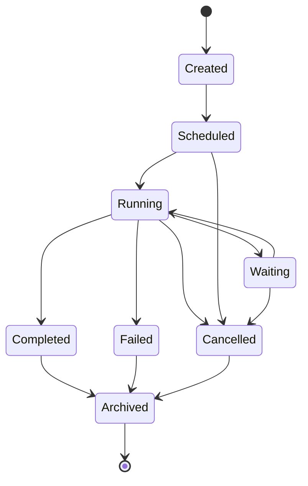
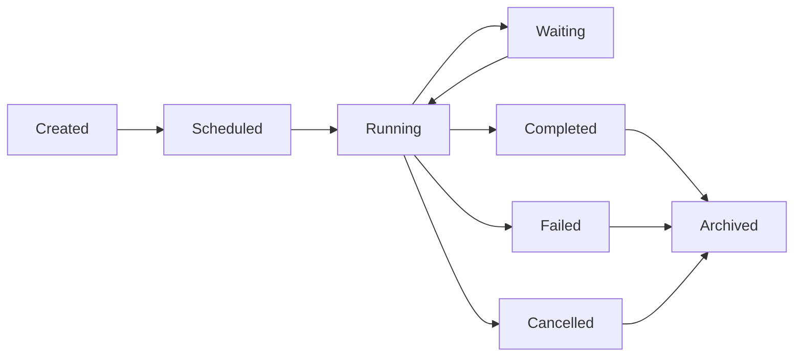

# MMOS v1.0 — Execution State Machine

Version: 1.0

Status: REFERENCE

---

# 1. Purpose

Dokumen ini mendefinisikan State Machine resmi untuk Object **Execution**
di dalam MMOS.

Execution merupakan representasi runtime dari sebuah Workflow yang sedang
atau telah dijalankan.

Seluruh implementasi Execution Engine wajib mengikuti state machine ini
agar perilaku sistem konsisten pada seluruh Runtime maupun SDK.

Dokumen ini diturunkan dari:

- MAS-200 Execution Model
- MAS-300 Engine Architecture
- IMS-400 Execution Specification

Dokumen ini tidak mendefinisikan perilaku baru.

---

# 2. Execution Philosophy

Execution mengikuti prinsip:

- Explicit State
- Deterministic Transition
- Event Driven
- Observable
- Recoverable
- Immutable History

Execution tidak boleh berpindah state secara arbitrer.

Semua perpindahan state harus melalui transition resmi.

---

# 3. State Machine Overview



---

# 4. Execution States

| State | Description |
|---------|-------------|
| Created | Execution baru dibuat |
| Scheduled | Menunggu dijalankan |
| Running | Sedang dieksekusi |
| Waiting | Menunggu event eksternal |
| Completed | Berhasil selesai |
| Failed | Gagal dieksekusi |
| Cancelled | Dibatalkan |
| Archived | Disimpan sebagai histori |

---

# 5. Created

Execution telah dibuat tetapi belum masuk scheduler.

Karakteristik:

- Execution ID tersedia
- Workflow telah dipilih
- Context dibuat
- Belum ada Task berjalan

Event:

```
ExecutionCreated
```

---

# 6. Scheduled

Execution telah masuk antrian.

Execution menunggu:

- Resource
- Worker
- Scheduler
- Dependency

Event:

```
ExecutionScheduled
```

---

# 7. Running

Execution sedang berjalan.

Execution Engine dapat:

- menjalankan Task
- membaca Memory
- memanggil Runtime
- memanggil Capability
- menerbitkan Event

Event:

```
ExecutionStarted
```

---

# 8. Waiting

Execution berhenti sementara.

Penyebab:

- Human Approval
- Timer
- External Callback
- Queue
- Webhook
- Long Running Capability

Execution dapat dilanjutkan kembali.

Event:

```
ExecutionWaiting
```

---

# 9. Completed

Execution berhasil selesai.

Seluruh Task telah selesai.

Workflow menghasilkan:

```
ExecutionResult
```

Event:

```
ExecutionCompleted
```

State ini bersifat terminal.

---

# 10. Failed

Execution gagal.

Contoh:

- Runtime Error
- Capability Error
- Workflow Error
- Validation Error
- Timeout

Event:

```
ExecutionFailed
```

State ini bersifat terminal.

---

# 11. Cancelled

Execution dihentikan sebelum selesai.

Sumber pembatalan:

- User
- Administrator
- Timeout Policy
- System Shutdown

Event:

```
ExecutionCancelled
```

State ini bersifat terminal.

---

# 12. Archived

Execution dipindahkan menjadi histori.

Tujuan:

- Audit
- Replay
- Analytics
- Monitoring

Execution tidak dapat dijalankan kembali.

Event:

```
ExecutionArchived
```

---

# 13. Transition Rules

| From | To | Allowed |
|------|----|----------|
| Created | Scheduled | ✓ |
| Scheduled | Running | ✓ |
| Running | Waiting | ✓ |
| Waiting | Running | ✓ |
| Running | Completed | ✓ |
| Running | Failed | ✓ |
| Running | Cancelled | ✓ |
| Scheduled | Cancelled | ✓ |
| Waiting | Cancelled | ✓ |
| Completed | Archived | ✓ |
| Failed | Archived | ✓ |
| Cancelled | Archived | ✓ |

Transition lain dianggap tidak valid.

---

# 14. State Transition Diagram



---

# 15. Trigger Matrix

| Trigger | Result |
|----------|--------|
| Scheduler Ready | Running |
| Task Finished | Tetap Running / Completed |
| External Wait | Waiting |
| Resume Event | Running |
| Runtime Error | Failed |
| Timeout | Failed / Cancelled |
| User Cancel | Cancelled |
| Archive Policy | Archived |

---

# 16. Retry Behaviour

Retry tidak membuat Execution baru.

Retry tetap berada pada Execution yang sama.

```
Running

↓

Failed

↓

Retry

↓

Running
```

Retry Count dicatat sebagai Metadata.

---

# 17. Waiting Behaviour

Execution dapat mengalami beberapa Waiting.

```
Running

↓

Waiting

↓

Running

↓

Waiting

↓

Running
```

Tidak ada batasan jumlah Waiting.

---

# 18. Timeout Behaviour

Jika timeout terjadi.

```
Running

↓

Timeout

↓

Failed
```

atau

```
Running

↓

Timeout

↓

Cancelled
```

Ditentukan oleh Execution Policy.

---

# 19. Parallel Execution

Execution dapat menjalankan Task paralel.

Namun Execution State tetap:

```
Running
```

State Task tidak memengaruhi State Execution secara langsung.

---

# 20. Event Mapping

| State | Event |
|---------|-------|
| Created | ExecutionCreated |
| Scheduled | ExecutionScheduled |
| Running | ExecutionStarted |
| Waiting | ExecutionWaiting |
| Completed | ExecutionCompleted |
| Failed | ExecutionFailed |
| Cancelled | ExecutionCancelled |
| Archived | ExecutionArchived |

---

# 21. Metrics

Execution menghasilkan Metrics.

Contoh:

- Start Time
- Finish Time
- Duration
- Waiting Time
- Retry Count
- Failed Task Count
- Runtime Count
- Capability Count

---

# 22. State Validation

Execution Engine wajib memvalidasi state sebelum menjalankan operasi.

Contoh:

```
Completed

↓

Execute Task

↓

Rejected
```

Karena Completed merupakan terminal state.

---

# 23. Recovery

Execution dapat dipulihkan apabila berada pada:

- Scheduled
- Running
- Waiting

Execution yang telah:

- Completed
- Failed
- Cancelled

tidak dapat di-resume.

Recovery dilakukan melalui mekanisme Retry atau Replay sesuai Policy.

---

# 24. State Ownership

Execution dikelola sepenuhnya oleh:

```
Execution Engine
```

Engine lain tidak boleh mengubah state Execution secara langsung.

---

# 25. Design Principles

Execution State Machine mengikuti prinsip:

- Explicit State
- Single Owner
- Deterministic Transition
- Recoverable
- Observable
- Event Driven
- Immutable History
- Policy Controlled

---

# 26. Relationship with Other State Machines

Execution berkaitan dengan:

```
Workflow State

↓

Task State

↓

Runtime State

↓

Capability State

↓

Memory State
```

Namun perubahan state pada Object lain tidak otomatis mengubah
Execution State kecuali melalui Execution Engine.

---

# 27. Reference Documents

Dokumen ini diturunkan dari:

- MAS-200 Execution Model
- MAS-300 Engine Architecture
- IMS-400 Execution Specification
- object-lifecycle.md
- workflow-execution.md
- agent-execution.md

---

# END