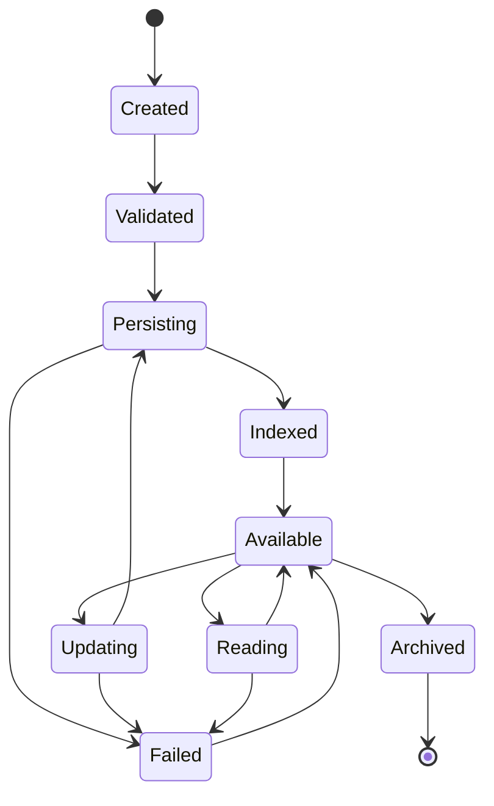
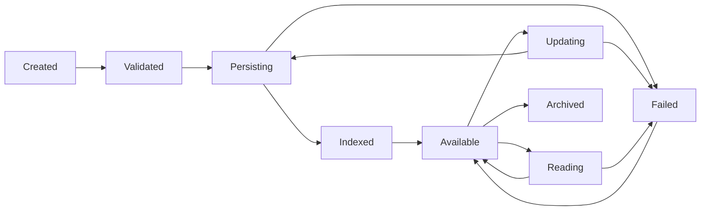

# MMOS v1.0 — Memory State Machine

Version: 1.0

Status: REFERENCE

---

# 1. Purpose

Dokumen ini mendefinisikan State Machine resmi untuk Object **Memory**
di dalam MMOS.

Memory merepresentasikan seluruh informasi yang dikelola oleh Memory Engine,
baik Session Memory, Working Memory, Long-Term Memory maupun Shared Memory.

State Machine ini memastikan seluruh implementasi Memory Engine memiliki
perilaku yang konsisten, version-aware, dapat diaudit, dan independen
terhadap teknologi penyimpanan.

Dokumen ini diturunkan dari:

- MAS-300 Engine Architecture
- MAS-500 Memory & Knowledge
- IMS-500 Memory Specification

Dokumen ini tidak mendefinisikan perilaku baru.

---

# 2. Memory Philosophy

Memory mengikuti prinsip:

- Versioned Object
- Explicit State
- Immutable History
- Context Driven
- Observable
- Recoverable
- Storage Independent

Memory bukan sekadar data yang disimpan.

Memory merupakan Object yang memiliki lifecycle sendiri.

---

# 3. Memory State Machine



---

# 4. Memory States

| State | Description |
|---------|-------------|
| Created | Memory Object dibuat |
| Validated | Lolos validasi |
| Persisting | Sedang disimpan |
| Indexed | Sedang diindeks |
| Available | Siap digunakan |
| Reading | Sedang dibaca |
| Updating | Sedang diperbarui |
| Failed | Operasi gagal |
| Archived | Menjadi histori |

---

# 5. Created

Memory Object baru dibuat.

Karakteristik:

- Memory ID tersedia
- Metadata tersedia
- Belum disimpan

Event

```
MemoryCreated
```

---

# 6. Validated

Memory Engine memvalidasi:

- Schema
- Workspace
- Permission
- Ownership
- Version
- Policy

Event

```
MemoryValidated
```

---

# 7. Persisting

Memory Engine menyimpan Object.

Aktivitas:

- Serialize Object
- Resolve Storage
- Persist Metadata
- Persist Content

Event

```
MemoryPersisting
```

---

# 8. Indexed

Memory berhasil disimpan.

Jika diperlukan dilakukan:

- Search Index
- Vector Index
- Metadata Index

Indexing dapat dilakukan secara asynchronous.

Event

```
MemoryIndexed
```

---

# 9. Available

Memory siap digunakan.

Memory dapat:

- dibaca
- diperbarui
- dijadikan Context
- digunakan Knowledge Engine

Event

```
MemoryAvailable
```

---

# 10. Reading

Memory sedang digunakan.

Contoh:

- Workflow membaca Context
- Runtime membaca Prompt Context
- Capability membaca Configuration

Setelah selesai kembali ke:

```
Available
```

Event

```
MemoryReading
```

---

# 11. Updating

Memory sedang diperbarui.

Aktivitas:

- Merge
- Replace
- Append
- Patch

Setelah selesai kembali ke:

```
Persisting
```

Event

```
MemoryUpdating
```

---

# 12. Failed

Operasi Memory gagal.

Contoh:

- Storage Error
- Version Conflict
- Permission Denied
- Validation Error
- Network Error

Event

```
MemoryFailed
```

Memory dapat dipulihkan.

---

# 13. Archived

Memory dipindahkan menjadi histori.

Digunakan untuk:

- Audit
- Replay
- Version History
- Analytics

Event

```
MemoryArchived
```

Terminal State.

---

# 14. Transition Rules

| From | To | Allowed |
|------|----|----------|
| Created | Validated | ✓ |
| Validated | Persisting | ✓ |
| Persisting | Indexed | ✓ |
| Indexed | Available | ✓ |
| Available | Reading | ✓ |
| Reading | Available | ✓ |
| Available | Updating | ✓ |
| Updating | Persisting | ✓ |
| Persisting | Failed | ✓ |
| Updating | Failed | ✓ |
| Reading | Failed | ✓ |
| Failed | Available | ✓ |
| Available | Archived | ✓ |

Transition lain dianggap tidak valid.

---

# 15. Transition Diagram



---

# 16. Trigger Matrix

| Trigger | Result |
|----------|--------|
| Validation Success | Validated |
| Save Started | Persisting |
| Save Success | Indexed |
| Index Completed | Available |
| Read Request | Reading |
| Update Request | Updating |
| Save Error | Failed |
| Retry Success | Available |
| Archive Policy | Archived |

---

# 17. Version Behaviour

Memory selalu memiliki Version.

```text
Version 1

↓

Version 2

↓

Version 3

↓

Version 4
```

Version lama tidak diubah.

Version baru selalu dibuat saat Update berhasil.

---

# 18. Merge Behaviour

Memory Update dapat berupa:

- Replace
- Merge
- Append
- Patch

Strategi ditentukan oleh Memory Policy.

---

# 19. Read Behaviour

Memory dapat dibaca berkali-kali.

```text
Available

↓

Reading

↓

Available

↓

Reading

↓

Available
```

Reading tidak mengubah isi Memory.

---

# 20. Concurrent Update

Jika dua Execution memperbarui Memory yang sama.

```text
Update A

↓

Version Check

↓

Conflict?

↓

Merge / Reject
```

Conflict Resolution mengikuti Memory Policy.

---

# 21. Retry Behaviour

Jika operasi gagal.

```text
Persisting

↓

Failed

↓

Retry

↓

Persisting
```

Retry tidak membuat Memory Object baru.

---

# 22. Event Mapping

| State | Event |
|---------|-------|
| Created | MemoryCreated |
| Validated | MemoryValidated |
| Persisting | MemoryPersisting |
| Indexed | MemoryIndexed |
| Available | MemoryAvailable |
| Reading | MemoryReading |
| Updating | MemoryUpdating |
| Failed | MemoryFailed |
| Archived | MemoryArchived |

---

# 23. Metrics

Memory menghasilkan Metrics.

Contoh:

- Read Count
- Write Count
- Update Count
- Version Count
- Conflict Count
- Retry Count
- Average Read Latency
- Average Write Latency
- Index Size

---

# 24. State Validation

Memory Engine wajib memvalidasi state.

Contoh:

```text
Archived

↓

Update

↓

Rejected
```

Memory yang telah diarsipkan tidak boleh diperbarui.

---

# 25. Recovery

Memory dapat dipulihkan apabila berada pada:

- Persisting
- Reading
- Updating
- Failed

Recovery dilakukan melalui:

- Retry
- Version Recovery
- Conflict Resolution

Memory yang telah diarsipkan tidak dapat dipulihkan menjadi Available.

---

# 26. State Ownership

State Memory hanya boleh diubah oleh:

```
Memory Engine
```

Engine lain hanya dapat melakukan Request melalui kontrak resmi Memory Engine.

---

# 27. Relationship with Other State Machines

Memory berhubungan dengan:

```text
Workflow State

↓

Execution State

↓

Task State

↓

Runtime State

↓

Capability State

↓

Event State
```

Memory menjadi sumber Context bagi seluruh Engine, tetapi tidak
mengendalikan State Machine Engine lain.

---

# 28. Design Principles

Memory State Machine mengikuti prinsip:

- Versioned Objects
- Immutable History
- Explicit State
- Storage Independent
- Context Oriented
- Recoverable
- Observable
- Contract First

---

# 29. Reference Documents

Dokumen ini diturunkan dari:

- MAS-500 Memory & Knowledge
- IMS-500 Memory Specification
- memory-read.md
- memory-write.md
- execution-state.md
- runtime-state.md
- capability-state.md
- object-lifecycle.md

---

# END