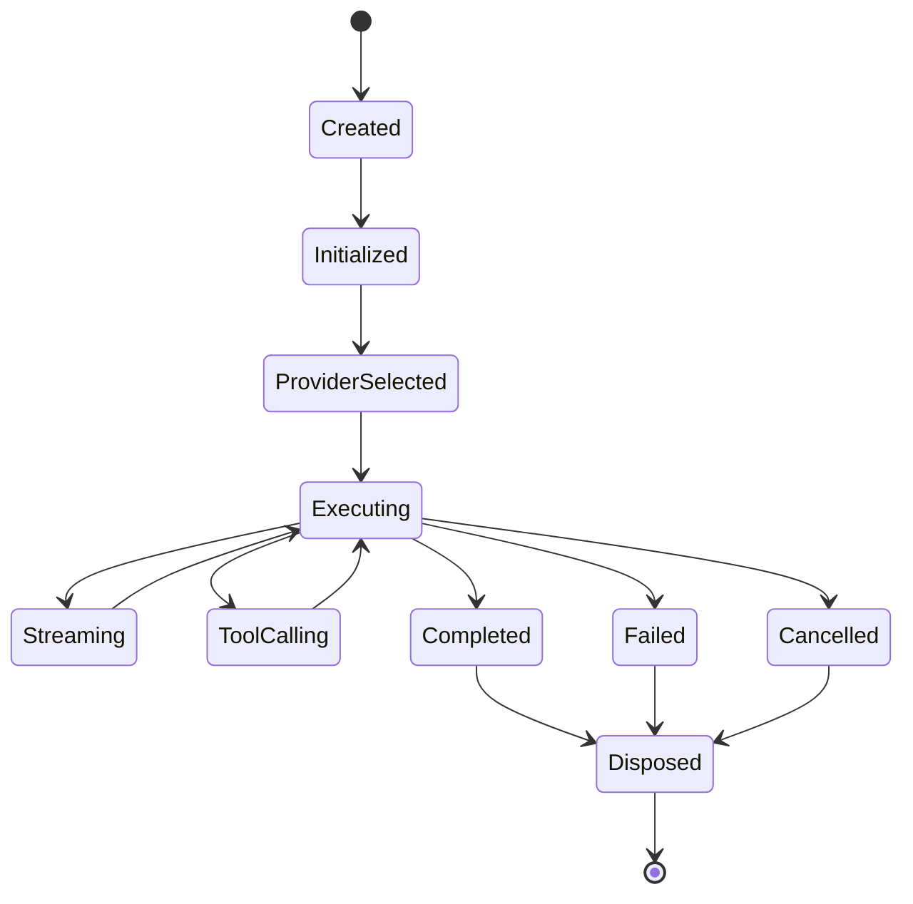
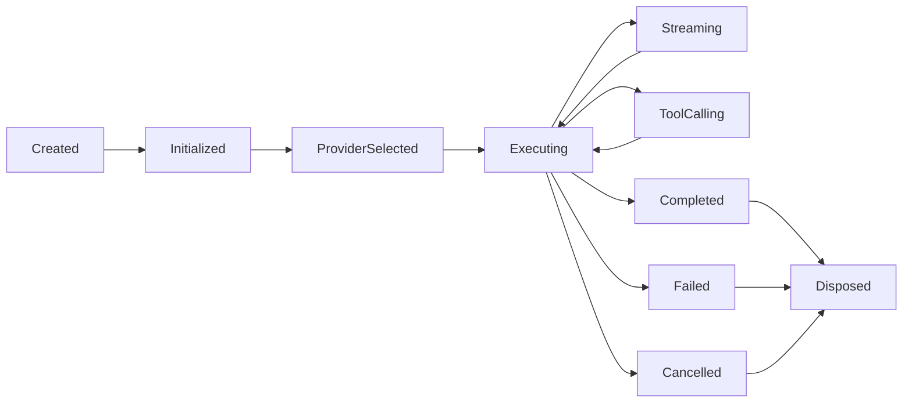

# MMOS v1.0 — Runtime State Machine

Version: 1.0

Status: REFERENCE

---

# 1. Purpose

Dokumen ini mendefinisikan State Machine resmi untuk Object **Runtime**
di dalam MMOS.

Runtime merupakan objek yang merepresentasikan satu sesi komunikasi
antara Execution Engine dengan AI Provider melalui Runtime Adapter.

State Machine ini memastikan seluruh Runtime Adapter memiliki perilaku
yang konsisten, independen terhadap provider, serta dapat dipantau dan
diaudit.

Dokumen ini diturunkan dari:

- MAS-300 Engine Architecture
- MAS-700 AI Runtime
- IMS-400 Execution Specification
- IMS-700 Runtime Specification

Dokumen ini tidak mendefinisikan spesifikasi baru.

---

# 2. Runtime Philosophy

Runtime mengikuti prinsip:

- Stateless
- Provider Agnostic
- Adapter Pattern
- Explicit State
- Deterministic Transition
- Observable
- Recoverable

Runtime tidak menyimpan Business State.

Runtime hanya hidup selama proses Execution.

---

# 3. Runtime State Machine



---

# 4. Runtime States

| State | Description |
|---------|-------------|
| Created | Runtime dibuat |
| Initialized | Runtime siap digunakan |
| ProviderSelected | Provider telah dipilih |
| Executing | Request sedang diproses |
| Streaming | Provider mengirim Streaming Response |
| ToolCalling | Menunggu hasil Tool Call |
| Completed | Runtime selesai |
| Failed | Runtime gagal |
| Cancelled | Runtime dibatalkan |
| Disposed | Runtime dihancurkan |

---

# 5. Created

Runtime dibuat oleh Execution Engine.

Karakteristik:

- Runtime ID tersedia
- Execution ID tersedia
- Belum memilih Provider

Event

```
RuntimeCreated
```

---

# 6. Initialized

Runtime selesai melakukan inisialisasi.

Aktivitas:

- Load Runtime Policy
- Load Configuration
- Load Provider Registry

Event

```
RuntimeInitialized
```

---

# 7. ProviderSelected

Runtime berhasil memilih Provider.

Pemilihan mempertimbangkan:

- Model
- Policy
- Availability
- Cost
- Latency
- Capability

Event

```
ProviderSelected
```

---

# 8. Executing

Runtime mengirim Request ke Provider.

Aktivitas:

- Request Mapping
- Authentication
- HTTP/API Request
- Waiting Provider Response

Event

```
RuntimeStarted
```

---

# 9. Streaming

Provider mengirim Response secara bertahap.

Aktivitas:

- Receive Chunk
- Normalize Chunk
- Forward Chunk
- Update Metrics

Runtime dapat kembali ke:

```
Executing
```

setelah Streaming selesai.

Event

```
RuntimeStreaming
```

---

# 10. ToolCalling

Provider meminta Tool Call.

Runtime:

- meneruskan Tool Request
- menunggu hasil Capability
- mengirim hasil kembali ke Provider

Runtime tidak menjalankan Tool.

Event

```
RuntimeToolCalling
```

---

# 11. Completed

Provider berhasil menyelesaikan Request.

Output:

```
RuntimeResponse
```

Event

```
RuntimeCompleted
```

Terminal State.

---

# 12. Failed

Runtime gagal.

Contoh:

- Provider Error
- Authentication Error
- Timeout
- Rate Limit
- Network Failure
- Invalid Response

Event

```
RuntimeFailed
```

Terminal State.

---

# 13. Cancelled

Runtime dihentikan.

Penyebab:

- Execution Cancelled
- Workflow Cancelled
- User Request
- System Shutdown

Event

```
RuntimeCancelled
```

Terminal State.

---

# 14. Disposed

Runtime dibersihkan.

Aktivitas:

- Release Connection
- Release Resource
- Clear Temporary Context

Runtime tidak dapat digunakan kembali.

Event

```
RuntimeDisposed
```

---

# 15. Transition Rules

| From | To | Allowed |
|------|----|----------|
| Created | Initialized | ✓ |
| Initialized | ProviderSelected | ✓ |
| ProviderSelected | Executing | ✓ |
| Executing | Streaming | ✓ |
| Streaming | Executing | ✓ |
| Executing | ToolCalling | ✓ |
| ToolCalling | Executing | ✓ |
| Executing | Completed | ✓ |
| Executing | Failed | ✓ |
| Executing | Cancelled | ✓ |
| Completed | Disposed | ✓ |
| Failed | Disposed | ✓ |
| Cancelled | Disposed | ✓ |

Transition lain dianggap tidak valid.

---

# 16. Transition Diagram



---

# 17. Trigger Matrix

| Trigger | Result |
|----------|--------|
| Runtime Initialized | Initialized |
| Provider Selected | ProviderSelected |
| Request Sent | Executing |
| Stream Started | Streaming |
| Stream Finished | Executing |
| Tool Call Requested | ToolCalling |
| Tool Result Returned | Executing |
| Provider Success | Completed |
| Provider Error | Failed |
| User Cancel | Cancelled |
| Cleanup Finished | Disposed |

---

# 18. Streaming Behaviour

Streaming merupakan sub-proses dari Execution.

```text
Executing

↓

Streaming

↓

Executing

↓

Streaming

↓

Executing
```

Streaming dapat terjadi berkali-kali hingga Response selesai.

---

# 19. Tool Call Behaviour

Jika Provider meminta Tool.

```text
Executing

↓

ToolCalling

↓

Capability

↓

Executing
```

Runtime tidak mengetahui implementasi Capability.

---

# 20. Retry Behaviour

Retry dilakukan tanpa membuat Runtime baru apabila masih memungkinkan.

```text
Executing

↓

Failed

↓

Retry

↓

Executing
```

Retry mengikuti Runtime Policy.

Apabila Retry membutuhkan Provider baru, Runtime kembali ke state:

```
ProviderSelected
```

---

# 21. Failover Behaviour

Jika Provider gagal.

```text
Executing

↓

Failed

↓

ProviderSelected

↓

Executing
```

Provider dapat berubah selama Runtime masih aktif.

---

# 22. Timeout Behaviour

Jika Timeout terjadi.

```text
Executing

↓

Timeout

↓

Failed
```

atau

```text
Executing

↓

Timeout

↓

Cancelled
```

Ditentukan oleh Runtime Policy.

---

# 23. Event Mapping

| State | Event |
|---------|-------|
| Created | RuntimeCreated |
| Initialized | RuntimeInitialized |
| ProviderSelected | ProviderSelected |
| Executing | RuntimeStarted |
| Streaming | RuntimeStreaming |
| ToolCalling | RuntimeToolCalling |
| Completed | RuntimeCompleted |
| Failed | RuntimeFailed |
| Cancelled | RuntimeCancelled |
| Disposed | RuntimeDisposed |

---

# 24. Metrics

Runtime menghasilkan Metrics.

Contoh:

- Request Count
- Completion Count
- Streaming Count
- Tool Call Count
- Retry Count
- Failover Count
- Token Usage
- Latency
- Cost Estimation

---

# 25. State Validation

Runtime Adapter wajib memvalidasi State.

Contoh:

```text
Completed

↓

Send Request

↓

Rejected
```

Runtime yang telah selesai tidak boleh digunakan kembali.

---

# 26. Recovery

Runtime dapat dipulihkan apabila berada pada:

- Initialized
- ProviderSelected
- Executing

Recovery dilakukan menggunakan:

- Retry
- Provider Failover

Runtime yang telah:

- Completed
- Failed
- Cancelled
- Disposed

tidak dapat di-resume.

---

# 27. State Ownership

State Runtime hanya boleh diubah oleh:

```
Runtime Adapter
```

Execution Engine hanya memulai atau menghentikan Runtime melalui kontrak resmi.

---

# 28. Relationship with Other State Machines

Runtime berhubungan dengan:

```text
Execution State

↓

Task State

↓

Capability State

↓

Memory State

↓

Event State
```

Runtime tidak mengendalikan State Machine lain, tetapi menghasilkan Event
yang dapat memicu proses pada Engine lain.

---

# 29. Design Principles

Runtime State Machine mengikuti prinsip:

- Provider Independent
- Stateless Runtime
- Adapter Pattern
- Explicit State
- Recoverable
- Observable
- Replaceable Provider
- Contract First

---

# 30. Reference Documents

Dokumen ini diturunkan dari:

- MAS-700 AI Runtime
- IMS-700 Runtime Specification
- runtime-overview.md
- runtime-call.md
- execution-state.md
- task-state.md
- object-lifecycle.md

---

# END