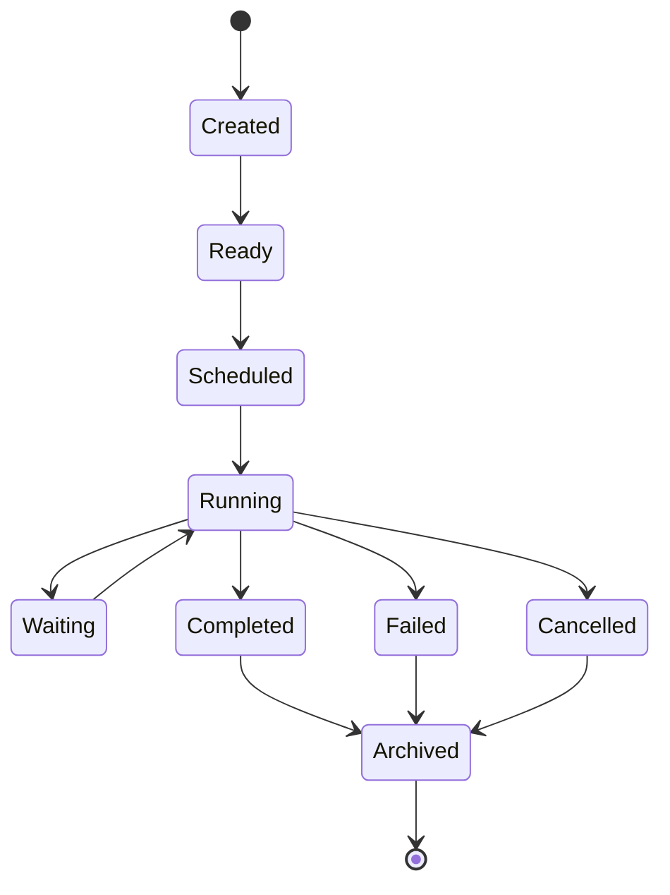
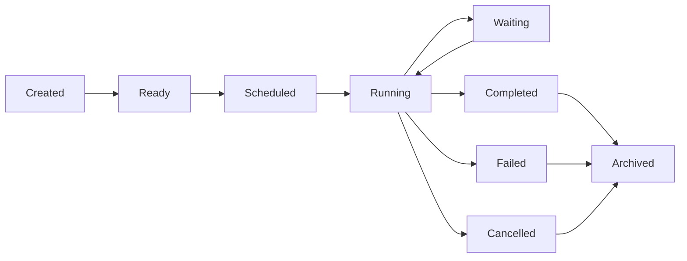

# MMOS v1.0 — Task State Machine

Version: 1.0

Status: REFERENCE

---

# 1. Purpose

Dokumen ini mendefinisikan State Machine resmi untuk Object **Task**
di dalam MMOS.

Task merupakan unit kerja terkecil yang dijadwalkan oleh Workflow Engine
dan dieksekusi oleh Execution Engine.

State Machine ini memastikan setiap implementasi MMOS memiliki perilaku
Task yang konsisten, dapat diaudit, dan dapat dipantau.

Dokumen ini diturunkan dari:

- MAS-200 Execution Model
- MAS-300 Engine Architecture
- IMS-300 Workflow Specification
- IMS-400 Execution Specification

Dokumen ini tidak mendefinisikan spesifikasi baru.

---

# 2. Task Philosophy

Task mengikuti prinsip:

- Single Responsibility
- Explicit State
- Deterministic Transition
- Atomic Execution
- Observable
- Recoverable

Task selalu menjadi bagian dari satu Workflow Execution.

Task tidak pernah berdiri sendiri.

---

# 3. Task State Machine



---

# 4. Task States

| State | Description |
|---------|-------------|
| Created | Task dibuat |
| Ready | Dependency terpenuhi |
| Scheduled | Menunggu Worker |
| Running | Sedang dijalankan |
| Waiting | Menunggu proses eksternal |
| Completed | Berhasil selesai |
| Failed | Gagal |
| Cancelled | Dibatalkan |
| Archived | Diarsipkan |

---

# 5. Created

Task dibuat sebagai bagian dari Workflow.

Karakteristik:

- Task ID tersedia
- Workflow telah diketahui
- Dependency belum dievaluasi

Event

```
TaskCreated
```

---

# 6. Ready

Task siap dijadwalkan.

Seluruh dependency telah terpenuhi.

Contoh:

- Parent Task selesai
- Branch aktif
- Condition bernilai true

Event

```
TaskReady
```

---

# 7. Scheduled

Task telah masuk scheduler.

Task menunggu:

- Worker
- Resource
- Execution Slot

Event

```
TaskScheduled
```

---

# 8. Running

Execution Engine mulai menjalankan Task.

Task dapat:

- membaca Memory
- memanggil Runtime
- memanggil Capability
- menghasilkan Output

Event

```
TaskStarted
```

---

# 9. Waiting

Task berhenti sementara.

Penyebab:

- Human Approval
- External Callback
- Long Running Capability
- Timer
- Queue Response

Task dapat kembali ke Running.

Event

```
TaskWaiting
```

---

# 10. Completed

Task selesai dengan sukses.

Task menghasilkan:

```
TaskResult
```

Event

```
TaskCompleted
```

Terminal State.

---

# 11. Failed

Task gagal.

Contoh:

- Runtime Error
- Capability Error
- Validation Error
- Timeout
- Internal Exception

Event

```
TaskFailed
```

Terminal State.

---

# 12. Cancelled

Task dihentikan.

Penyebab:

- Workflow Cancelled
- Execution Cancelled
- User Request
- System Shutdown

Event

```
TaskCancelled
```

Terminal State.

---

# 13. Archived

Task dipindahkan menjadi histori.

Digunakan untuk:

- Audit
- Replay
- Analytics
- Monitoring

Event

```
TaskArchived
```

---

# 14. Transition Rules

| From | To | Allowed |
|------|----|----------|
| Created | Ready | ✓ |
| Ready | Scheduled | ✓ |
| Scheduled | Running | ✓ |
| Running | Waiting | ✓ |
| Waiting | Running | ✓ |
| Running | Completed | ✓ |
| Running | Failed | ✓ |
| Running | Cancelled | ✓ |
| Completed | Archived | ✓ |
| Failed | Archived | ✓ |
| Cancelled | Archived | ✓ |

Transition lain dianggap tidak valid.

---

# 15. Transition Diagram



---

# 16. Trigger Matrix

| Trigger | Result |
|----------|--------|
| Dependency Resolved | Ready |
| Scheduler Accepted | Scheduled |
| Worker Assigned | Running |
| External Wait | Waiting |
| Resume Event | Running |
| Execution Success | Completed |
| Runtime Error | Failed |
| Capability Error | Failed |
| User Cancel | Cancelled |
| Archive Policy | Archived |

---

# 17. Dependency Behaviour

Task hanya dapat memasuki state **Ready** apabila seluruh dependency selesai.

Contoh:

```text
Task A

↓

Task B

↓

Task C
```

Task B tidak dapat memasuki Ready sebelum Task A selesai.

---

# 18. Parallel Task Behaviour

Workflow dapat memiliki beberapa Task paralel.

```text
Task A

├── Task B
├── Task C
└── Task D
```

Masing-masing Task memiliki State Machine sendiri.

Perubahan state pada satu Task tidak mengubah state Task lainnya.

---

# 19. Retry Behaviour

Retry dilakukan pada Task yang sama.

```text
Running

↓

Failed

↓

Retry

↓

Running
```

Retry Counter disimpan sebagai Metadata.

Retry mengikuti Retry Policy.

---

# 20. Waiting Behaviour

Task dapat mengalami Waiting berkali-kali.

```text
Running

↓

Waiting

↓

Running

↓

Waiting

↓

Running
```

Tidak ada batasan jumlah Waiting.

---

# 21. Timeout Behaviour

Jika timeout terjadi.

```text
Running

↓

Timeout

↓

Failed
```

atau

```text
Running

↓

Timeout

↓

Cancelled
```

Ditentukan oleh Task Policy.

---

# 22. Runtime Interaction

Task dapat menggunakan Runtime.

```text
Task Running

↓

Runtime Request

↓

Runtime Response

↓

Continue
```

State Runtime tidak mengubah Task State secara langsung.

Task tetap berada pada:

```
Running
```

---

# 23. Capability Interaction

Task juga dapat menggunakan Capability.

```text
Task Running

↓

Capability Request

↓

Capability Response

↓

Continue
```

Capability memiliki State Machine sendiri.

---

# 24. Event Mapping

| State | Event |
|---------|-------|
| Created | TaskCreated |
| Ready | TaskReady |
| Scheduled | TaskScheduled |
| Running | TaskStarted |
| Waiting | TaskWaiting |
| Completed | TaskCompleted |
| Failed | TaskFailed |
| Cancelled | TaskCancelled |
| Archived | TaskArchived |

---

# 25. Metrics

Task menghasilkan Metrics.

Contoh:

- Start Time
- Finish Time
- Duration
- Waiting Duration
- Retry Count
- Runtime Calls
- Capability Calls
- Memory Reads
- Memory Writes

---

# 26. State Validation

Execution Engine wajib memvalidasi state sebelum menjalankan operasi.

Contoh:

```text
Completed

↓

Invoke Runtime

↓

Rejected
```

Task yang telah selesai tidak dapat dijalankan kembali.

---

# 27. Recovery

Task dapat dipulihkan apabila berada pada:

- Ready
- Scheduled
- Running
- Waiting

Task yang telah:

- Completed
- Failed
- Cancelled

tidak dapat di-resume.

Recovery dilakukan menggunakan Retry atau Replay sesuai Policy.

---

# 28. State Ownership

State Task hanya boleh diubah oleh:

```
Execution Engine
```

Workflow Engine hanya menentukan urutan Task.

Workflow Engine tidak mengubah State Task secara langsung.

---

# 29. Relationship with Other State Machines

Task berhubungan dengan:

```text
Workflow State

↓

Execution State

↓

Runtime State

↓

Capability State

↓

Memory State
```

Task menjadi penghubung utama antar State Machine tersebut.

---

# 30. Design Principles

Task State Machine mengikuti prinsip:

- Single Responsibility
- Explicit State
- Deterministic Transition
- Atomic Execution
- Policy Driven
- Recoverable
- Observable
- Event Driven

---

# 31. Reference Documents

Dokumen ini diturunkan dari:

- MAS-200 Execution Model
- MAS-300 Engine Architecture
- IMS-300 Workflow Specification
- IMS-400 Execution Specification
- execution-state.md
- workflow-state.md
- workflow-execution.md
- agent-execution.md

---

# END