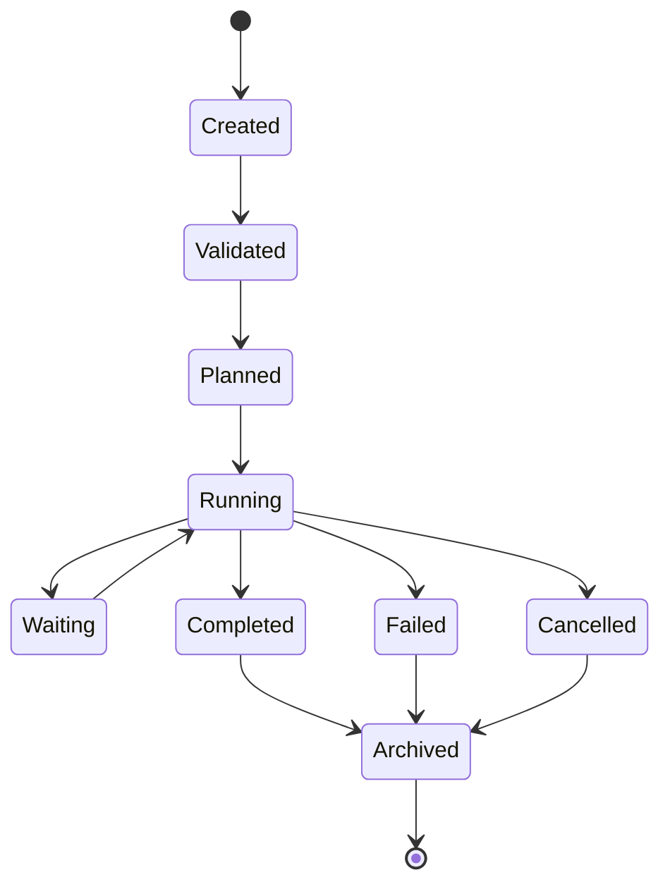
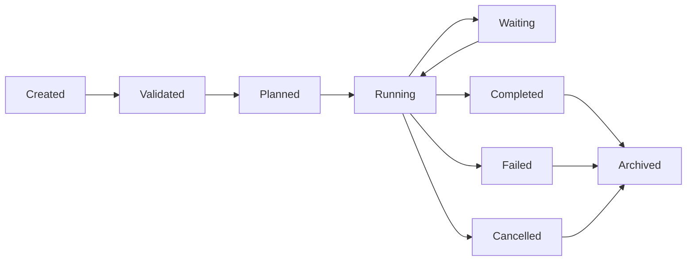

# MMOS v1.0 — Workflow State Machine

Version: 1.0

Status: REFERENCE

---

# 1. Purpose

Dokumen ini mendefinisikan State Machine resmi untuk Object **Workflow**
di dalam MMOS.

Workflow merepresentasikan definisi proses bisnis yang dijalankan oleh
Execution Engine melalui Execution Plan yang dibangun oleh Workflow Engine.

Workflow State Machine memastikan seluruh implementasi Workflow Engine
memiliki perilaku yang konsisten.

Dokumen ini diturunkan dari:

- MAS-200 Execution Model
- MAS-300 Engine Architecture
- IMS-300 Workflow Specification
- IMS-400 Execution Specification

Dokumen ini tidak mendefinisikan spesifikasi baru.

---

# 2. Workflow Philosophy

Workflow mengikuti prinsip:

- Declarative Execution
- Explicit State
- Deterministic Transition
- Immutable Definition
- Observable
- Recoverable

Workflow Definition bersifat immutable selama Execution berlangsung.

---

# 3. Workflow State Machine



---

# 4. Workflow States

| State | Description |
|---------|-------------|
| Created | Workflow dibuat |
| Validated | Workflow lolos validasi |
| Planned | Execution Plan telah dibuat |
| Running | Workflow sedang berjalan |
| Waiting | Workflow menunggu event eksternal |
| Completed | Workflow selesai |
| Failed | Workflow gagal |
| Cancelled | Workflow dibatalkan |
| Archived | Workflow diarsipkan |

---

# 5. Created

Workflow baru dibuat.

Karakteristik:

- Workflow ID tersedia
- Metadata tersedia
- Belum divalidasi

Event

```
WorkflowCreated
```

---

# 6. Validated

Workflow berhasil divalidasi.

Validasi meliputi:

- Schema
- Version
- Dependency
- Task Definition
- Branch
- Loop

Workflow siap dibuatkan Execution Plan.

Event

```
WorkflowValidated
```

---

# 7. Planned

Workflow Engine berhasil membuat:

```
Execution Plan
```

Execution Plan berisi:

- Task Graph
- Dependency
- Parallel Group
- Retry Policy
- Timeout Policy

Workflow belum menjalankan Task.

Event

```
WorkflowPlanned
```

---

# 8. Running

Workflow sedang dijalankan.

Workflow Engine dapat:

- memilih Task berikutnya
- mengevaluasi Condition
- mengelola Loop
- mengelola Branch
- mengelola Join

Event

```
WorkflowStarted
```

---

# 9. Waiting

Workflow berhenti sementara.

Penyebab:

- Human Approval
- External Callback
- Timer
- Scheduler
- Long Running Capability

Workflow dapat dilanjutkan kembali.

Event

```
WorkflowWaiting
```

---

# 10. Completed

Workflow selesai.

Seluruh Task berhasil dijalankan.

Output:

```
WorkflowResult
```

Event

```
WorkflowCompleted
```

Terminal State.

---

# 11. Failed

Workflow gagal.

Penyebab:

- Task Failure
- Runtime Failure
- Capability Failure
- Validation Error
- Policy Violation

Event

```
WorkflowFailed
```

Terminal State.

---

# 12. Cancelled

Workflow dihentikan.

Penyebab:

- User
- Administrator
- Timeout
- Platform Policy

Event

```
WorkflowCancelled
```

Terminal State.

---

# 13. Archived

Workflow dipindahkan menjadi histori.

Tujuan:

- Audit
- Analytics
- Replay
- Monitoring

Workflow tidak dapat dijalankan kembali.

Event

```
WorkflowArchived
```

---

# 14. Transition Rules

| From | To | Allowed |
|------|----|----------|
| Created | Validated | ✓ |
| Validated | Planned | ✓ |
| Planned | Running | ✓ |
| Running | Waiting | ✓ |
| Waiting | Running | ✓ |
| Running | Completed | ✓ |
| Running | Failed | ✓ |
| Running | Cancelled | ✓ |
| Completed | Archived | ✓ |
| Failed | Archived | ✓ |
| Cancelled | Archived | ✓ |

Semua transition lain dianggap tidak valid.

---

# 15. Transition Diagram



---

# 16. Trigger Matrix

| Trigger | Result |
|----------|--------|
| Validation Success | Validated |
| Planning Completed | Planned |
| Scheduler Start | Running |
| External Wait | Waiting |
| Resume Event | Running |
| All Tasks Finished | Completed |
| Task Failure | Failed |
| User Cancel | Cancelled |
| Archive Policy | Archived |

---

# 17. Branch Behaviour

Workflow dapat memiliki beberapa Branch.

```
Decision

↓

Branch A

↓

Join

↓

Continue
```

State Workflow tetap:

```
Running
```

Branch tidak memiliki lifecycle independen.

---

# 18. Loop Behaviour

Workflow dapat melakukan Loop.

```
Task

↓

Condition

↓

Repeat

↓

Task
```

Selama Loop berlangsung Workflow tetap berada pada state:

```
Running
```

---

# 19. Parallel Behaviour

Workflow dapat memiliki Task paralel.

```
Task A

Task B

Task C

↓

Join

↓

Continue
```

Workflow tetap berada pada state:

```
Running
```

---

# 20. Waiting Behaviour

Workflow dapat mengalami beberapa Waiting.

```
Running

↓

Waiting

↓

Running

↓

Waiting

↓

Running
```

Jumlah Waiting tidak dibatasi.

---

# 21. Retry Behaviour

Retry tidak membuat Workflow baru.

Retry dilakukan pada Workflow yang sama.

```
Running

↓

Failed Task

↓

Retry

↓

Running
```

Retry mengikuti Workflow Policy.

---

# 22. Timeout Behaviour

Jika Timeout terjadi.

```
Running

↓

Timeout

↓

Failed
```

atau

```
Running

↓

Timeout

↓

Cancelled
```

Ditentukan oleh Policy.

---

# 23. Event Mapping

| State | Event |
|---------|-------|
| Created | WorkflowCreated |
| Validated | WorkflowValidated |
| Planned | WorkflowPlanned |
| Running | WorkflowStarted |
| Waiting | WorkflowWaiting |
| Completed | WorkflowCompleted |
| Failed | WorkflowFailed |
| Cancelled | WorkflowCancelled |
| Archived | WorkflowArchived |

---

# 24. Metrics

Workflow menghasilkan Metrics.

Contoh:

- Start Time
- End Time
- Duration
- Waiting Duration
- Task Count
- Completed Task
- Failed Task
- Retry Count
- Parallel Task Count

---

# 25. State Validation

Workflow Engine wajib memvalidasi state.

Contoh:

```
Completed

↓

Execute Next Task

↓

Rejected
```

Workflow yang telah selesai tidak dapat menerima Task baru.

---

# 26. Recovery

Workflow dapat dipulihkan apabila berada pada:

- Planned
- Running
- Waiting

Workflow yang telah:

- Completed
- Failed
- Cancelled

tidak dapat dilanjutkan kembali.

Recovery dilakukan melalui mekanisme Retry atau Replay sesuai Policy.

---

# 27. State Ownership

Workflow State hanya boleh diubah oleh:

```
Workflow Engine
```

Execution Engine tidak boleh mengubah Workflow State secara langsung.

---

# 28. Relationship with Other State Machines

Workflow memiliki hubungan dengan:

```
Execution State

↓

Task State

↓

Runtime State

↓

Capability State
```

Workflow Engine mengoordinasikan perubahan state, tetapi setiap Object tetap
dikelola oleh Engine pemiliknya.

---

# 29. Design Principles

Workflow State Machine mengikuti prinsip:

- Declarative Workflow
- Explicit State
- Single State Owner
- Deterministic Transition
- Policy Driven
- Observable
- Recoverable
- Immutable Definition

---

# 30. Reference Documents

Dokumen ini diturunkan dari:

- MAS-200 Execution Model
- MAS-300 Engine Architecture
- IMS-300 Workflow Specification
- IMS-400 Execution Specification
- execution-state.md
- workflow-execution.md
- object-lifecycle.md

---

# END